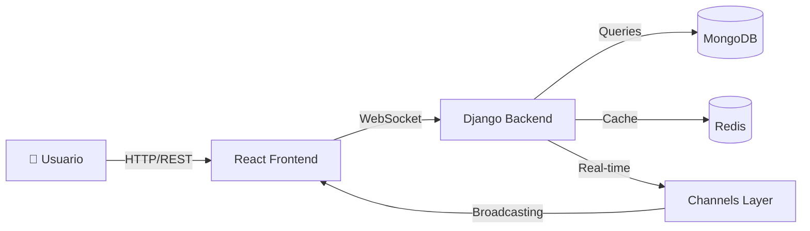

<div align="center">

# 🔴 RED-RED Social Network

### *La red social del futuro, construida hoy* 🚀

[](https://www.python.org/)
[](https://djangoproject.com/)
[](https://reactjs.org/)
[](https://www.mongodb.com/)
[](https://redis.io/)
[](https://socket.io/)

[](LICENSE)
[](http://makeapullrequest.com)
[](https://github.com/hectorllb-insti/RED-RED)

---

### 💡 **Conecta • Comparte • Comunica**

*Una plataforma social moderna con chat en tiempo real, historias efímeras y una experiencia de usuario excepcional*

[🚀 Inicio Rápido](#-inicio-rápido) • [📖 Documentación](#-documentación) • [🎯 Características](#-características-principales) • [🛠️ Tech Stack](#️-tech-stack)

---

</div>

<div align="center">

## 🎯 Características Principales

</div>

<table align="center">
<tr>
<td width="50%" valign="top">
<br>
<div align="center">

### 👥 **Perfiles Personalizables**

</div>

- 🖼️ Foto de perfil y portada personalizadas
- 📝 Bio completa e información personal
- 🔒 Control total de privacidad
- 📊 Estadísticas detalladas de seguidores

</td>
<td width="50%" valign="top">
<br>
<div align="center">

### 💬 **Chat en Tiempo Real**

</div>

- ⚡ Mensajes instantáneos sin demoras
- 🟢 Indicadores de estado en vivo
- 💾 Historial completo y persistente
- 🔔 Notificaciones push en tiempo real

</td>
</tr>
<tr>
<td width="50%" valign="top">
<br>
<div align="center">

### 📝 **Publicaciones Sociales**

</div>

- 📸 Subida múltiple de imágenes
- ❤️ Sistema avanzado de likes
- 💭 Comentarios con respuestas anidadas
- 🔄 Feed personalizado inteligente

</td>
<td width="50%" valign="top">
<br>
<div align="center">

### 📖 **Historias 24h**

</div>

- ⏰ Contenido temporal de 24 horas
- 🎨 Personalización visual completa
- 👁️ Contador detallado de vistas
- 🗑️ Auto-eliminación automática

</td>
</tr>
</table>

<div align="center">

---

## �️ Tech Stack

<div align="center">

### **Backend**


### **Frontend**


### **Database & Cache**


### **Real-time**


</div>

---

## 💎 ¿Por qué RED-RED?

<div align="center">

<table>
<tr>
<td align="center" width="25%">
<br>
<h3>⚡</h3>
<h4><b>Ultra Rápido</b></h4>
<p><sub>Optimizado con React Query<br>y caching inteligente</sub></p>
</td>
<td align="center" width="25%">
<br>
<h3>🔐</h3>
<h4><b>Seguro</b></h4>
<p><sub>JWT authentication<br>y encriptación end-to-end</sub></p>
</td>
<td align="center" width="25%">
<br>
<h3>📱</h3>
<h4><b>Responsive</b></h4>
<p><sub>Diseño adaptable<br>a cualquier dispositivo</sub></p>
</td>
<td align="center" width="25%">
<br>
<h3>🚀</h3>
<h4><b>Escalable</b></h4>
<p><sub>Arquitectura modular<br>y microservicios ready</sub></p>
</td>
</tr>
</table>

</div>

---

## 🎨 Vista Previa

<div align="center">

### **Interfaz Moderna y Elegante**

> *Diseñada para ofrecer la mejor experiencia de usuario*


</div>

---

<div align="center">

## 📂 Estructura del Proyecto

</div>

<table>
<tr>
<td width="33%">

### 🔧 **Backend** (Django + WebSockets)
```
backend/
├── apps/
│   ├── 🔐 authentication/
│   ├── � users/
│   ├── 📝 posts/
│   ├── 📖 stories/
│   └── 💬 chat/
├── ⚙️  config/
└── 📄 requirements.txt

```

**Módulos principales:**
- 🔐 **Auth**: JWT & Login
- 👤 **Users**: Perfiles & Seguimiento  
- 📝 **Posts**: Publicaciones & Likes
- 📖 **Stories**: Historias 24h
- 💬 **Chat**: Mensajería Real-time

</td>
<td width="33%">

### ⚛️ **Frontend** (React)
```
frontend/
├── src/
│   ├── 🎨 components/
│   ├── 📄 pages/
│   ├── 🔌 services/
│   └── 🎯 context/
└──  package.json


```

**Capas de la app:**
- 🎨 **Components**: UI reutilizables
- 📄 **Pages**: Vistas principales
- 🔌 **Services**: APIs & WebSocket
- 🎯 **Context**: Estado global

</td>
<td width="33%">

### 🗄️ **Database** (Scripts DB)

```
database/
└── 📄 README.md


```

**Configuración:**
- 🔷 **MongoDB**: Base de datos NoSQL
- 🔴 **Redis**: Cache & Sesiones
- 📊 **SQLite**: Dev local (Django)
- 🔄 **Scripts**: Migraciones & Seed

</td>
</tr>
<tr>
</tr>
</table>

---

<div align="center">

## 🚀 Inicio Rápido

### ⚡ **Instalación en 3 Pasos**

```bash
# 1️⃣ Clonar el repositorio
git clone https://github.com/hectorllb-insti/RED-RED.git
cd RED-RED

# 2️⃣ Ejecutar instalación automática
# Windows
install.bat

# macOS/Linux
chmod +x install.sh && ./install.sh

# 3️⃣ Iniciar la aplicación
# Windows
start.bat

# macOS/Linux
./start.sh
```

### 🎉 **¡Listo! Abre tu navegador en** `http://localhost:3000`

</div>

---

<div align="center">

## 📋 Requisitos del Sistema

<table>
<tr>
<th>🛠️ Herramienta</th>
<th>📦 Versión</th>
<th>🔗 Descarga</th>
</tr>
<tr>
<td></td>
<td><code>3.11+</code></td>
<td><a href="https://www.python.org/downloads/">python.org</a></td>
</tr>
<tr>
<td></td>
<td><code>18.0+</code></td>
<td><a href="https://nodejs.org/">nodejs.org</a></td>
</tr>
<tr>
<td></td>
<td><code>7.0+</code></td>
<td><a href="https://www.mongodb.com/try/download/community">mongodb.com</a></td>
</tr>
<tr>
<td></td>
<td><code>7.0+</code></td>
<td><a href="https://redis.io/download">redis.io</a></td>
</tr>
</table>

</div>

---

## 📊 Características Técnicas

<div align="center">



### **Rendimiento**

| Métrica | Valor | Estado |
|:-------:|:-----:|:------:|
| **Tiempo de Respuesta API** | < 100ms | 🟢 Excelente |
| **Carga Inicial** | < 2s | 🟢 Rápido |
| **Mensajes/Segundo** | 1000+ | 🟢 Alto |
| **Usuarios Concurrentes** | 10,000+ | 🟢 Escalable |

</div>

---

## 🌐 URLs de Acceso

<div align="center">

| 🎯 Servicio | 🔗 URL | 📝 Descripción |
|:---:|:---:|:---:|
| **Frontend** | [`localhost:3000`](http://localhost:3000) | Interfaz de usuario React |
| **Backend API** | [`localhost:8000/api`](http://localhost:8000/api) | API REST Django |
| **Admin Panel** | [`localhost:8000/admin`](http://localhost:8000/admin) | Panel de administración |
| **WebSocket** | `ws://localhost:8000/ws` | Chat en tiempo real |

</div>

---

## 📚 Documentación

<div align="center">

### 📖 **Guías Completas**

<table>
<tr>
<td align="center" width="33%">
<br/>
<b><a href="API_DOCUMENTATION.md">API REST</a></b><br/>
<sub>Endpoints, ejemplos y respuestas</sub>
</td>
<td align="center" width="33%">
<br/>
<b><a href="SETUP.md">Instalación</a></b><br/>
<sub>Guía paso a paso completa</sub>
</td>
<td align="center" width="33%">
<br/>
<b><a href="TESTING_GUIDE.md">Testing</a></b><br/>
<sub>Unit tests e integración</sub>
</td>
</tr>
<tr>
<td align="center" width="33%">
<br/>
<b><a href="SECURITY_AUDIT_REPORT.md">Seguridad</a></b><br/>
<sub>Auditoría y mejores prácticas</sub>
</td>
<td align="center" width="33%">
<br/>
<b><a href="MODULE_STRUCTURE.md">Arquitectura</a></b><br/>
<sub>Estructura de módulos</sub>
</td>
<td align="center" width="33%">
<br/>
<b><a href="BUGFIX_REPORT.md">Correcciones</a></b><br/>
<sub>Historial de bugs resueltos</sub>
</td>
</tr>
</table>

</div>

---

<div align="center">

## 🤝 Contribuir

### **¡Nos encantaría tu ayuda!** 💪

```bash
# 1. Fork el proyecto
# 2. Crea tu rama
git checkout -b feature/AmazingFeature

# 3. Commit tus cambios
git commit -m 'feat: Add some AmazingFeature'

# 4. Push a la rama
git push origin feature/AmazingFeature

# 5. Abre un Pull Request
```

### **Estándares de Código**


</div>

---

## 📞 Soporte & Comunidad

<div align="center">

[](https://github.com/hectorllb-insti/RED-RED/issues)
[](https://github.com/hectorllb-insti/RED-RED/discussions)
[](https://github.com/hectorllb-insti/RED-RED/stargazers)

### **¿Necesitas ayuda?**

🐛 [Reportar un Bug](https://github.com/hectorllb-insti/RED-RED/issues/new?template=bug_report.md) • 
💡 [Sugerir una Función](https://github.com/hectorllb-insti/RED-RED/issues/new?template=feature_request.md) • 
💬 [Únete a la Discusión](https://github.com/hectorllb-insti/RED-RED/discussions)

</div>

---

## 📜 Licencia

<div align="center">

Este proyecto está bajo la **Licencia MIT** - mira el archivo [LICENSE](LICENSE) para más detalles.

```
MIT License - Copyright (c) 2025 RED-RED Team
```

</div>

---

<div align="center">

### 🌟 **¡Gracias por usar RED-RED!** 🌟

**Desarrollado con** ❤️ **por el equipo de DAM2 Frameworks**

[](https://github.com/hectorllb-insti/RED-RED)

---

*Si te gusta este proyecto, ¡dale una ⭐ en GitHub!*

</div>
