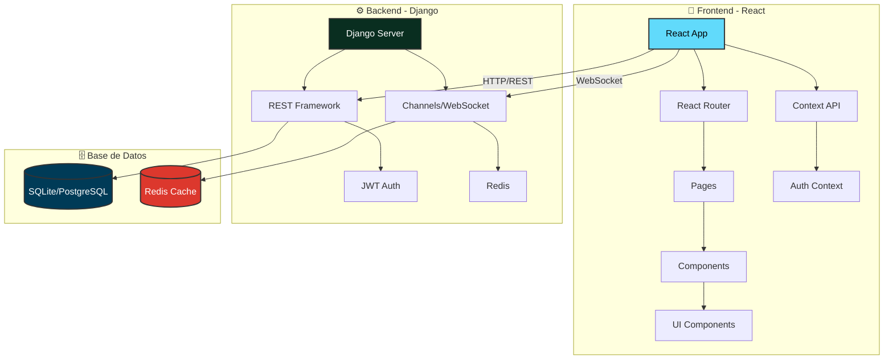
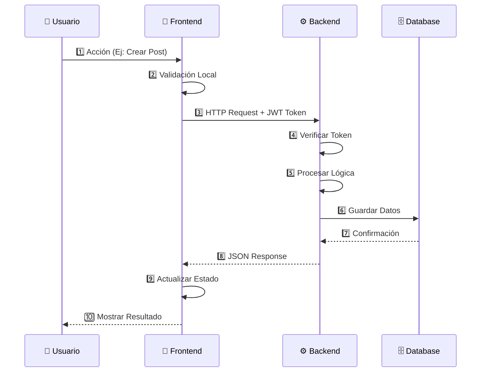
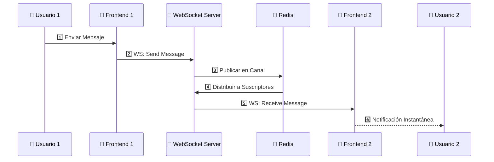
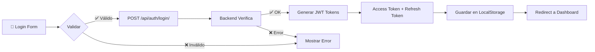

<div align="center">

# 🔴 RED-RED Social Network 🔴

### *La Red Social de Nueva Generación*

[](https://choosealicense.com/licenses/mit/)
[](https://www.python.org/)
[](https://www.djangoproject.com/)
[](https://reactjs.org/)
[](https://www.typescriptlang.org/)
[](https://tailwindcss.com/)
[](https://redis.io/)
[](https://channels.readthedocs.io/)
[](https://jwt.io/)


[✨ Características](#-características-principales) •
[🚀 Instalación](#-instalación-rápida) •
[🏗️ Arquitectura](#️-arquitectura-del-proyecto) •
[🔄 Flujo](#-flujo-de-datos) •
[📁 Estructura](#-estructura-del-proyecto) •
[🤝 Contribuir](#-cómo-contribuir) •
[📚 Glosario](#-glosario-técnico)

---

</div>

## 📖 Sobre el Proyecto

**RED-RED** es una plataforma de red social moderna y completa, construida con las últimas tecnologías web. Ofrece una experiencia de usuario fluida y en tiempo real, con características similares a las principales redes sociales actuales.

### ✨ Características Principales

#### 🎯 Core Features
- ✅ **Autenticación JWT** - Sistema seguro
- 👤 **Perfiles Personalizados** - Avatar & Bio
- 📝 **Publicaciones Completas** - Texto e imágenes
- ❤️ **Sistema de Likes** - Interacciones sociales
- 💬 **Comentarios** - Conversaciones anidadas
- 🔄 **Sistema de Seguimiento** - Follow/Unfollow

#### 🚀 Advanced Features
- 📸 **Stories de 24h** - Contenido temporal
- 💬 **Chat en Tiempo Real** - WebSockets
- 🔔 **Notificaciones Push** - Instantáneas
- 🔍 **Búsqueda de Usuarios** - Exploración
- 🎨 **Interfaz Moderna** - UI/UX Premium
- 📱 **Responsive Design** - Mobile First

---

## 🛠️ Stack Tecnológico

<div align="center">

### Backend


### Frontend


### Herramientas & DevOps


</div>

---

## 🖥️ Interfaz Gráfica

<div align="center">

### Vista Previa de la Aplicación

<!-- Aquí puedes agregar capturas de pantalla de tu proyecto -->


</div>

---

## 🚀 Instalación Rápida

### 📋 Prerrequisitos

```bash
- Python 3.11+
- Node.js 18.0+
- npm 9.0+
- Redis Server
```

### 🔧 Instalación Automática

#### Windows
```bash
# Ejecutar el script de instalación
.\install.bat
```

#### Linux/MacOS
```bash
# Dar permisos y ejecutar
chmod +x install.sh
./install.sh
```

### ⚙️ Instalación Manual

<details>
<summary><b>📦 Backend Setup</b></summary>

```bash
# 1. Navegar al directorio backend
cd backend

# 2. Crear entorno virtual
python -m venv venv

# 3. Activar entorno virtual
# Windows
venv\Scripts\activate
# Linux/MacOS
source venv/bin/activate

# 4. Instalar dependencias
pip install -r requirements.txt

# 5. Realizar migraciones
python manage.py makemigrations
python manage.py migrate

# 6. Crear superusuario (opcional)
python manage.py createsuperuser

# 7. Iniciar servidor
python manage.py runserver
```

</details>

<details>
<summary><b>🎨 Frontend Setup</b></summary>

```bash
# 1. Navegar al directorio frontend
cd frontend

# 2. Instalar dependencias
npm install

# 3. Iniciar servidor de desarrollo
npm start
```

</details>

### 🚀 Iniciar Aplicación

```bash
# Opción 1: Desde la raíz (ambos servidores)
npm run dev

# Opción 2: Scripts individuales
start.bat  # Windows
```

**Acceder a:**
- 🌐 Frontend: `http://localhost:3000`
- ⚙️ Backend API: `http://localhost:8000`
- 🔧 Admin Panel: `http://localhost:8000/admin`

---

## 🏗️ Arquitectura del Proyecto

<div align="center">



</div>

---

## 🔄 Flujo de Datos

### 📡 Flujo HTTP (REST API)



### ⚡ Flujo WebSocket (Tiempo Real)



### 🔐 Flujo de Autenticación



---

## 📁 Estructura del Proyecto

```
RED-RED/
│
├── 🐍 backend/                      # Django Backend
│   ├── apps/                        # Aplicaciones Django
│   │   ├── authentication/          # 🔐 Sistema de autenticación JWT
│   │   ├── users/                   # 👤 Gestión de perfiles y seguidores
│   │   ├── posts/                   # 📝 Publicaciones, likes y comentarios
│   │   ├── stories/                 # 📸 Historias temporales (24h)
│   │   └── chat/                    # 💬 Mensajería en tiempo real
│   │
│   ├── config/                      # ⚙️ Configuración Django
│   │   ├── settings.py              # Configuración principal
│   │   ├── urls.py                  # Rutas globales
│   │   ├── asgi.py                  # Servidor WebSocket
│   │   └── wsgi.py                  # Servidor HTTP
│   │
│   ├── notifications/               # 🔔 Sistema de notificaciones
│   ├── media/                       # 📁 Archivos subidos (imágenes)
│   ├── db.sqlite3                   # 🗄️ Base de datos
│   └── manage.py                    # 🎯 CLI Django
│
├── ⚛️ frontend/                     # React Frontend
│   ├── src/
│   │   ├── components/              # 🧩 Componentes reutilizables
│   │   │   ├── Layout.js            # Estructura principal
│   │   │   ├── PostCard.js          # Tarjeta de publicación
│   │   │   ├── Avatar.js            # Componente de avatar
│   │   │   └── ui/                  # Componentes UI base
│   │   │
│   │   ├── pages/                   # 📄 Páginas con rutas
│   │   │   ├── Home.js              # Feed principal
│   │   │   ├── Profile.js           # Perfil de usuario
│   │   │   ├── Messages.js          # Chat
│   │   │   ├── Login.js             # Autenticación
│   │   │   └── Settings.js          # Configuración
│   │   │
│   │   ├── services/                # 🌍 Servicios HTTP
│   │   │   ├── api.js               # Cliente Axios
│   │   │   └── tokenManager.js      # Gestión JWT
│   │   │
│   │   ├── context/                 # 🔄 Estado global
│   │   │   └── AuthContext.js       # Contexto de autenticación
│   │   │
│   │   ├── hooks/                   # 🪝 Custom Hooks
│   │   ├── utils/                   # 🛠️ Utilidades
│   │   └── styles/                  # 🎨 Estilos globales
│   │
│   └── public/                      # 📦 Recursos estáticos
│
├── 🗂️ database/                     # Base de Datos
│   └── README.md                    # Documentación de BD
│
├── �📚 Documentación
│   ├── API_DOCUMENTATION.md         # Documentación API REST
│   ├── STRUCTURE.md                 # Estructura detallada
│   ├── MODULE_STRUCTURE.md          # Estructura de módulos
│   ├── SECURITY_REPORT.md           # Reporte de seguridad
│   └── SETUP.md                     # Guía de instalación
│
└── 🔧 Configuración
    ├── package.json                 # Dependencias Node.js
    ├── requirements.txt             # Dependencias Python
    ├── install.bat / .sh            # Scripts de instalación
    └── start.bat                    # Script de inicio
```

---

## 🤝 Cómo Contribuir

¡Las contribuciones son bienvenidas y apreciadas! 🎉

### 📝 Proceso de Contribución

1. **Fork el proyecto** 🍴
   ```bash
   # Hacer fork desde GitHub
   ```

2. **Clonar tu fork** 📥
   ```bash
   git clone https://github.com/tu-usuario/RED-RED.git
   cd RED-RED
   ```

3. **Crear una rama** 🌿
   ```bash
   git checkout -b feature/AmazingFeature
   ```

4. **Hacer cambios y commit** 💾
   ```bash
   git add .
   git commit -m "Add: Amazing Feature"
   ```

5. **Push a tu fork** 🚀
   ```bash
   git push origin feature/AmazingFeature
   ```

6. **Abrir Pull Request** 🔃
   - Ir a GitHub y crear un Pull Request
   - Describir los cambios realizados
   - Esperar revisión

### 💡 Guías de Contribución

- 📖 Seguir el estilo de código existente
- ✅ Añadir tests para nuevas funcionalidades
- 📝 Actualizar documentación si es necesario
- 🔍 Asegurar que todos los tests pasen
- 🎨 Mantener UI/UX consistente

---

## 📚 Glosario Técnico

### 🔐 JWT (JSON Web Token)
Sistema de autenticación basado en tokens que permite mantener sesiones seguras sin necesidad de cookies. El token contiene información encriptada del usuario.

### ⚡ WebSocket
Protocolo de comunicación bidireccional en tiempo real entre cliente y servidor. Permite chat y notificaciones instantáneas sin necesidad de refrescar la página.

### 🔄 REST API
Arquitectura de servicios web que utiliza HTTP para realizar operaciones CRUD (Create, Read, Update, Delete) sobre recursos mediante endpoints.

### 🎨 React Context
Sistema de gestión de estado global en React que permite compartir datos entre componentes sin necesidad de pasar props manualmente en cada nivel.

### 🔴 Redis
Base de datos en memoria ultra-rápida utilizada para caché y como broker de mensajes para WebSockets. Almacena datos temporales y sesiones.

### 📦 Serializer
Componente de Django REST Framework que convierte modelos de Python a JSON y viceversa, validando y transformando datos para la API.

### 🛡️ CORS (Cross-Origin Resource Sharing)
Mecanismo de seguridad que permite o restringe peticiones HTTP entre diferentes dominios. Necesario para que Frontend y Backend se comuniquen.

---

<div align="center">

## 💝 Creado con Amor

Este proyecto ha sido desarrollado con **dedicación** y **pasión** por:

### 👨‍💻 Grupo de 2º DAM - Frameworks
**Ciclo Superior de Desarrollo de Aplicaciones Multiplataforma**

---

### 📄 Licencia

Este proyecto está bajo la Licencia MIT - ver el archivo [LICENSE](LICENSE) para más detalles.

```
MIT License - Copyright (c) 2025 RED-RED Team
```

---

### 🌟 Agradecimientos

Gracias a todos los que han contribuido a hacer de **RED-RED** una realidad.

Si te gusta el proyecto, ¡dale una ⭐ en GitHub!

---

**[⬆️ Volver arriba](#red-red-social-network)**

---

<sub>Última actualización: Noviembre 2025 | Made with ❤️ by DAM2 Frameworks Team</sub>

</div>
