<div align="center">

# 🔴 RED-RED Social Network

### *La red social del futuro, construida hoy* 🚀

[](https://www.python.org/)
[](https://djangoproject.com/)
[](https://reactjs.org/)
[](https://www.mongodb.com/)
[](https://redis.io/)
[](https://socket.io/)

[](LICENSE)
[](http://makeapullrequest.com)
[](https://github.com/hectorllb-insti/RED-RED)

---

### 💡 **Conecta • Comparte • Comunica**

*Una plataforma social moderna con chat en tiempo real, historias efímeras y una experiencia de usuario excepcional*

[🚀 Inicio Rápido](#-inicio-rápido) • [📖 Documentación](#-documentación) • [🎯 Características](#-características-principales) • [🛠️ Tech Stack](#️-tech-stack)

---

</div>

<div align="center">

## 🎯 Características Principales

<table>
<tr>
<td width="50%" align="center">

### 👥 **Perfiles Personalizables**
- 🖼️ Foto de perfil y portada
- � Bio y información personal
- 🔒 Control de privacidad
- 📊 Estadísticas de seguidores

</td>
<td width="50%" align="center">

### 💬 **Chat en Tiempo Real**
- ⚡ Mensajes instantáneos
- � Estado de conexión
- 💾 Historial persistente
- 🔔 Notificaciones push

</td>
</tr>
<tr>
<td width="50%" align="center">

### 📝 **Publicaciones Sociales**
- 📸 Subida de imágenes
- ❤️ Sistema de likes
- 💭 Comentarios anidados
- 🔄 Feed personalizado

</td>
<td width="50%" align="center">

### 📖 **Historias 24h**
- ⏰ Contenido temporal
- 🎨 Personalización visual
- �️ Contador de vistas
- 🗑️ Auto-eliminación

</td>
</tr>
</table>

</div>

---

## �️ Tech Stack

<div align="center">

### **Backend**


### **Frontend**


### **Database & Cache**


### **Real-time**


</div>

---

## 💎 ¿Por qué RED-RED?

<div align="center">

<table>
<tr>
<td align="center" width="25%">
<br>
<h3>⚡</h3>
<h4><b>Ultra Rápido</b></h4>
<p><sub>Optimizado con React Query<br>y caching inteligente</sub></p>
</td>
<td align="center" width="25%">
<br>
<h3>🔐</h3>
<h4><b>Seguro</b></h4>
<p><sub>JWT authentication<br>y encriptación end-to-end</sub></p>
</td>
<td align="center" width="25%">
<br>
<h3>📱</h3>
<h4><b>Responsive</b></h4>
<p><sub>Diseño adaptable<br>a cualquier dispositivo</sub></p>
</td>
<td align="center" width="25%">
<br>
<h3>🚀</h3>
<h4><b>Escalable</b></h4>
<p><sub>Arquitectura modular<br>y microservicios ready</sub></p>
</td>
</tr>
</table>

</div>

---

## 🎨 Vista Previa

<div align="center">

### **Interfaz Moderna y Elegante**

> *Diseñada para ofrecer la mejor experiencia de usuario*

```ascii
╔══════════════════════════════════════════════════════════════════╗
║  🏠 Feed  |  💬 Mensajes  |  📖 Historias  |  👤 Perfil         ║
╠══════════════════════════════════════════════════════════════════╣
║                                                                  ║
║  📸 [Nueva Publicación]           🔔 [Notificaciones: 5]        ║
║                                                                  ║
║  ┌────────────────────────────────────────────────────┐         ║
║  │  👤 Usuario123  •  Hace 2 horas                    │         ║
║  │  ──────────────────────────────────────────────    │         ║
║  │  ¡Mira esta increíble foto! 📷                     │         ║
║  │  [Imagen de publicación]                           │         ║
║  │                                                     │         ║
║  │  ❤️ 234 likes  💬 45 comentarios  🔄 12 shares     │         ║
║  └────────────────────────────────────────────────────┘         ║
║                                                                  ║
║  ┌─────────── 💬 Chat en Vivo ────────────┐                     ║
║  │  🟢 Amigo1: ¡Hola! ¿Qué tal?          │                     ║
║  │  🟢 Tú: ¡Todo bien! ✨                 │                     ║
║  └───────────────────────────────────────┘                     ║
╚══════════════════════════════════════════════════════════════════╝
```

</div>

---

<div align="center">

## 📂 Estructura del Proyecto

```bash
📦 RED-RED/
┣ 🔧 backend/                 # API Django + WebSockets
┃ ┣ 📁 apps/
┃ ┃ ┣ 🔐 authentication/     # JWT & Login
┃ ┃ ┣ 👤 users/              # Perfiles & Seguimiento
┃ ┃ ┣ 📝 posts/              # Publicaciones & Likes
┃ ┃ ┣ 📖 stories/            # Historias 24h
┃ ┃ ┗ 💬 chat/               # Mensajería Real-time
┃ ┣ ⚙️ config/               # Settings Django
┃ ┗ 📄 requirements.txt      # Dependencias Python
┃
┣ ⚛️ frontend/                # App React
┃ ┣ 📁 src/
┃ ┃ ┣ 🎨 components/         # Componentes UI
┃ ┃ ┣ 📄 pages/              # Páginas/Rutas
┃ ┃ ┣ 🔌 services/           # APIs & WebSocket
┃ ┃ ┗ 🎯 context/            # Estado Global
┃ ┗ 📦 package.json          # Dependencias Node
┃
┣ 🗄️ database/               # Scripts DB
┗ 📚 docs/                   # Documentación

```

</div>

---

## 🚀 Inicio Rápido

<div align="center">

### ⚡ **Instalación en 3 Pasos**

</div>

```bash
# 1️⃣ Clonar el repositorio
git clone https://github.com/hectorllb-insti/RED-RED.git
cd RED-RED

# 2️⃣ Ejecutar instalación automática
# Windows
install.bat

# macOS/Linux
chmod +x install.sh && ./install.sh

# 3️⃣ Iniciar la aplicación
# Windows
start.bat

# macOS/Linux
./start.sh
```

<div align="center">

### 🎉 **¡Listo! Abre tu navegador en** `http://localhost:3000`

</div>

---

<div align="center">

## 📋 Requisitos del Sistema

<table>
<tr>
<th>🛠️ Herramienta</th>
<th>📦 Versión</th>
<th>🔗 Descarga</th>
</tr>
<tr>
<td></td>
<td><code>3.11+</code></td>
<td><a href="https://www.python.org/downloads/">python.org</a></td>
</tr>
<tr>
<td></td>
<td><code>18.0+</code></td>
<td><a href="https://nodejs.org/">nodejs.org</a></td>
</tr>
<tr>
<td></td>
<td><code>7.0+</code></td>
<td><a href="https://www.mongodb.com/try/download/community">mongodb.com</a></td>
</tr>
<tr>
<td></td>
<td><code>7.0+</code></td>
<td><a href="https://redis.io/download">redis.io</a></td>
</tr>
</table>

</div>

---

## 📊 Características Técnicas

```mermaid
graph LR
    A[👤 Usuario] -->|HTTP/REST| B[React Frontend]
    B -->|WebSocket| C[Django Backend]
    C -->|Queries| D[(MongoDB)]
    C -->|Cache| E[(Redis)]
    C -->|Real-time| F[Channels Layer]
    F -->|Broadcasting| B
```

<div align="center">



### **Rendimiento**

| Métrica | Valor | Estado |
|:-------:|:-----:|:------:|
| **Tiempo de Respuesta API** | < 100ms | 🟢 Excelente |
| **Carga Inicial** | < 2s | 🟢 Rápido |
| **Mensajes/Segundo** | 1000+ | 🟢 Alto |
| **Usuarios Concurrentes** | 10,000+ | 🟢 Escalable |

</div>

---

## 🌐 URLs de Acceso

<div align="center">

| 🎯 Servicio | 🔗 URL | 📝 Descripción |
|:---:|:---:|:---:|
| **Frontend** | [`localhost:3000`](http://localhost:3000) | Interfaz de usuario React |
| **Backend API** | [`localhost:8000/api`](http://localhost:8000/api) | API REST Django |
| **Admin Panel** | [`localhost:8000/admin`](http://localhost:8000/admin) | Panel de administración |
| **WebSocket** | `ws://localhost:8000/ws` | Chat en tiempo real |

</div>

---

## 📚 Documentación

<div align="center">

### 📖 **Guías Completas**

<table>
<tr>
<td align="center" width="33%">
<br/>
<b><a href="API_DOCUMENTATION.md">API REST</a></b><br/>
<sub>Endpoints, ejemplos y respuestas</sub>
</td>
<td align="center" width="33%">
<br/>
<b><a href="SETUP.md">Instalación</a></b><br/>
<sub>Guía paso a paso completa</sub>
</td>
<td align="center" width="33%">
<br/>
<b><a href="TESTING_GUIDE.md">Testing</a></b><br/>
<sub>Unit tests e integración</sub>
</td>
</tr>
<tr>
<td align="center" width="33%">
<br/>
<b><a href="SECURITY_AUDIT_REPORT.md">Seguridad</a></b><br/>
<sub>Auditoría y mejores prácticas</sub>
</td>
<td align="center" width="33%">
<br/>
<b><a href="MODULE_STRUCTURE.md">Arquitectura</a></b><br/>
<sub>Estructura de módulos</sub>
</td>
<td align="center" width="33%">
<br/>
<b><a href="BUGFIX_REPORT.md">Correcciones</a></b><br/>
<sub>Historial de bugs resueltos</sub>
</td>
</tr>
</table>

</div>

---

## 🤝 Contribuir

<div align="center">

### **¡Nos encantaría tu ayuda!** 💪

```bash
# 1. Fork el proyecto
# 2. Crea tu rama
git checkout -b feature/AmazingFeature

# 3. Commit tus cambios
git commit -m 'feat: Add some AmazingFeature'

# 4. Push a la rama
git push origin feature/AmazingFeature

# 5. Abre un Pull Request
```

### **Estándares de Código**


</div>

---

## 📞 Soporte & Comunidad

<div align="center">

[](https://github.com/hectorllb-insti/RED-RED/issues)
[](https://github.com/hectorllb-insti/RED-RED/discussions)
[](https://github.com/hectorllb-insti/RED-RED/stargazers)

### **¿Necesitas ayuda?**

🐛 [Reportar un Bug](https://github.com/hectorllb-insti/RED-RED/issues/new?template=bug_report.md) • 
💡 [Sugerir una Función](https://github.com/hectorllb-insti/RED-RED/issues/new?template=feature_request.md) • 
💬 [Únete a la Discusión](https://github.com/hectorllb-insti/RED-RED/discussions)

</div>

---

## 📜 Licencia

<div align="center">

Este proyecto está bajo la **Licencia MIT** - mira el archivo [LICENSE](LICENSE) para más detalles.

```
MIT License - Copyright (c) 2025 RED-RED Team
```

</div>

---

<div align="center">

### 🌟 **¡Gracias por usar RED-RED!** 🌟

**Desarrollado con** ❤️ **por el equipo de DAM2 Frameworks**

[](https://github.com/hectorllb-insti/RED-RED)

---

*Si te gusta este proyecto, ¡dale una ⭐ en GitHub!*

</div>
