# 🐍 Despliegue del Backend en PythonAnywhere

> **Guía completa para deployar Django en PythonAnywhere**

## 📋 Tabla de Contenidos

- [Pre-requisitos](#pre-requisitos)
- [Configuración Inicial](#configuración-inicial)
- [Despliegue del Backend](#despliegue-del-backend)
- [Configuración Avanzada](#configuración-avanzada)
- [Mantenimiento](#mantenimiento)

---

## 🎯 Pre-requisitos

```mermaid
graph TD
    A[Cuenta PythonAnywhere] --> B[Cuenta Gratuita o Pagada]
    B --> C{Tipo de cuenta}
    C -->|Free| D[1 Web App]
    C -->|Paid| E[Múltiples Apps + HTTPS Custom]
    D --> F[✅ Suficiente para empezar]
    E --> F
```



### ✅ Checklist

- [ ] Cuenta en [PythonAnywhere](https://www.pythonanywhere.com)
- [ ] Código del backend en GitHub
- [ ] Base de datos preparada
- [ ] Variables de entorno documentadas

---

## 🚀 Configuración Inicial

### 1. **Crear Cuenta y Web App**


#### Paso a Paso:

1. **Registrarse**
   - Ve a https://www.pythonanywhere.com
   - Click en `Pricing & signup`
   - Elige plan gratuito o de pago

2. **Dashboard**
   ```
   https://www.pythonanywhere.com/user/[tu-usuario]/
   ```

3. **Crear Web App**
   - Tab `Web`
   - Click `Add a new web app`
   - Selecciona: `Manual configuration`
   - Python version: `3.10` o superior

---

## 📦 Despliegue del Backend

### 2. **Clonar Repositorio**

```bash
# Abrir Bash console en PythonAnywhere
cd ~
git clone https://github.com/tu-usuario/RED-RED.git
cd RED-RED/backend
```

### 3. **Crear Entorno Virtual**

```bash
# Crear virtualenv
mkvirtualenv redred-env --python=/usr/bin/python3.10

# Activar
workon redred-env

# Instalar dependencias
pip install -r requirements.txt
```

**📦 Dependencias principales:**
```
Django==4.2.7
djangorestframework==3.14.0
channels==4.0.0
daphne==4.0.0
django-cors-headers==4.3.1
djangorestframework-simplejwt==5.3.1
python-decouple==3.8
Pillow==10.1.0
whitenoise==6.6.0
```

---

## ⚙️ Configuración de Django

### 4. **Variables de Entorno**

Crear archivo `.env` en `backend/`:

```bash
nano ~/RED-RED/backend/.env
```

```env
# Seguridad
SECRET_KEY=tu-clave-secreta-super-segura-cambiar-esto
DEBUG=False

# Hosts permitidos
ALLOWED_HOSTS=.pythonanywhere.com,.vercel.app,tu-dominio.com

# Base de datos (SQLite por defecto)
DATABASE_URL=sqlite:///db.sqlite3

# CORS
CORS_ALLOWED_ORIGINS=https://tu-frontend.vercel.app

# Media y Static
MEDIA_ROOT=/home/tu-usuario/RED-RED/backend/media
STATIC_ROOT=/home/tu-usuario/RED-RED/backend/staticfiles
```

### 5. **Configurar `settings.py`**

```python
# backend/config/settings.py

# Importar decouple
from decouple import config

# Debug
DEBUG = config('DEBUG', default=False, cast=bool)

# Hosts permitidos
ALLOWED_HOSTS = config(
    'ALLOWED_HOSTS', 
    default='.pythonanywhere.com,.vercel.app',
    cast=lambda v: [s.strip() for s in v.split(',')]
)

# Base de datos
DATABASES = {
    'default': {
        'ENGINE': 'django.db.backends.sqlite3',
        'NAME': BASE_DIR / 'db.sqlite3',
    }
}

# Archivos estáticos
STATIC_URL = '/static/'
STATIC_ROOT = os.path.join(BASE_DIR, 'staticfiles')

# Archivos media
MEDIA_URL = '/media/'
MEDIA_ROOT = os.path.join(BASE_DIR, 'media')

# Whitenoise para servir archivos estáticos
MIDDLEWARE = [
    'corsheaders.middleware.CorsMiddleware',
    'django.middleware.security.SecurityMiddleware',
    'whitenoise.middleware.WhiteNoiseMiddleware',  # ⚡ Después de SecurityMiddleware
    # ... resto de middleware
]

# CORS
CORS_ALLOWED_ORIGINS = config(
    'CORS_ALLOWED_ORIGINS',
    default='https://red-red.vercel.app',
    cast=lambda v: [s.strip() for s in v.split(',')]
)

CORS_ALLOW_CREDENTIALS = True
```

---

## 🔧 Configurar Web App en PythonAnywhere

### 6. **Configuración WSGI**


**Editar WSGI file:**

1. Tab `Web` en PythonAnywhere
2. Click en el link del WSGI file
3. Reemplazar todo con:

```python
import os
import sys

# Añadir proyecto al path
path = '/home/tu-usuario/RED-RED/backend'
if path not in sys.path:
    sys.path.insert(0, path)

# Configurar Django settings
os.environ['DJANGO_SETTINGS_MODULE'] = 'config.settings'

# Cargar variables de entorno
from pathlib import Path
from decouple import config as decouple_config

# Activar virtualenv
activate_this = '/home/tu-usuario/.virtualenvs/redred-env/bin/activate_this.py'
with open(activate_this) as file_:
    exec(file_.read(), dict(__file__=activate_this))

# Importar aplicación Django
from django.core.wsgi import get_wsgi_application
application = get_wsgi_application()
```

### 7. **Configurar Virtualenv en Web Tab**

```
Virtualenv path: /home/tu-usuario/.virtualenvs/redred-env
```

### 8. **Configurar Static Files**

En el tab `Web`, sección **Static files**:

| URL | Directory |
|-----|-----------|
| `/static/` | `/home/tu-usuario/RED-RED/backend/staticfiles` |
| `/media/` | `/home/tu-usuario/RED-RED/backend/media` |

---

## 🗄️ Configurar Base de Datos

### 9. **Migraciones**

```bash
# En Bash console
cd ~/RED-RED/backend
workon redred-env

# Crear migraciones
python manage.py makemigrations

# Aplicar migraciones
python manage.py migrate

# Crear superusuario
python manage.py createsuperuser

# Recolectar archivos estáticos
python manage.py collectstatic --noinput
```

**Diagrama de migraciones:**


---

## 🔒 Configuración de Seguridad

### 10. **Settings de Producción**

```python
# Seguridad HTTPS
SECURE_SSL_REDIRECT = True
SESSION_COOKIE_SECURE = True
CSRF_COOKIE_SECURE = True

# Headers de seguridad
SECURE_BROWSER_XSS_FILTER = True
SECURE_CONTENT_TYPE_NOSNIFF = True
X_FRAME_OPTIONS = 'DENY'

# HSTS (solo si tienes HTTPS custom)
SECURE_HSTS_SECONDS = 31536000
SECURE_HSTS_INCLUDE_SUBDOMAINS = True
SECURE_HSTS_PRELOAD = True
```

---

## 🌐 Servir Archivos Media en Producción

### 11. **URLs para Media Files**

```python
# backend/config/urls.py
from django.conf import settings
from django.conf.urls.static import static

urlpatterns = [
    # ... tus URLs
]

# Servir archivos media en producción (PythonAnywhere)
if not settings.DEBUG:
    urlpatterns += static(
        settings.MEDIA_URL, 
        document_root=settings.MEDIA_ROOT
    )
```

---

## 🚀 Deploy Final

### 12. **Reload Web App**

```mermaid
graph LR
    A[Código Actualizado] --> B[Git Pull]
    B --> C[Install Dependencies]
    C --> D[Migrations]
    D --> E[Collectstatic]
    E --> F[Reload Web App]
    F --> G[✅ Live]
```



**Desde PythonAnywhere:**

1. Tab `Web`
2. Click botón verde `Reload [tu-usuario].pythonanywhere.com`
3. Espera ~10 segundos
4. ✅ ¡Listo!

---

## 📊 Verificar Deploy

### Checklist Post-Deploy:

```bash
# Verificar que carga
curl https://tu-usuario.pythonanywhere.com/api/

# Verificar endpoints principales
curl https://tu-usuario.pythonanywhere.com/api/users/
curl https://tu-usuario.pythonanywhere.com/api/posts/
curl https://tu-usuario.pythonanywhere.com/api/auth/login/
```

**Respuesta esperada:**
```json
{
  "message": "API funcionando correctamente"
}
```

---

## 🔄 Proceso de Actualización

### Cada vez que actualices el código:

```bash
# 1. Bash console en PythonAnywhere
cd ~/RED-RED/backend
workon redred-env

# 2. Pull cambios
git pull origin main

# 3. Instalar nuevas dependencias (si hay)
pip install -r requirements.txt

# 4. Migraciones (si hay cambios en models)
python manage.py migrate

# 5. Recolectar estáticos
python manage.py collectstatic --noinput

# 6. Reload en Web tab
```

---

## 🐛 Solución de Problemas

### ❌ Error 502: Bad Gateway

**Causa:** Error en WSGI configuration

**Solución:**
1. Revisar logs: `error.log` en tab Web
2. Verificar paths en WSGI file
3. Verificar virtualenv path
4. Reload web app

### ❌ Static files no cargan

**Causa:** `collectstatic` no ejecutado

**Solución:**
```bash
python manage.py collectstatic --noinput
```

### ❌ ImportError en WSGI

**Causa:** Virtualenv no activado o path incorrecto

**Solución:**
```python
# Verificar en WSGI file
path = '/home/TU-USUARIO-CORRECTO/RED-RED/backend'
```

### ❌ CORS errors desde frontend

**Causa:** Frontend no en `CORS_ALLOWED_ORIGINS`

**Solución:**
```python
# settings.py
CORS_ALLOWED_ORIGINS = [
    'https://tu-frontend.vercel.app',
    'http://localhost:3000',  # Para desarrollo
]
```

---

## 📈 Monitoreo


### Ver logs:

1. **Error log**: Tab `Web` → Ver link `error.log`
2. **Access log**: Tab `Web` → Ver link `access.log`
3. **Server log**: Tab `Web` → Ver link `server.log`

---

## 💾 Backup de Base de Datos

```bash
# Exportar base de datos
python manage.py dumpdata > backup_$(date +%Y%m%d).json

# Restaurar backup
python manage.py loaddata backup_20250126.json
```

---

## 🎯 Límites de Cuenta Gratuita

| Recurso | Límite Free | Límite Paid |
|---------|-------------|-------------|
| CPU | 100s/día | Ilimitado |
| Web Apps | 1 | Múltiples |
| Almacenamiento | 512MB | 10GB+ |
| Scheduled Tasks | 1 | Ilimitados |
| Always-on | ❌ No | ✅ Sí |

---

## ⚡ Optimizaciones

### Cachear queries:

```python
# settings.py
CACHES = {
    'default': {
        'BACKEND': 'django.core.cache.backends.locmem.LocMemCache',
        'LOCATION': 'unique-snowflake',
    }
}
```

### Comprimir respuestas:

```python
MIDDLEWARE = [
    'django.middleware.gzip.GZipMiddleware',  # ⚡ Al inicio
    # ... resto
]
```

---

## 📚 Scripts Útiles

### Crear admin por email:

```bash
# backend/make_admin_by_email.py
python make_admin_by_email.py usuario@email.com
```

### Limpiar streams antiguos:

```bash
python cleanup_streams.py
```

---

## ✅ Checklist Final

- [ ] Web app creada y configurada
- [ ] Repositorio clonado
- [ ] Virtualenv creado y dependencias instaladas
- [ ] Variables de entorno configuradas
- [ ] WSGI file configurado correctamente
- [ ] Static files mapeados
- [ ] Migraciones aplicadas
- [ ] Superusuario creado
- [ ] Web app reloaded
- [ ] API responde correctamente
- [ ] CORS configurado para frontend
- [ ] Logs revisados sin errores

---

**URL de tu API:**
```
https://tu-usuario.pythonanywhere.com
```