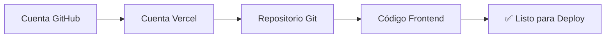
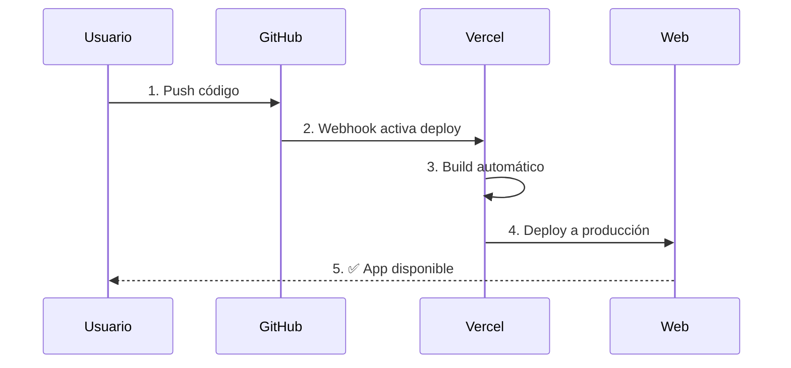
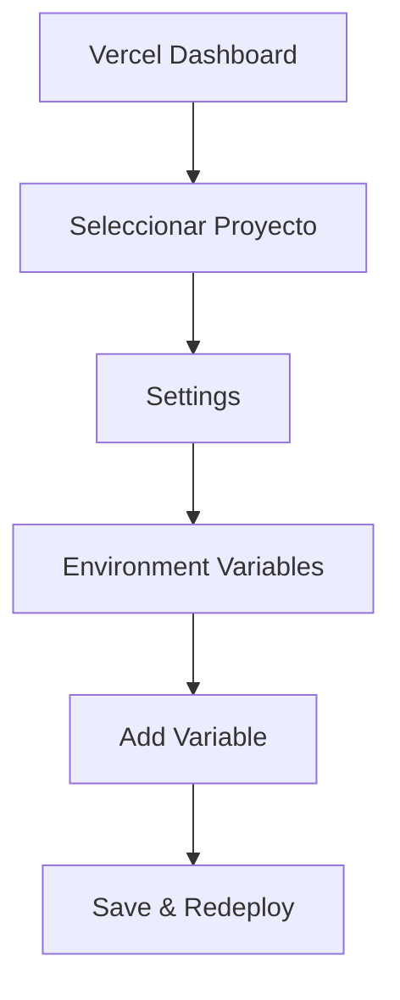
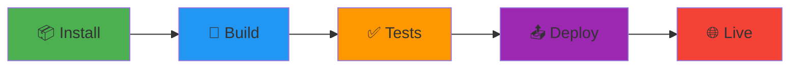
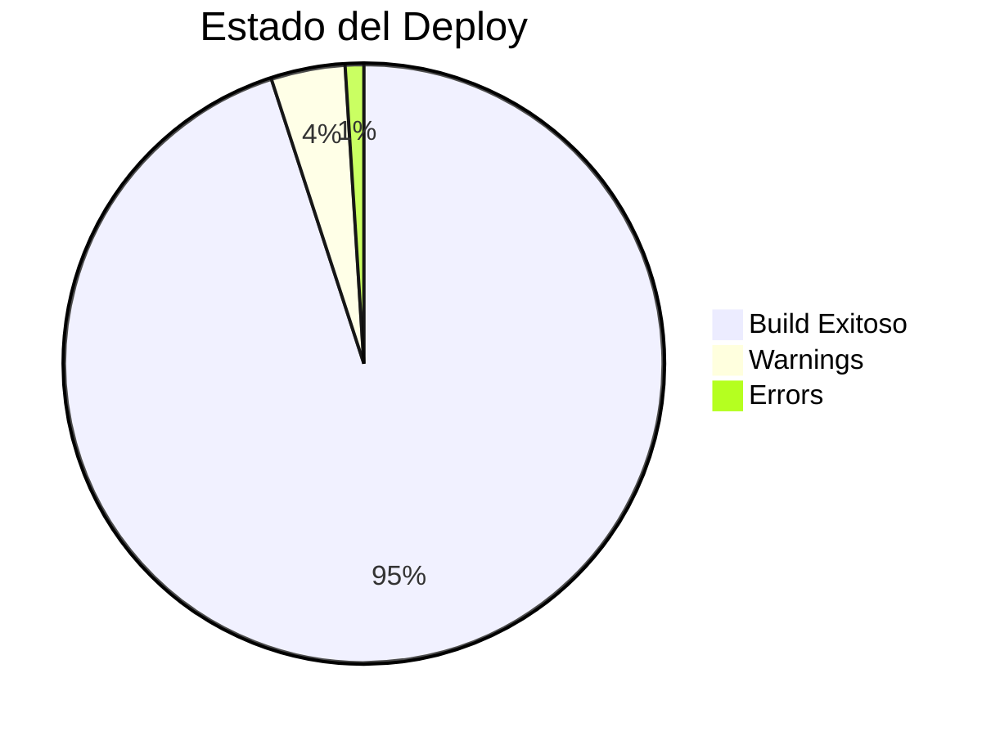
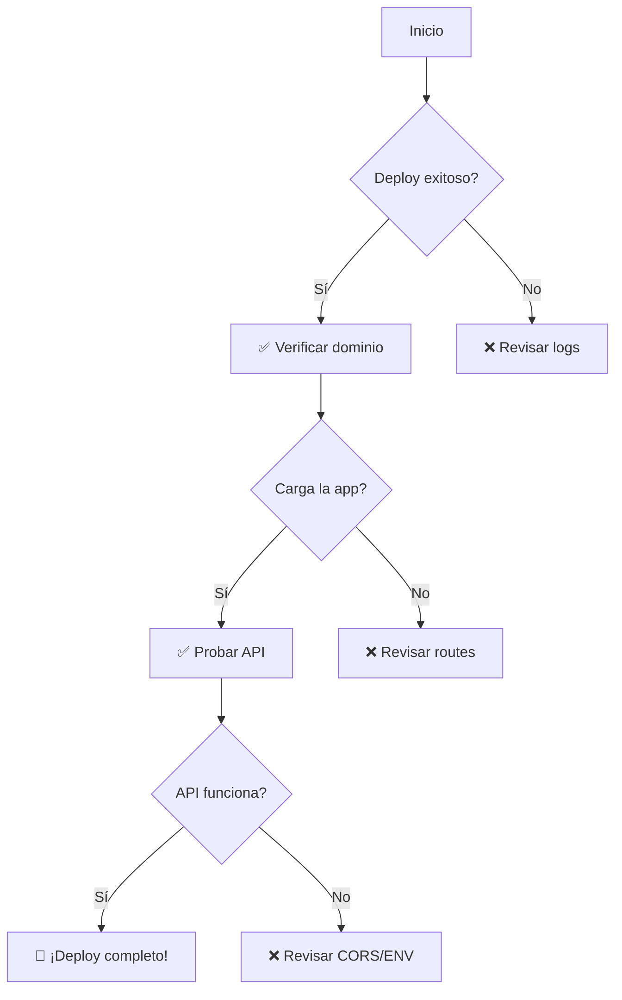
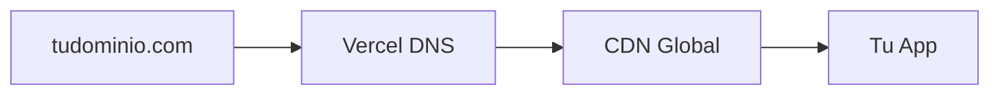
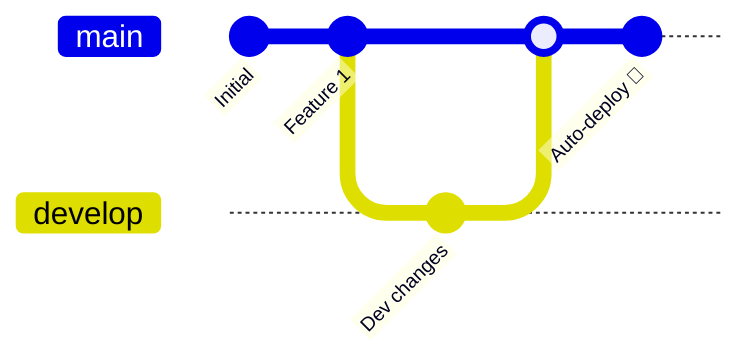

# 🚀 Despliegue del Frontend en Vercel

> **Guía visual para deployar RED-RED en Vercel**

## 📋 Tabla de Contenidos

- [Pre-requisitos](#pre-requisitos)
- [Configuración del Proyecto](#configuración-del-proyecto)
- [Despliegue](#despliegue)
- [Variables de Entorno](#variables-de-entorno)
- [Solución de Problemas](#solución-de-problemas)

---

## 🎯 Pre-requisitos



### ✅ Checklist

- [ ] Cuenta en [Vercel](https://vercel.com)
- [ ] Repositorio en GitHub con el código
- [ ] Proyecto Next.js configurado
- [ ] Variables de entorno preparadas

---

## ⚙️ Configuración del Proyecto

### 1. **Estructura del Frontend**

```
frontend/
├── 📄 next.config.mjs    # Configuración Next.js
├── 📄 vercel.json        # Configuración Vercel
├── 📄 package.json       # Dependencias
├── app/                  # Páginas y rutas
├── components/           # Componentes React
└── public/              # Archivos estáticos
```

### 2. **Configuración `vercel.json`**

```json
{
  "version": 2,
  "builds": [
    {
      "src": "package.json",
      "use": "@vercel/static-build",
      "config": {
        "distDir": "build"
      }
    }
  ],
  "routes": [
    {
      "src": "/static/(.*)",
      "headers": {
        "cache-control": "s-maxage=31536000,immutable"
      },
      "dest": "/static/$1"
    },
    {
      "src": "/(.*\\.(png|jpg|jpeg|gif|svg|ico|webp))",
      "dest": "/$1"
    },
    {
      "src": "/(.*)",
      "dest": "/index.html"
    }
  ]
}
```

**📌 Puntos clave:**
- ✨ **Builds**: Usa `@vercel/static-build` para compilar
- 🗂️ **DistDir**: Los archivos compilados van a `build/`
- 🔄 **Routes**: Maneja rutas SPA correctamente
- ⚡ **Cache**: Optimización de archivos estáticos

### 3. **Configuración `next.config.mjs`**

```javascript
/** @type {import('next').NextConfig} */
const nextConfig = {
  typescript: {
    ignoreBuildErrors: true,  // ⚠️ Para builds rápidos
  },
  images: {
    unoptimized: true,        // 🖼️ Sin optimización de imágenes
  },
}

export default nextConfig
```

---

## 🎬 Despliegue

### **Método 1: Deploy desde GitHub** (Recomendado)



#### Pasos:

1. **Accede a Vercel**
   ```bash
   https://vercel.com/dashboard
   ```

2. **Importar Proyecto**
   - Click en `New Project`
   - Selecciona tu repositorio de GitHub
   - Busca: `RED-RED` o el nombre de tu repo

3. **Configurar Build**
   ```yaml
   Framework Preset: Create React App
   Build Command: npm run build
   Output Directory: build
   Install Command: npm install
   ```

4. **Deploy** 🚀
   - Click en `Deploy`
   - Espera ~2-3 minutos
   - ✅ ¡Listo!

### **Método 2: Deploy desde CLI**

```bash
# 1. Instalar Vercel CLI
npm i -g vercel

# 2. Login
vercel login

# 3. Navegar al frontend
cd frontend

# 4. Deploy
vercel

# 5. Deploy a producción
vercel --prod
```

---

## 🔐 Variables de Entorno

### Configurar en Vercel Dashboard



### Variables Necesarias:

```bash
# API Backend
REACT_APP_API_URL=https://tu-usuario.pythonanywhere.com

# WebSocket Backend
REACT_APP_WS_URL=wss://tu-usuario.pythonanywhere.com

# Entorno
NODE_ENV=production
```

### 📝 Añadir Variables:

1. Ve a tu proyecto en Vercel
2. `Settings` → `Environment Variables`
3. Añade cada variable:
   ```
   Name:  REACT_APP_API_URL
   Value: https://tubackend.pythonanywhere.com
   Environment: Production, Preview, Development
   ```
4. Click `Save`
5. **Redeploy** el proyecto

---

## 🎨 Proceso de Build



### Timeline típico:

| Fase | Tiempo | Descripción |
|------|--------|-------------|
| 🔍 **Clone** | 5s | Clona el repositorio |
| 📦 **Install** | 30-60s | Instala dependencias |
| 🔧 **Build** | 60-90s | Compila el proyecto |
| 📤 **Deploy** | 10-20s | Sube a CDN |
| ✅ **Total** | **~2-3min** | Deploy completo |

---

## 🚨 Solución de Problemas

### ❌ Error: "Build Failed"

**Causa:** Errores de TypeScript o ESLint

**Solución:**
```json
// next.config.mjs
{
  typescript: {
    ignoreBuildErrors: true
  },
  eslint: {
    ignoreDuringBuilds: true
  }
}
```

### ❌ Error: "Module not found"

**Causa:** Dependencia no instalada

**Solución:**
```bash
npm install [nombre-paquete]
git add package.json package-lock.json
git commit -m "Add missing dependency"
git push
```

### ❌ Error: "API calls failing"

**Causa:** Variables de entorno incorrectas

**Solución:**
1. Verifica `REACT_APP_API_URL` en Vercel
2. Asegúrate de que el backend permite CORS
3. Redeploy después de cambiar variables

### ❌ Rutas no funcionan (404)

**Causa:** SPA routing no configurado

**Solución:** Ya está configurado en `vercel.json`:
```json
{
  "src": "/(.*)",
  "dest": "/index.html"
}
```

---

## 📊 Monitoreo Post-Deploy



### Panel de Control:

- 📈 **Analytics**: `vercel.com/[usuario]/[proyecto]/analytics`
- 🔍 **Logs**: `vercel.com/[usuario]/[proyecto]/logs`
- ⚡ **Performance**: `vercel.com/[usuario]/[proyecto]/speed-insights`

---

## ✅ Checklist Final



- [ ] Build completado sin errores
- [ ] App carga en el dominio de Vercel
- [ ] Variables de entorno configuradas
- [ ] Conexión con backend funciona
- [ ] Rutas SPA funcionan correctamente
- [ ] Assets e imágenes cargan bien
- [ ] WebSocket conecta (para streaming/chat)

---

## 🎯 Dominio Personalizado (Opcional)

### Añadir dominio propio:

1. **Vercel Dashboard** → Tu proyecto
2. `Settings` → `Domains`
3. `Add Domain` → Introduce tu dominio
4. Configura DNS según instrucciones
5. Espera propagación (~24h máximo)



---

## 🔄 Deploys Automáticos

**Con GitHub conectado:**



- ✅ **Push a `main`** → Deploy a producción
- ✅ **Push a `develop`** → Preview deploy
- ✅ **Pull Request** → Preview automático

---

## 📚 Recursos Adicionales

- 📖 [Documentación Vercel](https://vercel.com/docs)
- 🎓 [Next.js Deploy Guide](https://nextjs.org/docs/deployment)
- 💬 [Vercel Community](https://github.com/vercel/vercel/discussions)

---