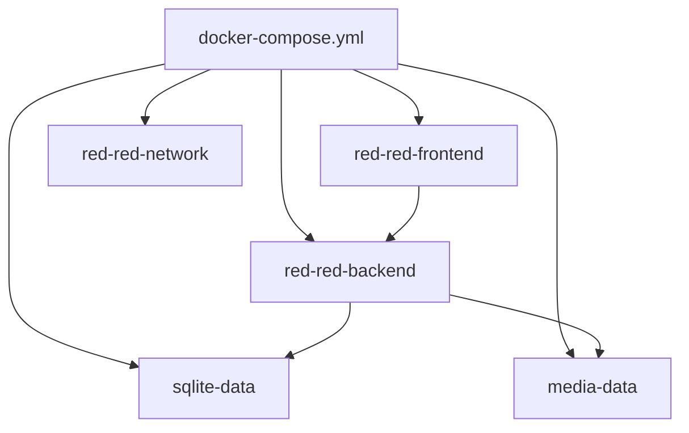

# Docker en Produccion: Estructura Tecnica (RED-RED)

## Alcance

Este documento explica unicamente como estan formados:

1. El Dockerfile del backend
2. El Dockerfile del frontend
3. El archivo docker-compose.yml

No se incluyen pasos operativos de despliegue.

---

## Vision general de la composicion

La arquitectura containerizada del proyecto se divide en dos servicios de aplicacion y recursos compartidos:

- Servicio backend: Django + Daphne (ASGI)
- Servicio frontend: React (CRA con react-scripts)
- Volumen de persistencia para SQLite
- Volumen de persistencia para archivos multimedia
- Red bridge dedicada para comunicacion interna

---

## Estructura del Dockerfile del backend

Ruta: `backend/Dockerfile`

### 1. Imagen base y entorno de runtime

- Base: `python:3.11-slim`
- Variables de entorno:
  - `PYTHONDONTWRITEBYTECODE=1`
  - `PYTHONUNBUFFERED=1`
  - `DJANGO_SETTINGS_MODULE=config.settings`

Objetivo estructural:

- Ejecutar Python con logs inmediatos y sin archivos bytecode.
- Fijar el modulo de configuracion de Django desde el contenedor.

### 2. Directorio de trabajo

- `WORKDIR /app`

Objetivo estructural:

- Unificar la raiz de ejecucion y copia de codigo dentro de la imagen.

### 3. Dependencias del sistema operativo

Instala paquetes del sistema (apt):

- `gcc`
- `libpq-dev`
- `libjpeg-dev`
- `zlib1g-dev`

Objetivo estructural:

- Cubrir compilacion y librerias nativas necesarias para dependencias Python.

### 4. Dependencias Python

- Copia `requirements.txt` desde la raiz del repositorio.
- Ejecuta `pip install --no-cache-dir -r requirements.txt`.

Objetivo estructural:

- Construir una capa de dependencias Python separada del codigo de aplicacion.

### 5. Codigo de aplicacion

- Copia `backend/` al contenedor.

Objetivo estructural:

- Incluir el proyecto Django y su configuracion ASGI/WSGI.

### 6. Estructura de directorios internos

Crea rutas para:

- `logs`
- `media/cover_pics`
- `media/posts`
- `media/profile_pics`
- `media/stories`
- `staticfiles`
- `/app/db_storage`

Objetivo estructural:

- Predefinir puntos de escritura y rutas de persistencia para runtime.

### 7. Paso de estaticos y arranque

- Ejecuta `collectstatic`.
- Expone puerto `8000`.
- `CMD` encadena:
  - creacion del directorio de datos
  - migraciones Django
  - arranque de Daphne sobre `config.asgi:application`

Objetivo estructural:

- Contenedor backend listo para trafico HTTP y WebSocket en ASGI.

---

## Estructura del Dockerfile del frontend

Ruta: `frontend/Dockerfile`

### 1. Imagen base y variables

- Base: `node:20-alpine`
- Variables:
  - `CI=false`
  - `NODE_ENV=development`

Objetivo estructural:

- Usar runtime Node ligero con comportamiento controlado de instalacion/ejecucion.

### 2. Directorio de trabajo

- `WORKDIR /app`

Objetivo estructural:

- Centralizar instalacion de dependencias y codigo fuente en una ruta estable.

### 3. Dependencias Node

- Copia `package.json` y `package-lock.json*`.
- Ejecuta `npm install --legacy-peer-deps`.

Objetivo estructural:

- Resolver dependencias del cliente respetando lockfile cuando existe.

### 4. Codigo fuente y puertos

- Copia todo el proyecto frontend al contenedor.
- Expone puerto `3000`.

Objetivo estructural:

- Preparar el runtime de React con su puerto de servicio.

### 5. Configuracion de red interna y comando

- Define:
  - `HOST=0.0.0.0`
  - `PORT=3000`
- Ejecuta `npx react-scripts start`.

Objetivo estructural:

- Permitir escucha en todas las interfaces del contenedor para acceso externo al servicio.

---

## Estructura del docker-compose.yml

Ruta: `docker-compose.yml`

### 1. Nombre del stack

- `name: red-red-social-network`

Objetivo estructural:

- Agrupar recursos Docker (contenedores, red, volumenes) bajo identidad comun.

### 2. Servicio backend

Servicio: `red-red-backend`

- `container_name: red-red-backend`
- `build.context: .`
- `build.dockerfile: backend/Dockerfile`
- `ports: 8000:8000`
- `env_file: ./backend/.env.docker`
- `volumes`:
  - `sqlite-data:/app/db_storage`
  - `media-data:/app/media`
- `restart: unless-stopped`
- `networks: red-red-network`

Objetivo estructural:

- Ejecutar backend con persistencia de base de datos y media fuera del filesystem efimero del contenedor.

### 3. Servicio frontend

Servicio: `red-red-frontend`

- `container_name: red-red-frontend`
- `build.context: ./frontend`
- `build.dockerfile: Dockerfile`
- `ports: 3000:3000`
- `env_file: ./frontend/.env.docker`
- `depends_on: red-red-backend`
- `restart: unless-stopped`
- `networks: red-red-network`

Objetivo estructural:

- Ejecutar frontend en contenedor separado y conectado a la misma red interna del backend.

### 4. Volumenes declarados

- `sqlite-data`
  - `name: red-red-db-sqlite`
  - `driver: local`
- `media-data`
  - `name: red-red-media`
  - `driver: local`

Objetivo estructural:

- Mantener persistencia de datos y ficheros entre recreaciones de contenedores.

### 5. Red declarada

- `red-red-network`
  - `name: red-red-social-network`
  - `driver: bridge`

Objetivo estructural:

- Aislar la comunicacion interna del stack y habilitar resolucion por nombre de servicio.

---

## Resumen estructural

La composicion Docker del proyecto esta formada por:

- Un contenedor backend orientado a Django ASGI (Daphne)
- Un contenedor frontend orientado a React (react-scripts)
- Persistencia explicita mediante volumenes dedicados
- Enlace entre servicios por red bridge de proyecto

Esta estructura separa responsabilidades por servicio y concentra la orquestacion en un unico `docker-compose.yml`.
