# 🛡️ Panel Administrativo - RED-RED

> **Sistema completo de administración y moderación para RED-RED**

## 📋 Tabla de Contenidos

- [Visión General](#visión-general)
- [Dashboard Principal](#dashboard-principal)
- [Gestión de Usuarios](#gestión-de-usuarios)
- [Moderación de Contenido](#moderación-de-contenido)
- [Configuración del Sitio](#configuración-del-sitio)
- [Logs y Auditoría](#logs-y-auditoría)
- [Permisos y Roles](#permisos-y-roles)

---

## 🎯 Visión General

El panel administrativo es una interfaz centralizada que permite a los administradores y moderadores gestionar todos los aspectos de la plataforma RED-RED.

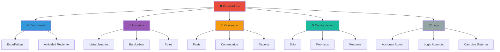

### Roles Administrativos:

| Rol | Nivel | Permisos |
|-----|-------|----------|
| Super Admin | 🔴 Máximo | Acceso total al sistema |
| Admin | 🟠 Alto | Gestión usuarios y contenido |
| Moderador | 🟡 Medio | Moderación de contenido |
| Support | 🟢 Básico | Ver reportes y responder |

---

## 📊 Dashboard Principal

### Visión General del Sistema:

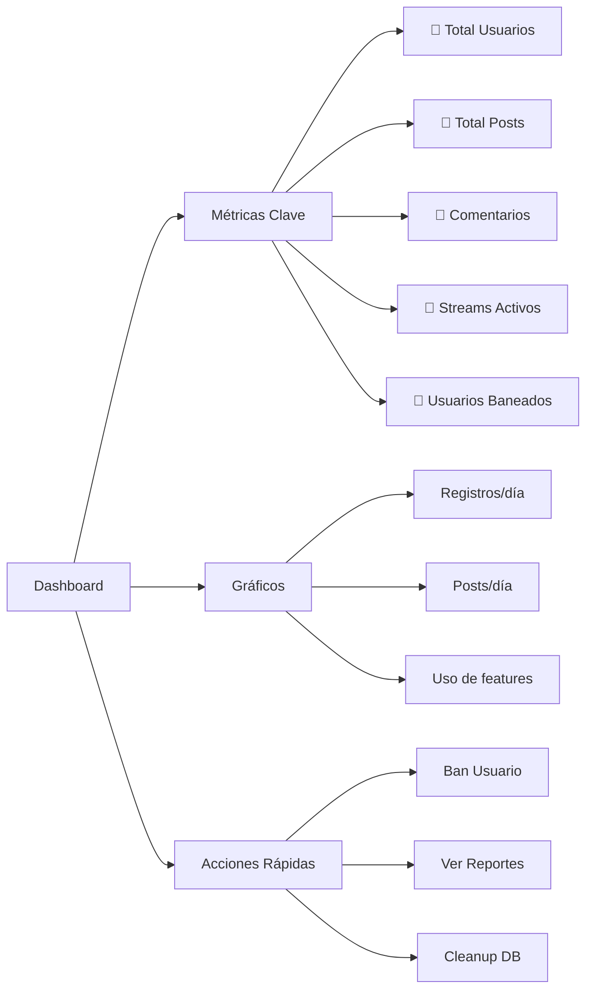

### Cards de Estadísticas:

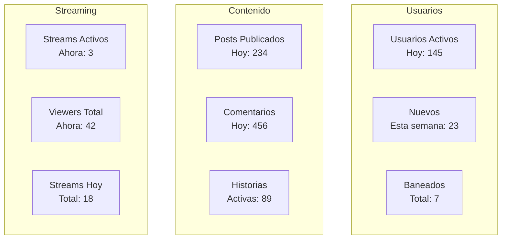

### Gráficas de Actividad:

**Gráfica de Usuarios (Últimos 7 días):**
- Línea temporal de registros diarios
- Comparación con semana anterior
- Picos de actividad marcados

**Gráfica de Contenido:**
- Posts por día
- Comentarios por día
- Stories creadas por día

**Mapa de Calor:**
- Actividad por hora del día
- Días más activos de la semana
- Features más usadas

---

## 👥 Gestión de Usuarios

### Panel de Usuarios:

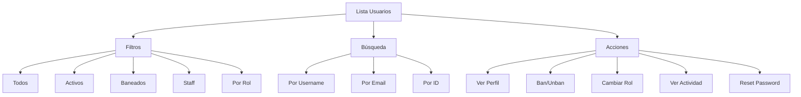

### Información de Usuario:

**Card de Usuario incluye:**

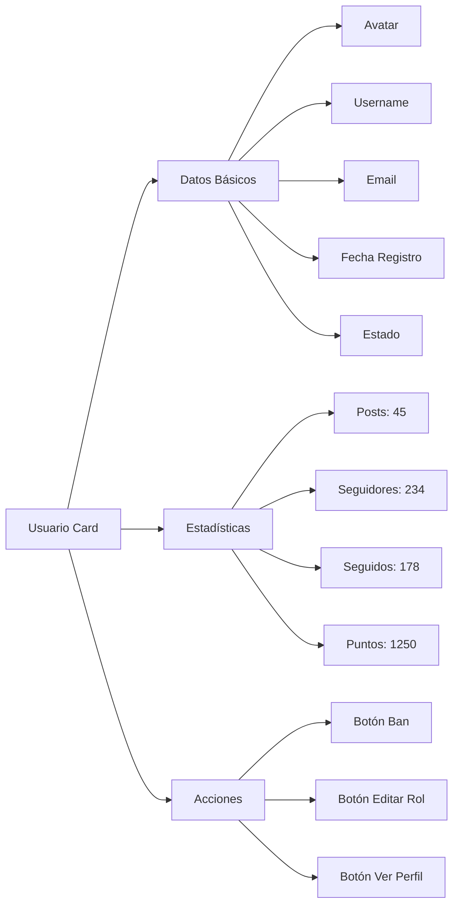

### Sistema de Baneos:

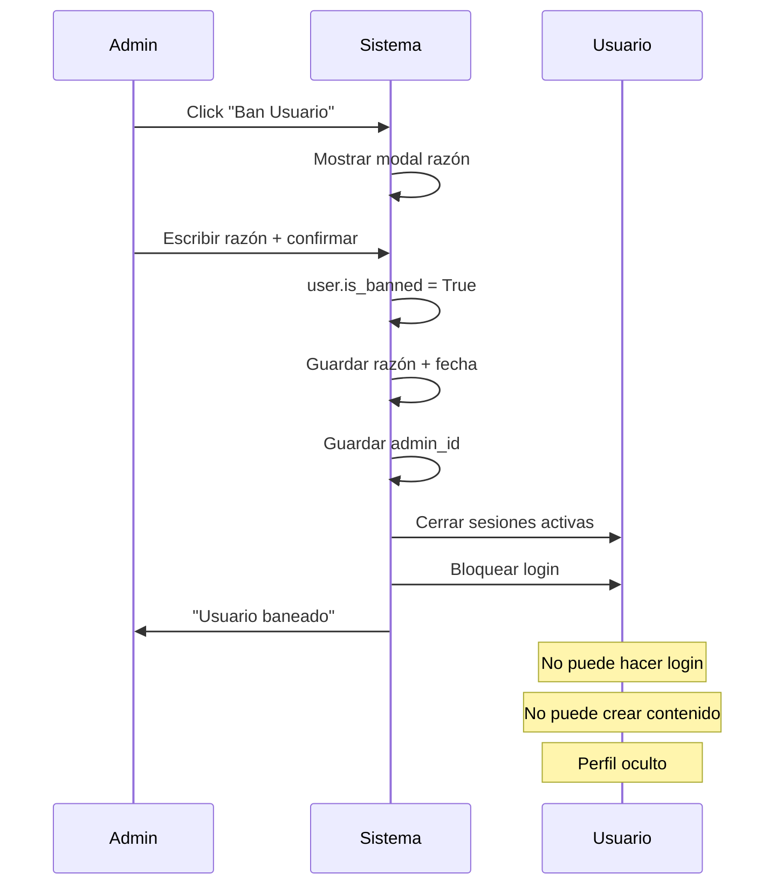

### Desbanear Usuario:

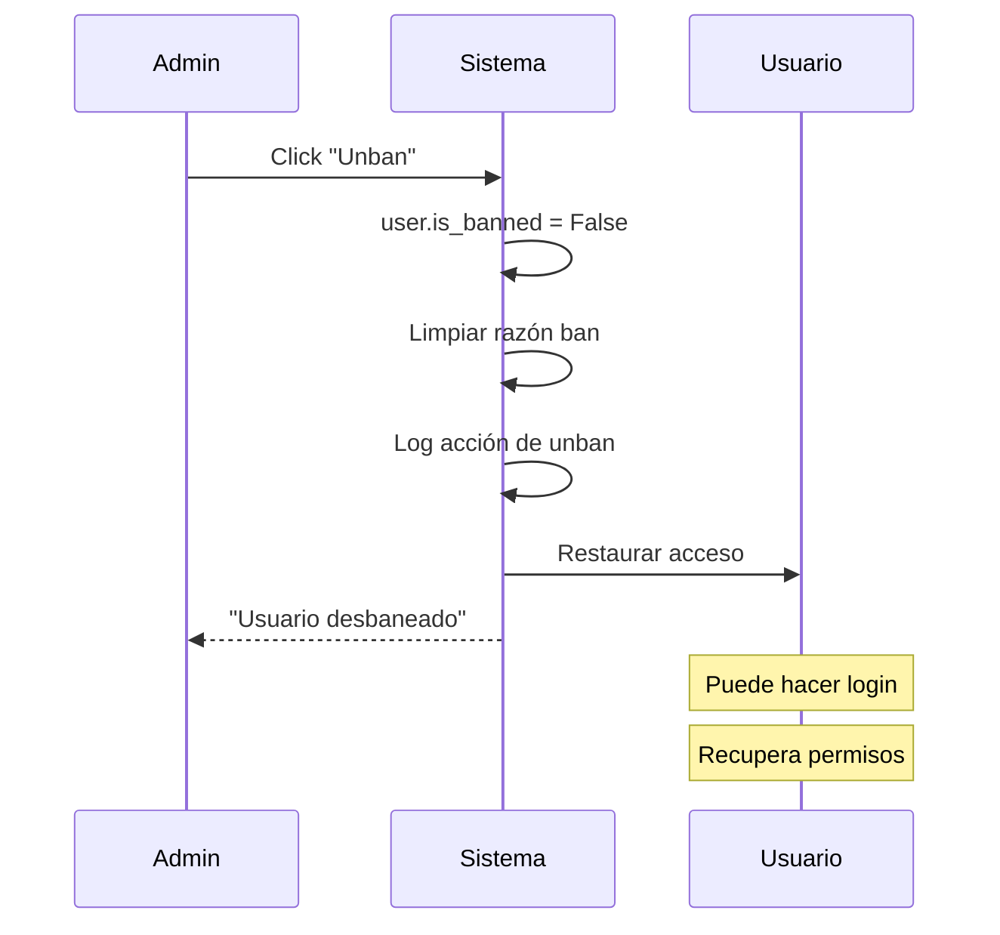

### Gestión de Roles:

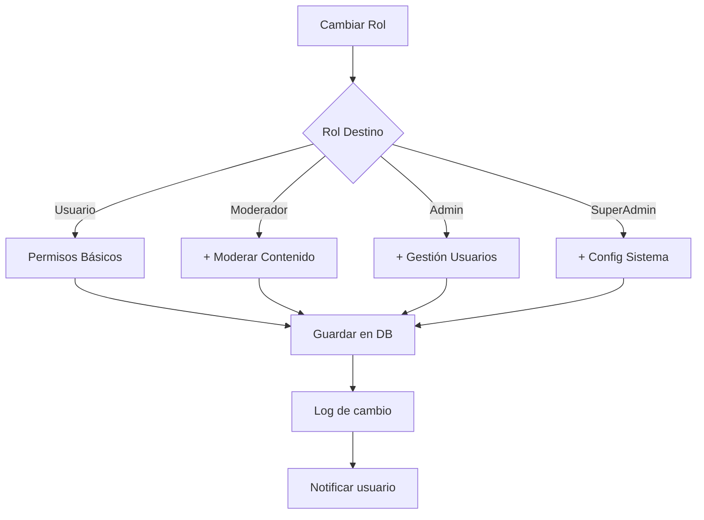

**Matriz de Permisos por Rol:**

| Acción | Usuario | Moderador | Admin | Super Admin |
|--------|---------|-----------|-------|-------------|
| Crear contenido | ✅ | ✅ | ✅ | ✅ |
| Eliminar propio contenido | ✅ | ✅ | ✅ | ✅ |
| Eliminar contenido ajeno | ❌ | ✅ | ✅ | ✅ |
| Ver reportes | ❌ | ✅ | ✅ | ✅ |
| Banear usuarios | ❌ | ❌ | ✅ | ✅ |
| Cambiar roles | ❌ | ❌ | ❌ | ✅ |
| Acceder panel admin | ❌ | ✅ | ✅ | ✅ |
| Configurar sitio | ❌ | ❌ | ❌ | ✅ |
| Ver logs sistema | ❌ | ❌ | ✅ | ✅ |

---

## 📝 Moderación de Contenido

### Sistema de Reportes:

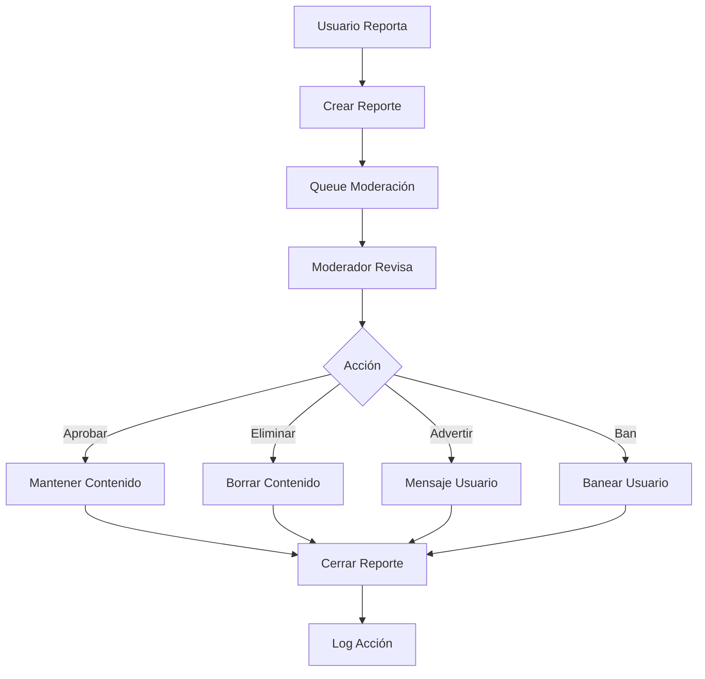

### Dashboard de Moderación:

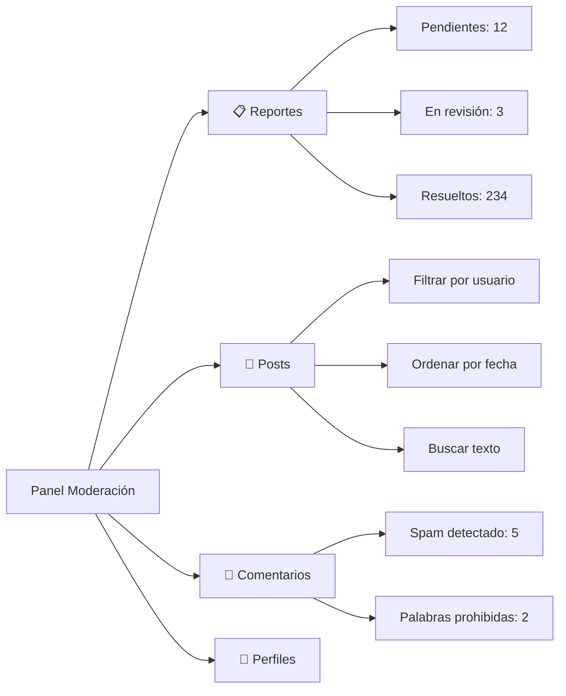

### Tipos de Reportes:

| Tipo | Descripción | Acción Típica |
|------|-------------|---------------|
| Spam | Contenido repetitivo | Eliminar + advertencia |
| Acoso | Ataques personales | Ban temporal/permanente |
| Contenido Inapropiado | Violación normas | Eliminar contenido |
| Información Falsa | Desinformación | Review manual |
| Copyright | Violación derechos | Eliminar + notificar |
| Suplantación | Fake account | Ban permanente |

### Flujo de Revisión:

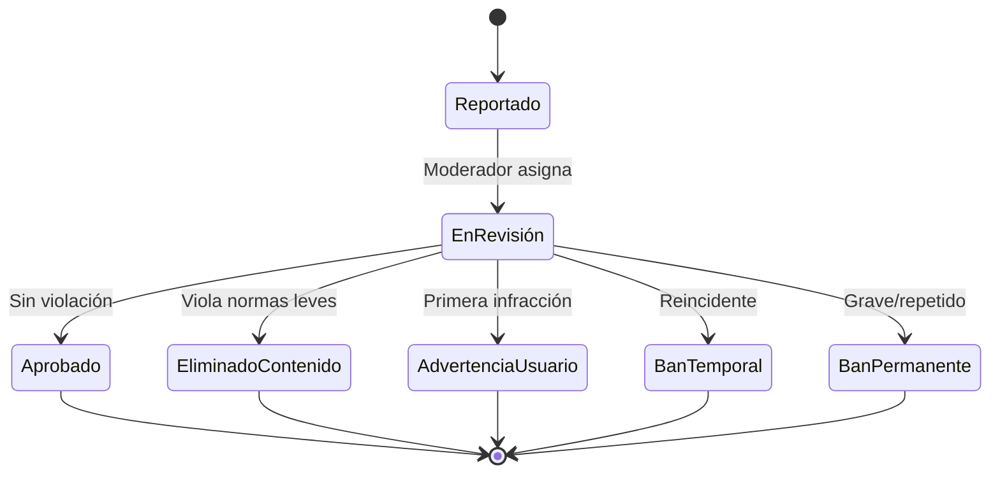

### Panel de Moderación Rápida:

**Vista de Reporte:**
- Contenido reportado
- Usuario reportado
- Razón del reporte
- Histórico del usuario
- Reportes previos

**Acciones Disponibles:**
- ✅ Aprobar (no viola normas)
- 🗑️ Eliminar contenido
- ⚠️ Advertir usuario
- 🔇 Silenciar temporalmente
- 🚫 Ban temporal (7/30 días)
- 🔴 Ban permanente

---

## ⚙️ Configuración del Sitio

### Panel de Configuración:

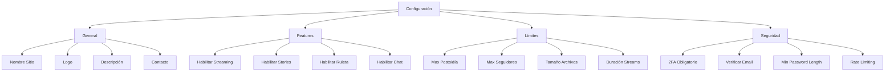

### Configuraciones Principales:

#### **Features Toggles:**

| Feature | Estado | Descripción |
|---------|--------|-------------|
| 🎥 Streaming | ON/OFF | Habilitar sistema de live streaming |
| 📖 Stories | ON/OFF | Habilitar historias temporales |
| 🎰 Ruleta | ON/OFF | Sistema de recompensas |
| 💬 Chat | ON/OFF | Chat en tiempo real |
| 🔔 Notificaciones | ON/OFF | Push notifications |
| 🌙 Modo Oscuro | ON/OFF | Tema oscuro por defecto |

#### **Límites del Sistema:**

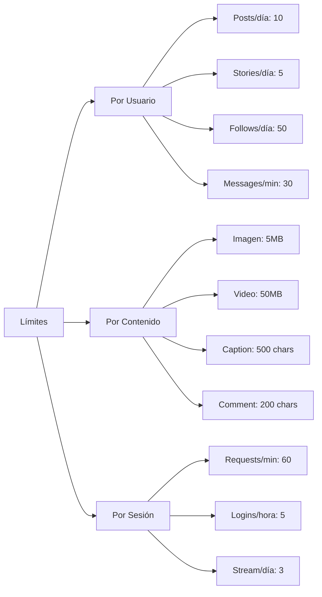

#### **Configuración de Seguridad:**

- **Autenticación:**
  - Longitud mínima contraseña: 8 caracteres
  - Requerir mayúsculas/números: Sí/No
  - 2FA obligatorio: Sí/No
  - Expiración token JWT: 24 horas

- **Rate Limiting:**
  - Requests por minuto: 60
  - Login attempts: 5 intentos/hora
  - API calls: 100/hora

- **Moderación Automática:**
  - Filtro de palabras prohibidas: ON/OFF
  - Detección de spam: ON/OFF
  - Auto-ban tras X reportes: 5 reportes

---

## 📋 Logs y Auditoría

### Sistema de Logging:

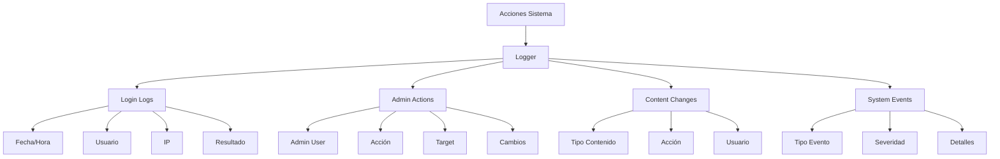

### Tipos de Logs:

#### **1. Login Attempts:**

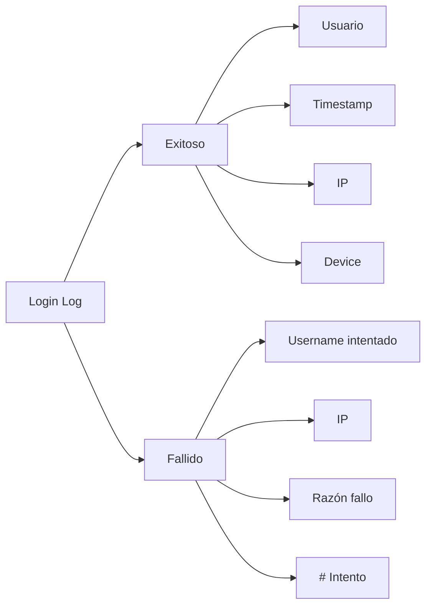

| Campo | Descripción | Ejemplo |
|-------|-------------|---------|
| Timestamp | Fecha y hora | 2024-01-15 14:30:22 |
| Usuario | Username | @usuario123 |
| IP | Dirección IP | 192.168.1.100 |
| Estado | Éxito/Fallo | ✅ Exitoso |
| Device | User agent | Chrome/Windows |

#### **2. Admin Actions:**

Registra todas las acciones administrativas:

| Acción | Admin | Target | Timestamp | Detalles |
|--------|-------|--------|-----------|----------|
| Ban Usuario | @admin1 | @usuario5 | 10:30 AM | Razón: Spam |
| Cambiar Rol | @admin1 | @user2 | 11:45 AM | User → Moderador |
| Eliminar Post | @mod1 | Post #123 | 12:15 PM | Violación normas |
| Cambiar Config | @superadmin | Site | 14:00 PM | Max posts/día: 10→15 |

#### **3. Content Moderation:**

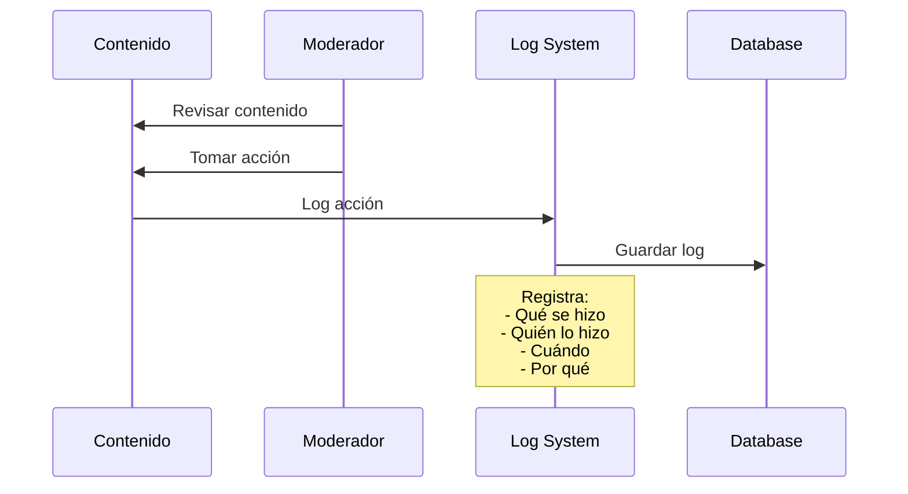

#### **4. System Events:**

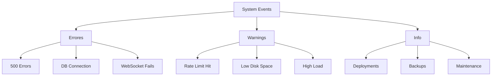

### Búsqueda y Filtrado de Logs:

**Filtros Disponibles:**
- Por rango de fechas
- Por tipo de acción
- Por usuario (actor o target)
- Por nivel de severidad
- Por resultado (success/fail)

**Exportación:**
- CSV para análisis
- JSON para integración
- PDF para reportes

---

## 🔐 Permisos y Roles

### Jerarquía de Roles:

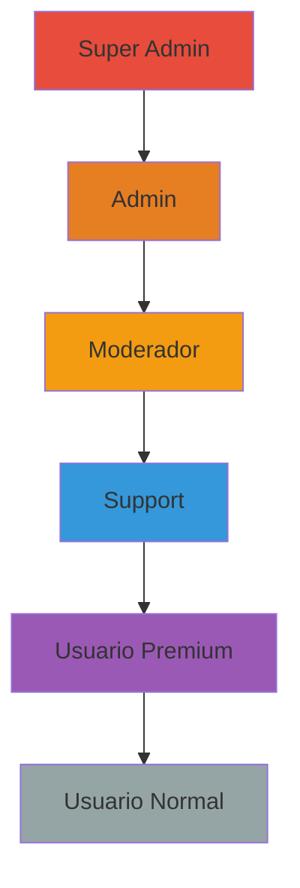

### Permisos Detallados:

#### **Super Admin:**
- ✅ Acceso total al panel
- ✅ Crear/editar/eliminar administradores
- ✅ Cambiar configuración del sitio
- ✅ Ver todos los logs
- ✅ Acceso a base de datos
- ✅ Deploy y mantenimiento
- ✅ Eliminar cualquier contenido
- ✅ Ban/unban usuarios

#### **Admin:**
- ✅ Gestionar usuarios (no otros admins)
- ✅ Ver logs de usuarios
- ✅ Moderar contenido
- ✅ Gestionar reportes
- ✅ Ver estadísticas
- ✅ Ban/unban usuarios normales
- ❌ Cambiar config sistema
- ❌ Modificar otros admins

#### **Moderador:**
- ✅ Revisar reportes
- ✅ Eliminar contenido inapropiado
- ✅ Advertir usuarios
- ✅ Ver logs de moderación
- ❌ Ban permanente
- ❌ Cambiar roles
- ❌ Acceso a configuración

#### **Support:**
- ✅ Ver reportes
- ✅ Responder tickets
- ✅ Ver perfil usuarios
- ❌ Eliminar contenido
- ❌ Ban usuarios
- ❌ Cambiar configuración

### Sistema de Asignación de Roles:

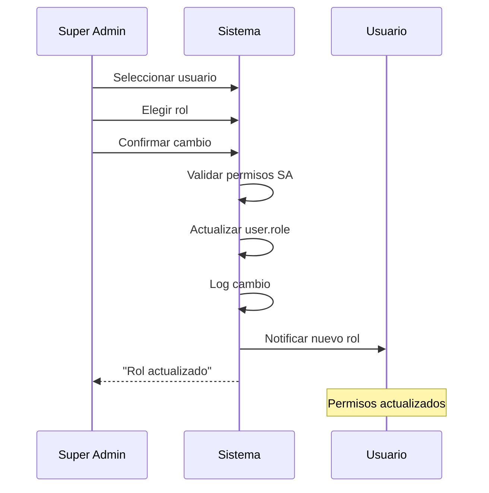

### Auditoría de Permisos:

El sistema registra todos los cambios de roles:

| Timestamp | Admin | Usuario Target | Rol Anterior | Rol Nuevo | Razón |
|-----------|-------|----------------|--------------|-----------|-------|
| 10:30 | @superadmin | @user123 | Usuario | Moderador | Confiable |
| 11:45 | @superadmin | @mod456 | Moderador | Admin | Promoción |
| 14:20 | @superadmin | @admin789 | Admin | Usuario | Abuso poder |

---

## 📊 Reportes y Analíticas

### Dashboard de Analíticas:

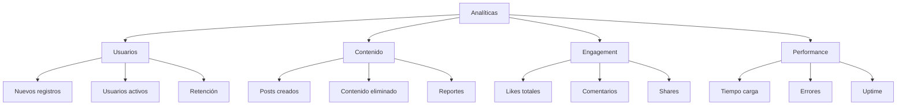

### Métricas Clave (KPIs):

```mermaid
graph LR
    A[KPIs] --> B[DAU/MAU]
    A --> C[Engagement Rate]
    A --> D[Content/User]
    A --> E[Report Rate]
    
    B --> B1[45%]
    C --> C1[3.2/día]
    D --> D1[8 posts/user]
    E --> E1[0.5%]
```

### Reportes Automáticos:

- **Reporte Diario**: Enviado a admins cada mañana
  - Nuevos usuarios
  - Posts creados
  - Reportes abiertos
  - Streams realizados

- **Reporte Semanal**: Resumen de actividad
  - Crecimiento usuarios
  - Engagement metrics
  - Top posts
  - Problemas detectados

- **Reporte Mensual**: Análisis profundo
  - Trends y patrones
  - Comparación con mes anterior
  - Predicciones
  - Recomendaciones

---

## 🚀 Acciones Rápidas

### Herramientas de Administración:

```mermaid
graph TD
    A[Quick Actions] --> B[🧹 Cleanup]
    A --> C[🔄 Maintenance]
    A --> D[📤 Bulk Actions]
    
    B --> B1[Limpiar streams viejos]
    B --> B2[Eliminar logs antiguos]
    B --> B3[Purgar cache]
    
    C --> C1[Reiniciar WebSocket]
    C --> C2[Rebuild index]
    C --> C3[Check DB health]
    
    D --> D1[Ban múltiples users]
    D --> D2[Eliminar posts en masa]
    D --> D3[Enviar notificaciones]
```

### Scripts de Mantenimiento:

#### **Cleanup Streams:**
- Elimina streams finalizados hace más de 24h
- Limpia archivos temporales de streaming
- Actualiza estadísticas

#### **Database Optimization:**
- Vacuum database
- Reindex tablas
- Analizar queries lentas

#### **Backup Automático:**
- Backup diario de base de datos
- Backup semanal de media files
- Retention policy: 30 días

---

## ✅ Checklist de Funcionalidades

- [x] ✅ Dashboard con estadísticas en tiempo real
- [x] ✅ Lista completa de usuarios con filtros
- [x] ✅ Sistema de ban/unban con razones
- [x] ✅ Gestión de roles y permisos
- [x] ✅ Panel de moderación de contenido
- [x] ✅ Sistema de reportes
- [x] ✅ Configuración del sitio
- [x] ✅ Logs de todas las acciones
- [x] ✅ Auditoría completa
- [x] ✅ Búsqueda y filtrado avanzado
- [x] ✅ Acciones rápidas
- [x] ✅ Reportes automáticos
- [x] ✅ Interfaz responsive
- [x] ✅ Protección de rutas (solo admins)

---

## 🎯 Mejores Prácticas

### Para Administradores:

1. **Revisar logs diariamente** para detectar problemas
2. **Responder reportes** en menos de 24 horas
3. **Documentar razones** de bans y acciones importantes
4. **Mantener comunicación** con el equipo de moderación
5. **Backup regular** de datos críticos

### Para Moderadores:

1. **Ser consistente** en decisiones de moderación
2. **Revisar contexto** antes de tomar acción
3. **Advertir antes de banear** (primera infracción leve)
4. **Documentar evidencia** en reportes
5. **Comunicar políticas** claramente

---

## 🔄 Roadmap Futuro

```mermaid
timeline
    title Mejoras Panel Admin
    Actual : Dashboard básico
         : Gestión usuarios
         : Sistema reportes
    Fase 2 : Analytics avanzados
          : Machine learning anti-spam
          : Auto-moderación mejorada
    Fase 3 : Sistema de tickets
          : Chat con usuarios
          : Automated reports
          : A/B testing tools
```

---

## 🎉 Resultado Final

Un panel administrativo completo con:
- 📊 **Dashboard** informativo y en tiempo real
- 👥 **Gestión de usuarios** eficiente con sistema de roles
- 🛡️ **Moderación** de contenido con múltiples herramientas
- ⚙️ **Configuración** flexible del sitio
- 📋 **Auditoría completa** de todas las acciones
- 🚀 **Herramientas** de mantenimiento y optimización

**¡Control total sobre RED-RED!** 🛡️

---