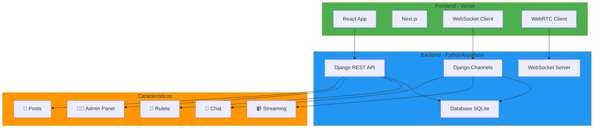
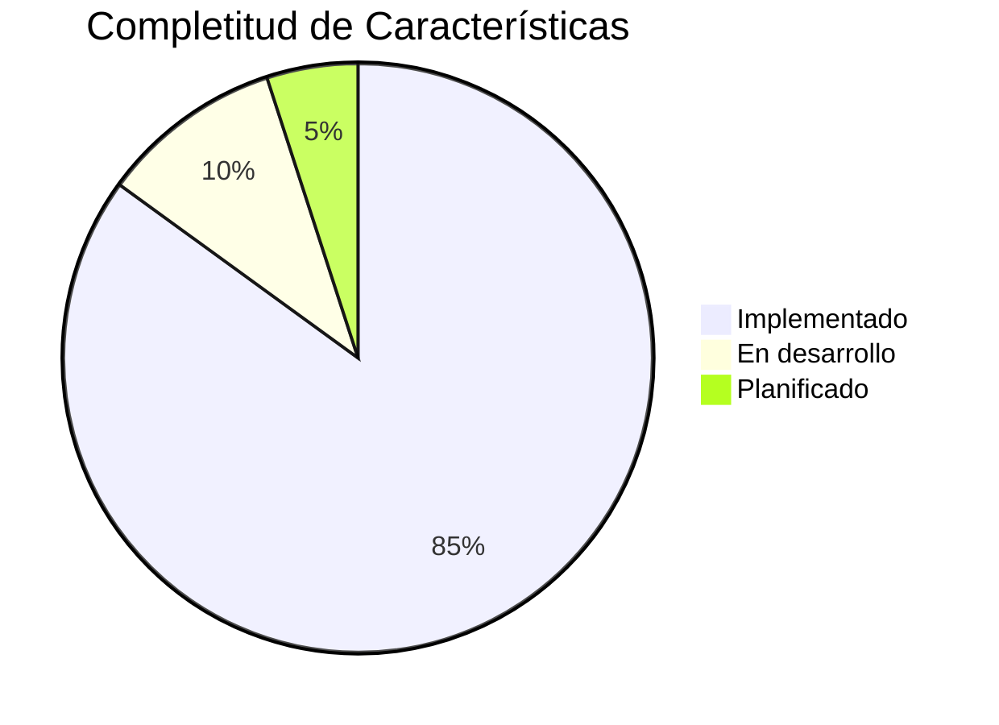

# 📚 Documentación RED-RED - Demo 5

> **Documentación completa del proyecto RED-RED**

## 📋 Índice de Contenidos

¡Bienvenido a la documentación técnica de RED-RED! Aquí encontrarás guías detalladas sobre cada aspecto importante del proyecto.

---

## 🚀 Despliegue y Configuración

### [📘 Despliegue en Vercel (Frontend)](./DESPLIEGUE_VERCEL.md)
**Guía completa para deployar el frontend de RED-RED en Vercel**

- ✅ Configuración paso a paso
- ⚙️ Variables de entorno
- 🔄 Deploy automático desde GitHub
- 🐛 Solución de problemas comunes
- 📊 Monitoreo y analytics

**Ideal para:** Configurar el frontend en producción

---

### [📗 Despliegue en PythonAnywhere (Backend)](./DESPLIEGUE_PYTHONANYWHERE.md)
**Guía completa para deployar el backend Django en PythonAnywhere**

- 🐍 Configuración de Python y Django
- 🗄️ Setup de base de datos
- 🔧 WSGI configuration
- 📦 Gestión de dependencias
- 🔄 Proceso de actualización
- 🐛 Troubleshooting

**Ideal para:** Poner el backend en producción

---

## 🎮 Sistemas del Proyecto

### [📙 Sistema de Streaming en Vivo](./SISTEMA_STREAMING.md)
**Arquitectura completa del sistema de transmisiones en vivo**

- 🎥 WebRTC para video P2P
- 🔌 WebSockets para señalización
- 👥 Gestión de viewers en tiempo real
- 💬 Chat en vivo
- 📊 Estadísticas de streaming
- 🛡️ Sistema de roles (Streamer, Mod, VIP)

**Ideal para:** Entender cómo funciona el streaming

---

### [📕 Sistema de Ruleta y Recompensas](./SISTEMA_RULETA.md)
**Sistema completo de gamificación con ruleta, tienda y personalización**

- 🎰 Ruleta diaria con probabilidades
- 💰 Sistema de puntos
- 🛍️ Tienda de items cosméticos
- 🎒 Inventario de usuario
- ✨ Personalización de perfil
- 📊 Estadísticas de juego

**Ideal para:** Implementar o modificar el sistema de recompensas

---

### [📓 Panel de Administración](./PANEL_ADMINISTRATIVO.md)
**Sistema completo de administración y moderación**

- 👨‍💼 Dashboard con estadísticas
- 👥 Gestión de usuarios
- 🔒 Sistema de roles y permisos
- 🚫 Ban/Unban de usuarios
- ⚙️ Configuración global del sitio
- 📝 Sistema de logs y auditoría
- 🛠️ Scripts de administración

**Ideal para:** Gestionar y moderar la plataforma

---

## 🔌 Tecnologías del Proyecto

### [📘 WebSockets en RED-RED](./WEBSOCKETS.md)
**Comunicación en tiempo real con WebSockets**

- 💬 Chat en tiempo real
- 🔔 Sistema de notificaciones
- 📹WebSockets](./WEBSOCKETS.md) - Comunicación en tiempo real
4. [Seguridad](./SEGURIDAD.md) - Protección y autenticación

#### 👨‍💼 **Administradores**
1. [Panel Administrativo](./PANEL_ADMINISTRATIVO.md) - Gestión completa
2. [Seguridad](./SEGURIDAD.md) - Roles y permisos

#### 🎮 **Product Managers**
1. [Sistema de Ruleta](./SISTEMA_RULETA.md) - Gamificación
2. [Sistema de Streaming](./SISTEMA_STREAMING.md) - Funcionalidad de streams
3. [Panel Administrativo](./PANEL_ADMINISTRATIVO.md
**Medidas de seguridad implementadas**

- 🔐 Autenticación con JWT
- 👮 Sistema de roles y autorización
- 🛡️ Protección contra ataques (CSRF, XSS, SQL Injection)
- 🔌 Seguridad en WebSockets
- 👤 Privacidad de usuarios
- 📝 Auditoría y logs

**Ideal para:** Comprender las medidas de seguridad

---

## 🎯 Guías Rápidas

### Por Tipo de Usuario

#### 👨‍💻 **Desarrolladores**
1. [Despliegue en Vercel](./DESPLIEGUE_VERCEL.md) - Frontend
2. [Despliegue en PythonAnywhere](./DESPLIEGUE_PYTHONANYWHERE.md) - Backend
3. [Sistema de Streaming](./SISTEMA_STREAMING.md) - WebRTC + WebSockets

#### 👨‍💼 **Administradores**
1. [Panel Administrativo](./PANEL_ADMINISTRATIVO.md) - Gestión completa
2. [Sistema de Streaming](./SISTEMA_STREAMING.md#roles-y-permisos) - Moderación de streams

#### 🎮 **Product Managers**
1. [Sistema de Ruleta](./SISTEMA_RULETA.md) - Gamificación
2. [Panel Administrativo](./PANEL_ADMINISTRATIVO.md#dashboard-de-estadísticas) - Métricas

---

## 📊 Diagrama de Arquitectura General



---

## 🛠️ Stack Tecnológico

### Frontend
- ⚛️ **React 18** - UI Framework
- ▲ **Next.js** - React Framework
- 🎨 **TailwindCSS** - Styling
- 🎭 **Framer Motion** - Animations
- 🌐 **WebRTC** - Video streaming
- 🔌 **WebSocket** - Real-time communication

### Backend
- 🐍 **Django 4.2** - Web Framework
- 🔌 **Django Channels** - WebSockets
- 📡 **Daphne** - ASGI Server
- 🗄️ **SQLite** - Database
- 🔐 **JWT** - Authentication
- 📦 **Django REST Framework** - API

### DevOps
- ☁️ **Vercel** - Frontend hosting
- 🐍 **PythonAnywhere** - Backend hosting
- 🔄 **Git/GitHub** - Version control
- 📦 **npm/pip** - Package management

---

## 📈 Estado del Proyecto



### ✅ Características Implementadas

- [x] Sistema de autenticación completo
- [x] Posts con imágenes y hashtags
- [x] Historias (Stories) temporales
- [x] Chat en tiempo real
- [x] Streaming en vivo con WebRTC
- [x] Sistema de ruleta y recompensas
- [x] Panel de administración
- [x] Sistema de notificaciones
- [x] Perfiles personalizables
- [x] Sistema de seguir/seguidos

### 🚧 En Desarrollo

- [ ] Sistema de reacciones a posts
- [ ] Mejoras en moderación automática
- [ ] Analytics avanzado

### 📅 Planificado

- [ ] App móvil nativa
- [ ] Sistema de mensajes grupales
- [ ] Integración con terceros

---

## 🎨 Capturas de Pantalla

### Dashboard Administrativo
```
┌─────────────────────────────────────┐
│  👨‍💼 Panel de Administración         │
├─────────────────────────────────────┤
│                                     │
│  📊 Usuarios: 1,234  📝 Posts: 5,678│
│  🟢 Activos: 856     ❤️ Likes: 12K  │
│                                     │
│  [Usuarios] [Config] [Logs]         │
│                                     │
└─────────────────────────────────────┘
```

### Ruleta de Recompensas
```
┌─────────────────────────────────────┐
│  🎰 Centro de Recompensas           │
├─────────────────────────────────────┤
│                                     │
│         [Ruleta Visual]             │
│                                     │
│  Tiradas: 🎲🎲⚪  Balance: 💰 395   │
│                                     │
│  [Jugar] [Tienda] [Inventario]      │
│                                     │
└─────────────────────────────────────┘
```

---

## 🔗 Enlaces Útiles

### Repositorio y Código
- 📂 [Repositorio GitHub](https://github.com/tu-usuario/RED-RED)
- 🌐 [Frontend en Vercel](https://red-red.vercel.app)
- 🐍 [Backend en PythonAnywhere](https://tu-usuario.pythonanywhere.com)

### Documentación Externa
- 📖 [Django Docs](https://docs.djangoproject.com/)
- ⚛️ [React Docs](https://react.dev/)
- 📡 [WebRTC Guide](https://webrtc.org/getting-started/overview)
- 🔌 [Django Channels](https://channels.readthedocs.io/)

---

## 💡 Consejos de Lectura

### Para Empezar
1. Lee primero las guías de despliegue si necesitas poner el proyecto en producción
2. Revisa el sistema que te interese desarrollar o mantener
3. Consulta el panel administrativo para funciones de gestión

### Para Desarrollo
- Cada documento incluye código de ejemplo
- Los diagramas Mermaid muestran flujos y arquitectura
- Las secciones de "Solución de Problemas" son muy útiles

### Para Gestión
- El panel administrativo tiene métricas y estadísticas
- Los logs te permiten auditar todas las acciones
- La configuración del sitio es flexible y en tiempo real

---

## 🤝 Contribuir

Si quieres contribuir al proyecto:
1. Fork el repositorio
2. Crea una rama para tu feature (`git checkout -b feature/AmazingFeature`)
3. Commit tus cambios (`git commit -m 'Add some AmazingFeature'`)
4. Push a la rama (`git push origin feature/AmazingFeature`)
5. Abre un Pull Request

## 🎉 Agradecimientos

Gracias por usar RED-RED. Esta documentación fue creada con ❤️ para hacer tu experiencia de desarrollo lo más fluida posible.

---

_Última actualización: 26 de enero de 2026_

