# 🔒 Seguridad en RED-RED

> **Medidas de seguridad implementadas en la plataforma**

## 📋 Tabla de Contenidos

- [Visión General](#visión-general)
- [Autenticación](#autenticación)
- [Autorización](#autorización)
- [Protección de Datos](#protección-de-datos)
- [Seguridad en WebSockets](#seguridad-en-websockets)
- [Prevención de Ataques](#prevención-de-ataques)
- [Gestión de Sesiones](#gestión-de-sesiones)
- [Privacidad de Usuario](#privacidad-de-usuario)

---

## 🎯 Visión General

RED-RED implementa múltiples capas de seguridad para proteger los datos de los usuarios y prevenir accesos no autorizados.


---

## 🔐 Autenticación

### Sistema de JWT (JSON Web Tokens)

RED-RED utiliza JWT para autenticar a los usuarios de forma segura y stateless.


### Características de Seguridad JWT:

#### 1. **Tokens de Acceso (Access Tokens)**

- **Duración corta**: Expiran en 15-30 minutos
- **Portabilidad**: Se envían en el header de cada request
- **Stateless**: No requieren almacenamiento en servidor
- **Firmados**: Imposible modificar sin detectar


#### 2. **Tokens de Refresco (Refresh Tokens)**

- **Duración larga**: Válidos por días/semanas
- **Renovación**: Generan nuevos access tokens
- **Revocables**: Pueden invalidarse si hay compromiso
- **Almacenamiento seguro**: HttpOnly cookies (recomendado)


### Flujo de Renovación de Tokens:


### Protección de Contraseñas:


**Características:**
- **Algoritmo**: PBKDF2-SHA256
- **Iteraciones**: 100,000+ (configurable)
- **Salt único**: Por cada contraseña
- **No reversible**: Imposible obtener la contraseña original

---

## 👮 Autorización

### Sistema de Roles:

RED-RED implementa un sistema de roles jerárquico para controlar el acceso a recursos.


### Verificación de Permisos:


### Permisos Granulares:

```mermaid
graph TD
    A[Acción del Usuario] --> B{Tipo de recurso}
    
    B -->|Post| C{Dueño del post?}
    C -->|Sí| D[Permitir editar/eliminar]
    C -->|No| E{Es moderador?}
    E -->|Sí| D
    E -->|No| F[Solo lectura]
    
    B -->|Usuario| G{Usuario objetivo}
    G -->|Sí mismo| H[Editar perfil]
    G -->|Otro| I{Es admin?}
    I -->|Sí| J[Banear/cambiar rol]
    I -->|No| K[Ver perfil público]
```



### Control de Acceso por Recurso:

| Recurso | Usuario | Moderador | Admin |
|---------|---------|-----------|-------|
| Ver posts públicos | ✅ | ✅ | ✅ |
| Crear posts | ✅ | ✅ | ✅ |
| Editar propio post | ✅ | ✅ | ✅ |
| Eliminar propio post | ✅ | ✅ | ✅ |
| Eliminar post ajeno | ❌ | ✅ | ✅ |
| Ver dashboard admin | ❌ | ✅ | ✅ |
| Banear usuarios | ❌ | ✅ | ✅ |
| Cambiar roles | ❌ | ❌ | ✅ |
| Configurar sitio | ❌ | ❌ | ✅ |

---

## 🛡️ Protección de Datos

### HTTPS y Encriptación en Tránsito:


**Características:**
- **TLS 1.3**: Protocolo de encriptación moderno
- **Certificados SSL**: Renovación automática
- **HSTS**: Fuerza HTTPS en el navegador
- **WSS**: WebSockets seguros

### Configuración de Headers de Seguridad:


| Header | Valor | Protección |
|--------|-------|------------|
| `X-Content-Type-Options` | `nosniff` | MIME sniffing |
| `X-Frame-Options` | `DENY` | Clickjacking |
| `X-XSS-Protection` | `1; mode=block` | XSS |
| `Strict-Transport-Security` | `max-age=31536000` | Downgrade attacks |

### Protección de Datos Sensibles:

```mermaid
graph TB
    A[Datos Sensibles] --> B[Contraseñas]
    A --> C[Tokens]
    A --> D[Emails]
    A --> E[Datos Personales]
    
    B --> F[Hasheadas PBKDF2]
    C --> G[Firmados + Expiración]
    D --> H[Encriptados en BD]
    E --> I[Acceso restringido]
    
    style F fill:#2ecc71
    style G fill:#2ecc71
    style H fill:#2ecc71
    style I fill:#2ecc71
```



---

## 🔌 Seguridad en WebSockets

### Autenticación de Conexiones WebSocket:

```mermaid
sequenceDiagram
    participant C as Cliente
    participant WS as WebSocket Server
    participant Auth as Auth Middleware
    
    C->>WS: Conectar + JWT token
    WS->>Auth: Validar token
    
    alt Token válido
        Auth-->>WS: Usuario autenticado
        WS->>WS: Unir a grupos
        WS-->>C: Conexión aceptada
    else Token inválido
        Auth-->>WS: No autenticado
        WS-->>C: Conexión rechazada
        WS->>C: Close connection
    end
```



### Protecciones Específicas:

#### 1. **Validación de Mensajes**

```mermaid
graph TD
    A[Mensaje WebSocket] --> B{Formato válido?}
    B -->|No| C[Rechazar]
    B -->|Sí| D{Usuario autenticado?}
    D -->|No| C
    D -->|Sí| E{Permisos correctos?}
    E -->|No| C
    E -->|Sí| F[Procesar]
```



#### 2. **Rate Limiting en WebSocket**

```mermaid
graph LR
    A[Usuario envía mensaje] --> B{Contador < Límite?}
    B -->|Sí| C[Procesar mensaje]
    B -->|No| D[Throttle/Timeout]
    C --> E[Incrementar contador]
    
    F[Cada minuto] --> G[Reset contador]
```



**Límites implementados:**
- Máximo 100 mensajes por minuto por usuario
- Máximo 10 conexiones simultáneas por usuario
- Timeout de 5 minutos sin actividad

#### 3. **Verificación de Pertenencia a Rooms**

```mermaid
sequenceDiagram
    participant U as Usuario
    participant WS as WebSocket
    participant DB as Database
    
    U->>WS: Enviar mensaje a room
    WS->>DB: Verificar membresía
    
    alt Usuario en room
        DB-->>WS: Pertenece
        WS->>WS: Broadcast mensaje
    else Usuario no en room
        DB-->>WS: No pertenece
        WS-->>U: Error: Acceso denegado
    end
```



---

## 🚫 Prevención de Ataques

### 1. **Protección CSRF (Cross-Site Request Forgery)**

```mermaid
graph TB
    A[Request POST] --> B{CSRF Token válido?}
    B -->|Sí| C[Procesar]
    B -->|No| D[403 Forbidden]
    
    E[Frontend] --> F[Obtener CSRF token]
    F --> G[Incluir en request]
    G --> A
    
    style B fill:#f39c12
    style D fill:#e74c3c
```



**Mecanismo:**
- Token único por sesión
- Incluido en formularios y requests AJAX
- Validado en cada request POST/PUT/DELETE
- Rotación automática

### 2. **Protección XSS (Cross-Site Scripting)**

```mermaid
graph TD
    A[Input de Usuario] --> B[Sanitización]
    B --> C[Escape HTML]
    C --> D[Validación]
    D --> E[Almacenar]
    
    F[Renderizar] --> G[Escape automático]
    G --> H[Mostrar en UI]
    
    style B fill:#2ecc71
    style C fill:#2ecc71
    style G fill:#2ecc71
```



**Protecciones:**
- Sanitización automática de inputs
- Escape de HTML en outputs
- Content Security Policy headers
- No ejecución de scripts inline

### 3. **Protección SQL Injection**

```mermaid
graph LR
    A[Query] --> B[ORM Django]
    B --> C[Prepared Statements]
    C --> D[Parámetros escapados]
    D --> E[Query seguro]
    
    style B fill:#2ecc71
    style C fill:#2ecc71
```



**Características:**
- Django ORM previene inyecciones
- Prepared statements automáticos
- Validación de tipos
- Sin queries raw sin validar

### 4. **Rate Limiting**


**Límites por Endpoint:**

| Endpoint | Límite | Ventana |
|----------|--------|---------|
| Login | 5 intentos | 15 min |
| Registro | 3 intentos | 1 hora |
| API general | 100 requests | 1 min |
| WebSocket messages | 100 mensajes | 1 min |
| Upload archivos | 10 uploads | 1 hora |

### 5. **Validación de Input**

```mermaid
graph TB
    A[Input Usuario] --> B{Tipo correcto?}
    B -->|No| C[Error 400]
    B -->|Sí| D{Longitud válida?}
    D -->|No| C
    D -->|Sí| E{Formato válido?}
    E -->|No| C
    E -->|Sí| F{Sanitizado?}
    F -->|No| G[Sanitizar]
    G --> H[Procesar]
    F -->|Sí| H
```

**Validaciones implementadas:**
- Longitud máxima de textos
- Formato de emails
- Tipos de archivos permitidos
- Tamaño máximo de uploads
- Caracteres permitidos en usernames

---

## 🔑 Gestión de Sesiones

### Ciclo de Vida de Sesión:

```mermaid
stateDiagram-v2
    [*] --> Login: Usuario ingresa
    Login --> Activa: Credenciales válidas
    Activa --> Renovada: Actividad del usuario
    Renovada --> Activa
    Activa --> Expirada: Timeout inactividad
    Activa --> Cerrada: Logout manual
    Expirada --> [*]
    Cerrada --> [*]
```

### Características de Seguridad:

#### 1. **Tokens con Expiración**

```mermaid
timeline
    title Vida de un Access Token
    15:00 : Login exitoso
         : Token generado
    15:15 : Uso activo
         : Token válido
    15:30 : Token expira
         : Requiere refresh
    15:31 : Nuevo token
         : Ciclo continúa
```

#### 2. **Cierre de Sesión Seguro**

```mermaid
sequenceDiagram
    participant U as Usuario
    participant F as Frontend
    participant API as Backend
    
    U->>F: Click Logout
    F->>API: POST /logout/
    API->>API: Invalidar refresh token
    API-->>F: Logout exitoso
    F->>F: Eliminar tokens
    F->>F: Limpiar localStorage
    F-->>U: Redirigir a login
```

#### 3. **Detección de Sesiones Sospechosas**

```mermaid
graph TD
    A[Nueva sesión] --> B{IP conocida?}
    B -->|No| C[Alertar usuario]
    B -->|Sí| D{Dispositivo conocido?}
    D -->|No| C
    D -->|Sí| E{Ubicación usual?}
    E -->|No| C
    E -->|Sí| F[Permitir]
```

---

## 👤 Privacidad de Usuario

### Control de Visibilidad:

```mermaid
graph TB
    A[Perfil de Usuario] --> B[Público]
    A --> C[Solo Seguidores]
    A --> D[Privado]
    
    B --> E[Todos ven posts]
    C --> F[Solo seguidores ven]
    D --> G[Solo tú ves]
    
    style B fill:#2ecc71
    style C fill:#f39c12
    style D fill:#e74c3c
```

### Gestión de Datos Personales:

```mermaid
graph TD
    A[Datos Personales] --> B[Ver mis datos]
    A --> C[Editar información]
    A --> D[Eliminar cuenta]
    A --> E[Descargar datos]
    
    D --> F{Confirmación}
    F -->|Sí| G[Anonimizar datos]
    F -->|No| H[Cancelar]
    G --> I[Eliminar contenido]
    I --> J[Cerrar sesiones]
    
    style D fill:#e74c3c
    style G fill:#e74c3c
```

### Protecciones de Privacidad:

| Característica | Descripción |
|----------------|-------------|
| Perfil privado | Control total de visibilidad |
| Bloqueo de usuarios | Prevenir interacciones no deseadas |
| Ocultar actividad | No mostrar likes/follows |
| Eliminar historial | Borrar mensajes antiguos |
| Exportar datos | Descarga completa de información |
| Derecho al olvido | Eliminación permanente de cuenta |

---

## 📱 Seguridad en Uploads

### Validación de Archivos:

```mermaid
graph TD
    A[Usuario sube archivo] --> B{Tipo permitido?}
    B -->|No| C[Rechazar]
    B -->|Sí| D{Tamaño válido?}
    D -->|No| C
    D -->|Sí| E{Scan malware?}
    E -->|Infectado| C
    E -->|Limpio| F[Procesar]
    F --> G[Redimensionar imagen]
    G --> H[Almacenar]
    
    style C fill:#e74c3c
    style H fill:#2ecc71
```

**Restricciones:**
- **Tipos permitidos**: JPG, PNG, GIF, WebP
- **Tamaño máximo**: 10MB
- **Dimensiones**: Redimensionadas automáticamente
- **Nombres**: Sanitizados y hasheados

---

## 🔍 Auditoría y Logs

### Sistema de Logs de Seguridad:

```mermaid
graph TB
    A[Eventos de Seguridad] --> B[Login exitoso]
    A --> C[Login fallido]
    A --> D[Cambio de contraseña]
    A --> E[Acciones admin]
    A --> F[Acceso denegado]
    
    B --> G[Registro en BD]
    C --> G
    D --> G
    E --> G
    F --> G
    
    G --> H[Dashboard Admin]
    G --> I[Alertas automáticas]
```

### Información Registrada:

```mermaid
graph LR
    A[Log Entry] --> B[Timestamp]
    A --> C[User ID]
    A --> D[IP Address]
    A --> E[Action Type]
    A --> F[Result]
    A --> G[Metadata]
```

**Eventos monitoreados:**
- Intentos de login (exitosos y fallidos)
- Acciones administrativas
- Cambios en permisos/roles
- Accesos denegados
- Modificaciones de datos sensibles

---

## 🚨 Respuesta a Incidentes

### Protocolo de Seguridad:

```mermaid
stateDiagram-v2
    [*] --> Detección: Incidente detectado
    Detección --> Evaluación: Análisis inicial
    Evaluación --> Contención: Severidad confirmada
    Contención --> Erradicación: Amenaza contenida
    Erradicación --> Recuperación: Amenaza eliminada
    Recuperación --> PostMortem: Sistema restaurado
    PostMortem --> [*]: Lecciones aprendidas
```

### Acciones Automáticas:

```mermaid
graph TD
    A[Amenaza Detectada] --> B{Tipo}
    B -->|Brute Force| C[Bloquear IP]
    B -->|Token robado| D[Invalidar tokens]
    B -->|Spam| E[Silenciar usuario]
    B -->|Malware| F[Eliminar archivo]
    
    C --> G[Notificar admin]
    D --> G
    E --> G
    F --> G
```

---

## ✅ Checklist de Seguridad

### Autenticación y Autorización
- [x] ✅ JWT con expiración
- [x] ✅ Refresh tokens
- [x] ✅ Contraseñas hasheadas (PBKDF2)
- [x] ✅ Sistema de roles
- [x] ✅ Permisos granulares
- [x] ✅ Verificación en cada request

### Protección de Datos
- [x] ✅ HTTPS/TLS en producción
- [x] ✅ WSS para WebSockets
- [x] ✅ Headers de seguridad
- [x] ✅ Encriptación de datos sensibles

### Prevención de Ataques
- [x] ✅ Protección CSRF
- [x] ✅ Prevención XSS
- [x] ✅ Prevención SQL Injection
- [x] ✅ Rate limiting
- [x] ✅ Validación de inputs

### WebSockets
- [x] ✅ Autenticación de conexiones
- [x] ✅ Validación de mensajes
- [x] ✅ Rate limiting WS
- [x] ✅ Verificación de permisos

### Privacidad
- [x] ✅ Control de visibilidad
- [x] ✅ Bloqueo de usuarios
- [x] ✅ Eliminación de cuenta
- [x] ✅ Exportación de datos

### Auditoría
- [x] ✅ Logs de seguridad
- [x] ✅ Registro de acciones admin
- [x] ✅ Monitoreo de intentos fallidos

---

## 🎯 Mejores Prácticas

### Para Desarrolladores:

1. **Nunca confiar en el cliente**: Validar todo en el servidor
2. **Principio de mínimo privilegio**: Solo los permisos necesarios
3. **Defensa en profundidad**: Múltiples capas de seguridad
4. **Mantener actualizado**: Parches de seguridad regulares
5. **Sanitizar inputs**: Siempre, sin excepciones

### Para Usuarios:

1. **Contraseñas fuertes**: Mínimo 8 caracteres, combinados
2. **No compartir credenciales**: Sesiones personales
3. **Cerrar sesión**: En dispositivos compartidos
4. **Reportar actividad sospechosa**: Sistema de reportes
5. **Actualizar regularmente**: Usar versión más reciente

---

## 🎉 Conclusión

RED-RED implementa un sistema de seguridad robusto con:
- 🔐 **Autenticación** moderna con JWT
- 👮 **Autorización** basada en roles
- 🛡️ **Protección** contra ataques comunes
- 🔒 **Privacidad** de datos de usuario
- 📝 **Auditoría** completa de acciones
- ⚡ **Respuesta** rápida a incidentes

**¡Tu seguridad es nuestra prioridad!** 🔒

---