# 🎰 Sistema de Ruleta y Recompensas - RED-RED

> **Sistema de gamificación con ruleta diaria, tienda y personalización**

## 📋 Tabla de Contenidos

- [Visión General](#visión-general)
- [Sistema de Puntos](#sistema-de-puntos)
- [Ruleta Diaria](#ruleta-diaria)
- [Tienda de Items](#tienda-de-items)
- [Sistema de Inventario](#sistema-de-inventario)
- [Personalización de Perfil](#personalización-de-perfil)

---

## 🎯 Visión General

El sistema de recompensas permite a los usuarios ganar puntos diariamente mediante una ruleta, comprar items cosméticos en la tienda y personalizar sus perfiles.

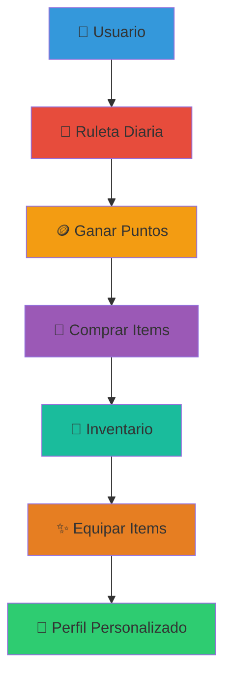

### Características Principales:

- 🎲 **Ruleta Diaria**: 3 tiradas gratis al día
- 💰 **Sistema de Puntos**: Acumulables y gastables
- 🛍️ **Tienda**: Marcos, efectos y insignias
- 🎒 **Inventario**: Gestión de items comprados
- ✨ **Personalización**: Equipar y mostrar items

---

## 💰 Sistema de Puntos

### Economía del Juego:

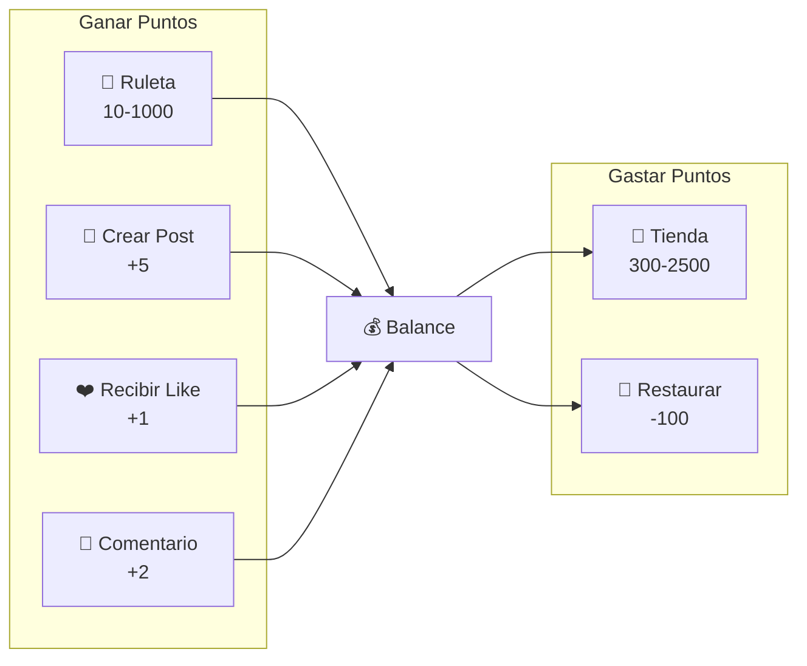

### Métodos para Ganar Puntos:

| Acción | Puntos | Frecuencia |
|--------|--------|------------|
| Ruleta (10-1000) | Variable | 3 veces/día |
| Crear post | +5 | Ilimitado |
| Recibir like | +1 | Por like |
| Recibir comentario | +2 | Por comentario |
| Nuevo seguidor | +3 | Por seguidor |

### Gestión de Balance:

El sistema gestiona automáticamente el balance de puntos:

- **Suma automática**: Al ganar premios o completar acciones
- **Resta automática**: Al comprar items o servicios
- **Validación**: No permite gastos si el balance es insuficiente
- **Persistencia**: Se guarda en localStorage y base de datos

---

## 🎰 Ruleta Diaria

### Mecánica de Juego:

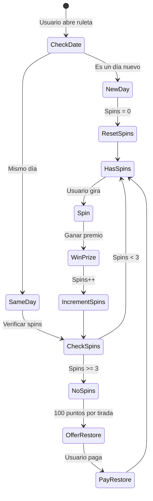

### Premios y Probabilidades:

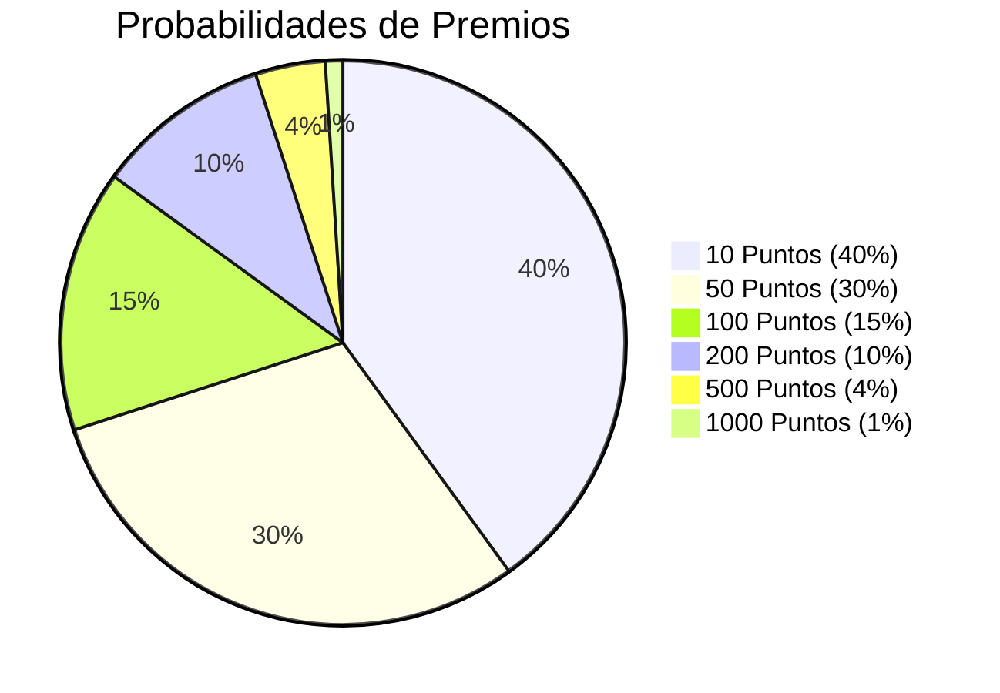

### Tabla de Premios:

| Premio | Valor | Tipo | Probabilidad | Color |
|--------|-------|------|--------------|-------|
| 10 Puntos | 10 | Común | 40% | Gris |
| 50 Puntos | 50 | Común | 30% | Gris oscuro |
| 100 Puntos | 100 | Raro | 15% | Azul |
| 200 Puntos | 200 | Raro | 10% | Azul oscuro |
| 500 Puntos | 500 | Épico | 4% | Morado |
| 1000 Puntos | 1000 | Legendario | 1% | Dorado |

### Sistema de Tiradas:

**Tiradas Gratis:**
- **3 tiradas diarias**: Se resetean a medianoche
- **Acumulación**: Las tiradas NO se acumulan entre días
- **Tracking**: Se guarda en localStorage por usuario

**Restaurar Tiradas:**
- **Costo**: 100 puntos por tirada
- **Límite**: Sin límite si tienes puntos
- **Uso**: Solo si ya usaste las 3 tiradas gratis

### Persistencia de Datos:

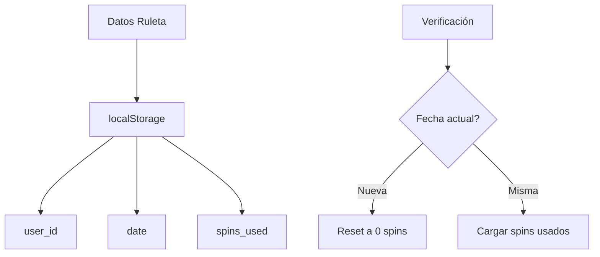

---

## 🛒 Tienda de Items

### Categorías de Items:

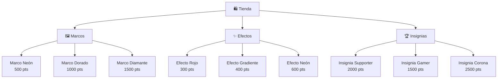

### Items Disponibles:

#### **Marcos de Perfil (5 items)**

| Nombre | Precio | Descripción |
|--------|--------|-------------|
| Marco Neón | 500 | Borde brillante neón |
| Marco Dorado | 1000 | Lujo VIP dorado |
| Marco de Fuego | 750 | Efecto de llamas |
| Marco Diamante | 1500 | Elegancia suprema |
| Marco Arcoíris | 800 | Colores vibrantes |

#### **Efectos de Chat (4 items)**

| Nombre | Precio | Descripción |
|--------|--------|-------------|
| Efecto Rojo | 300 | Estilo RedRed |
| Efecto Gradiente | 400 | Degradado único |
| Efecto Brillo | 500 | Mensajes brillan |
| Efecto Neón | 600 | Estilo cyberpunk |

#### **Insignias (5 items)**

| Nombre | Precio | Descripción |
|--------|--------|-------------|
| Insignia Supporter | 2000 | Apoyo a comunidad |
| Insignia Gamer | 1500 | Para jugadores |
| Insignia Estrella | 1800 | Destacar entre todos |
| Insignia Corona | 2500 | Realeza en RED-RED |
| Insignia Fuego | 1600 | Usuario en llamas |

### Proceso de Compra:

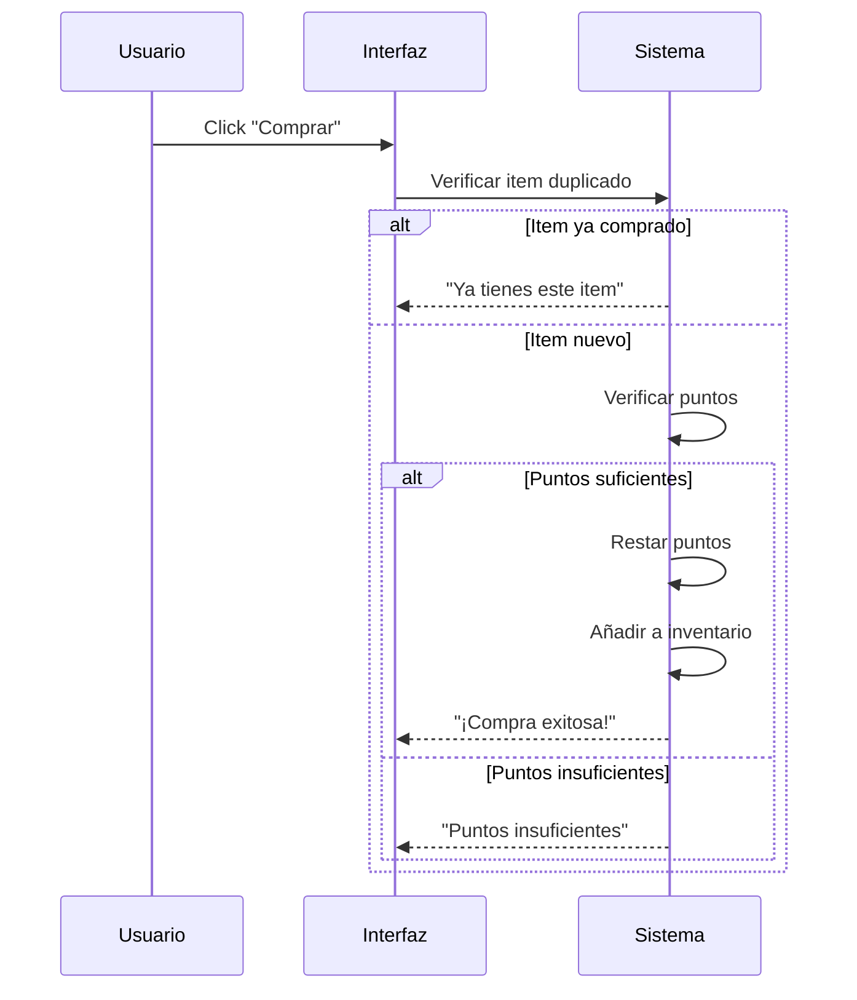

### Filtrado en Tienda:

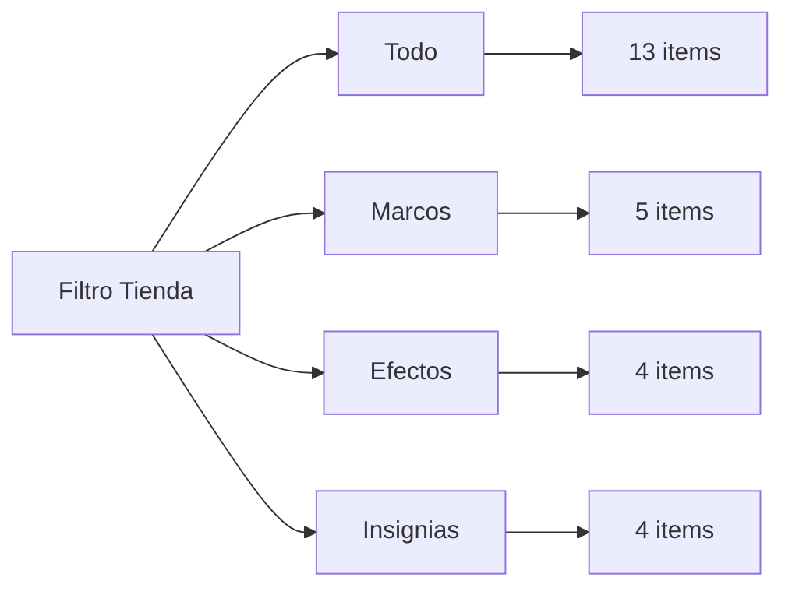

---

## 🎒 Sistema de Inventario

### Estructura del Inventario:

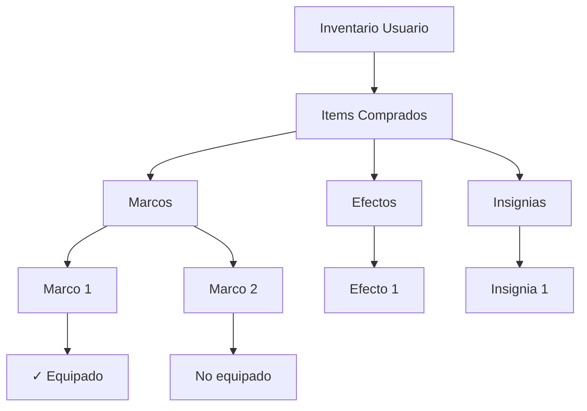

### Gestión de Items:

**Añadir al Inventario:**
- Se añade automáticamente al comprar
- No duplicados permitidos
- Organizado por categorías

**Ver Inventario:**
- Lista todos los items comprados
- Separa por tipo (marcos, efectos, insignias)
- Muestra cuáles están equipados

**Eliminar Items:**
- No implementado (compra permanente)
- Posibilidad de vender en futuro

---

## ✨ Personalización de Perfil

### Equipar Items:

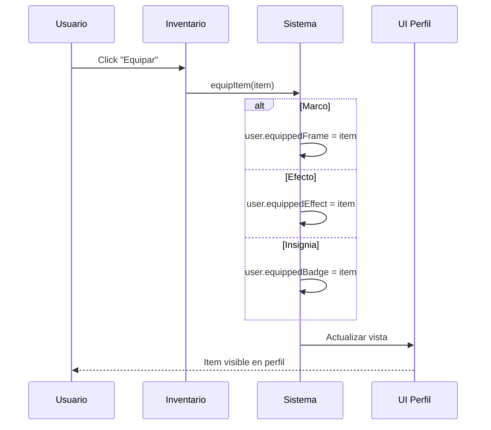

### Items Equipados:

Cada usuario puede tener equipado simultáneamente:

- **1 Marco**: Borde del avatar
- **1 Efecto**: Estilo de mensajes en chat
- **1 Insignia**: Badge visible en perfil

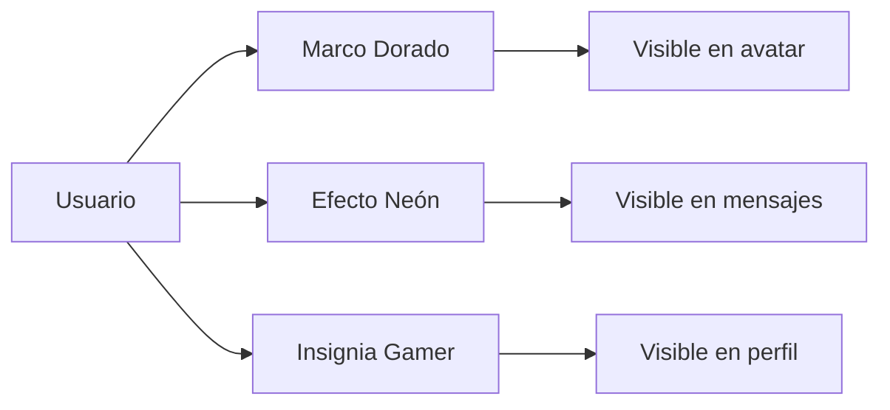

### Aplicación Visual:

#### 1. **Marcos en Avatar**

El marco equipado se aplica como borde del avatar del usuario:
- Border color según el marco
- Border width aumentado
- Animaciones opcionales

#### 2. **Efectos en Chat**

El efecto equipado cambia el estilo de los mensajes:
- Color de texto
- Sombras (text-shadow)
- Gradientes
- Animaciones de texto

#### 3. **Insignias en Perfil**

La insignia se muestra como badge:
- Junto al nombre de usuario
- En la tarjeta de perfil
- En lista de comentarios

---

## 📊 Estadísticas de Usuario

### Dashboard Personal:

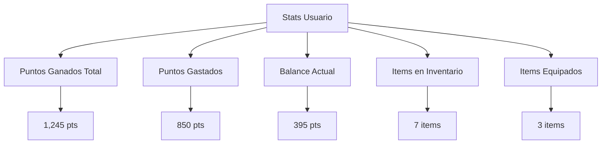

### Distribución de Puntos:

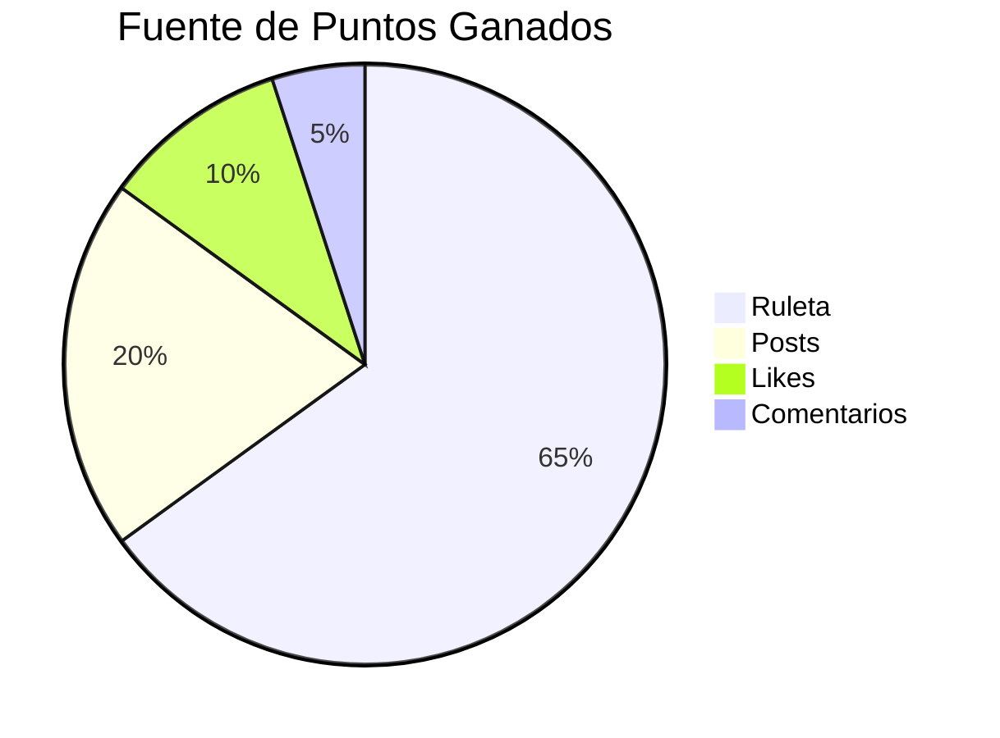

---

## 🎮 Interfaz de Usuario

### Tabs del Centro de Recompensas:

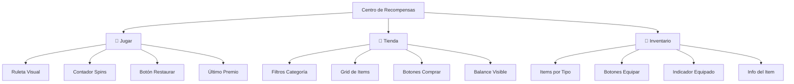

### Elementos Visuales:

#### **Ruleta:**
- Círculo dividido en 6 segmentos
- Colores según rareza del premio
- Animación de rotación (5 segundos)
- Indicador del premio ganado

#### **Tienda:**
- Grid responsive de items
- Cards con imagen, nombre y precio
- Botón de compra (deshabilitado si no hay puntos)
- Indicador de "Ya comprado"

#### **Inventario:**
- Organizado por pestañas (Marcos, Efectos, Insignias)
- Muestra todos los items comprados
- Botón "Equipar" o checkmark "✓ Equipado"
- Previsualización del item

---

## 🎯 Estrategias de Juego

### Maximizar Puntos:

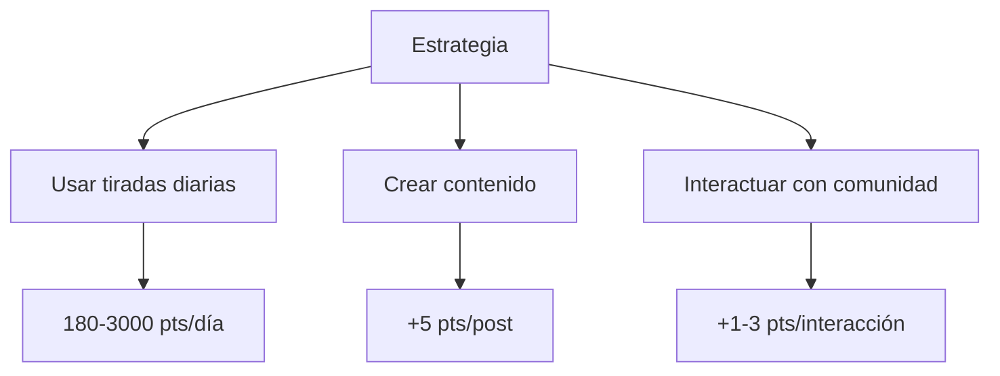

### Priorizar Compras:

1. **Económico**: Empezar con efectos (300-600 pts)
2. **Visual**: Marcos para destacar (500-1500 pts)
3. **Elite**: Insignias de prestigio (1500-2500 pts)

---

## 🔄 Roadmap Futuro

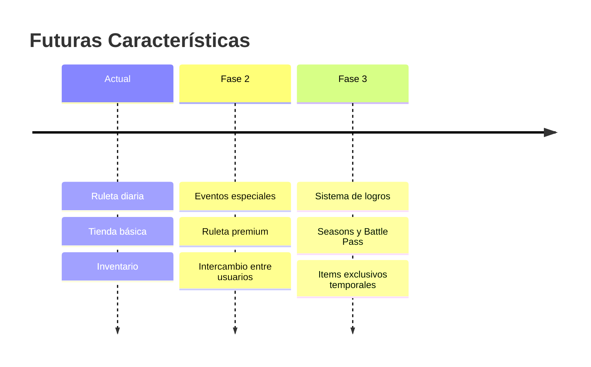

---

## ✅ Checklist de Funcionalidades

- [x] ✅ Ruleta con 6 premios diferentes
- [x] ✅ Sistema de probabilidades balanceado
- [x] ✅ 3 tiradas gratis diarias
- [x] ✅ Restaurar tiradas con puntos
- [x] ✅ Reset diario automático
- [x] ✅ Tienda con 13+ items
- [x] ✅ Filtrado por categoría
- [x] ✅ Sistema de compra validado
- [x] ✅ Inventario organizado
- [x] ✅ Equipar/desequipar items
- [x] ✅ Visualización en perfil
- [x] ✅ Efectos aplicados en chat
- [x] ✅ Persistencia en localStorage
- [x] ✅ Animaciones fluidas
- [x] ✅ Diseño responsive

---

## 🎉 Resultado Final

Un sistema completo de gamificación con:
- 🎰 **Ruleta diaria** con probabilidades balanceadas
- 💰 **Economía virtual** funcional
- 🛍️ **Tienda** con items cosméticos variados
- 🎒 **Inventario** bien organizado
- ✨ **Personalización** completa de perfil y chat
- 📊 **Estadísticas** de usuario detalladas

**¡Diversión y personalización garantizadas!** 🎮

---