# 📹 Sistema de Streaming en Vivo - RED-RED

> **Cómo funciona el sistema de transmisiones en vivo**

## 📋 Tabla de Contenidos

- [Visión General](#visión-general)
- [Arquitectura del Sistema](#arquitectura-del-sistema)
- [Flujos de Funcionamiento](#flujos-de-funcionamiento)
- [Gestión de Viewers](#gestión-de-viewers)
- [Sistema de Roles](#sistema-de-roles)
- [Chat en Vivo](#chat-en-vivo)

---

## 🎯 Visión General

El sistema de streaming permite a los usuarios transmitir video en tiempo real usando **WebRTC** para la transmisión peer-to-peer y **WebSockets** para la señalización y chat en vivo.

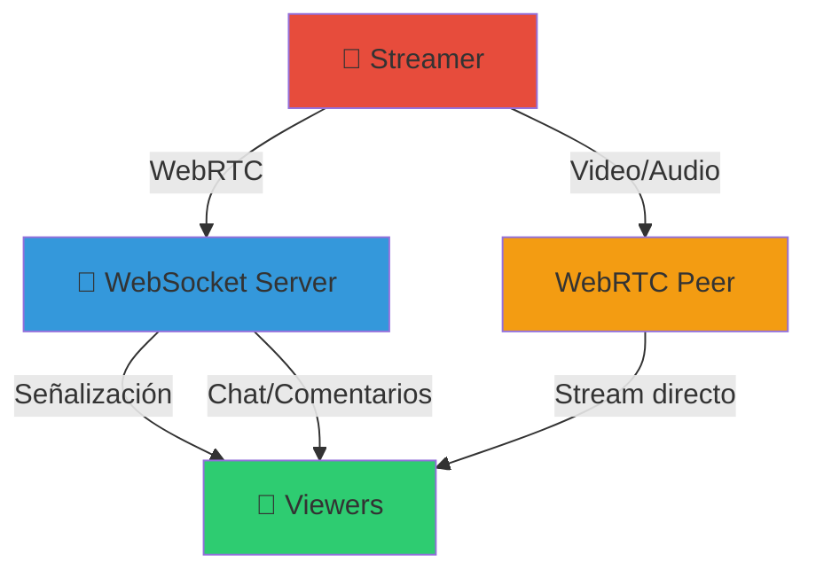

### Tecnologías Clave:

- 🔌 **Django Channels**: Gestión de WebSocket para señalización
- 📡 **WebRTC**: Transmisión de video/audio peer-to-peer
- 🎥 **MediaStream API**: Captura de cámara y micrófono
- 💬 **Real-time Chat**: Comentarios en tiempo real
- 👥 **Live Viewers**: Contador actualizado en vivo

---

## 🏗️ Arquitectura del Sistema

### Componentes Principales:

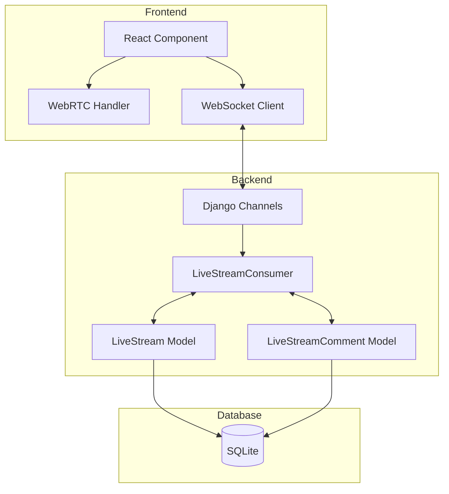

### Modelos de Datos:

#### 1. **LiveStream**

Almacena información sobre cada transmisión:

- **streamer**: Usuario que transmite
- **title**: Título del stream
- **description**: Descripción opcional
- **status**: Estado actual (waiting, live, ended)
- **started_at**: Momento de inicio
- **ended_at**: Momento de finalización
- **viewers_count**: Número actual de espectadores
- **peak_viewers**: Pico máximo de viewers

**Estados posibles:**

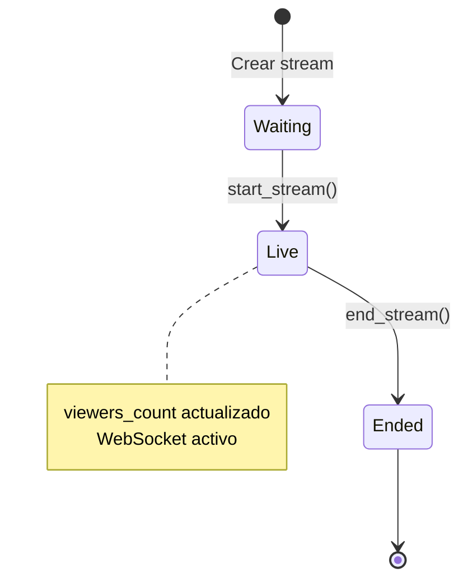

#### 2. **LiveStreamComment**

Gestiona comentarios en tiempo real:

- **live_stream**: Stream al que pertenece
- **user**: Usuario que comenta
- **content**: Contenido del comentario
- **created_at**: Timestamp del comentario

#### 3. **StreamModerator y StreamVIP**

Roles especiales dentro de un stream:

- **StreamModerator**: Usuarios con permisos de moderación
- **StreamVIP**: Usuarios con beneficios especiales

---

## 🔄 Flujos de Funcionamiento

### Crear y Empezar Stream:

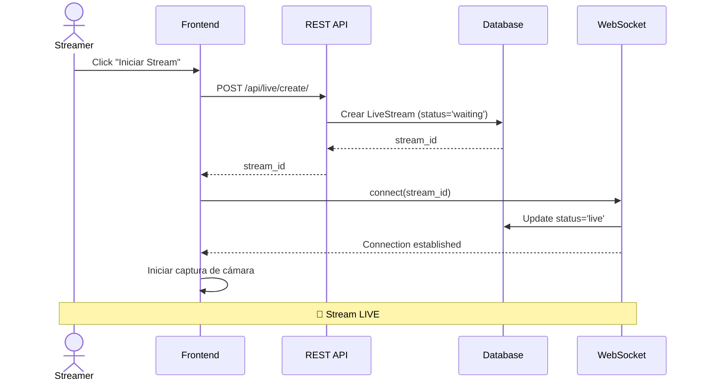

**Pasos:**

1. **Creación**: El streamer crea un nuevo stream (estado: "waiting")
2. **Conexión WebSocket**: Se conecta al canal WebSocket específico del stream
3. **Inicio de transmisión**: Cambia estado a "live" y notifica disponibilidad
4. **Captura de media**: Accede a cámara/micrófono del navegador
5. **Listo para viewers**: El stream aparece en la lista de streams activos

### Unirse como Viewer:

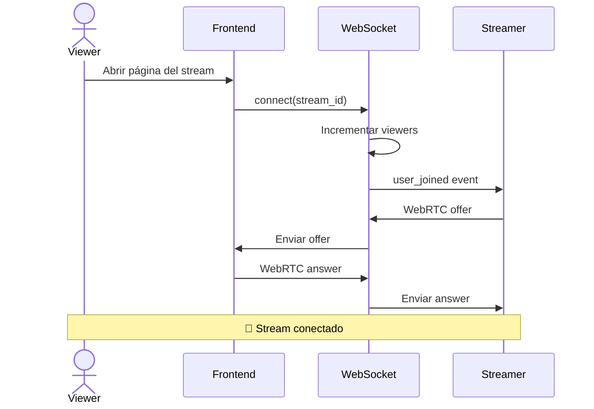

**Pasos:**

1. **Conexión**: El viewer se conecta al WebSocket del stream
2. **Incremento de contador**: Se suma 1 al viewers_count
3. **Notificación**: El streamer recibe evento "user_joined"
4. **Señalización WebRTC**: Intercambio de offers/answers para establecer conexión P2P
5. **Stream activo**: El viewer recibe el video en tiempo real

### Finalizar Stream:

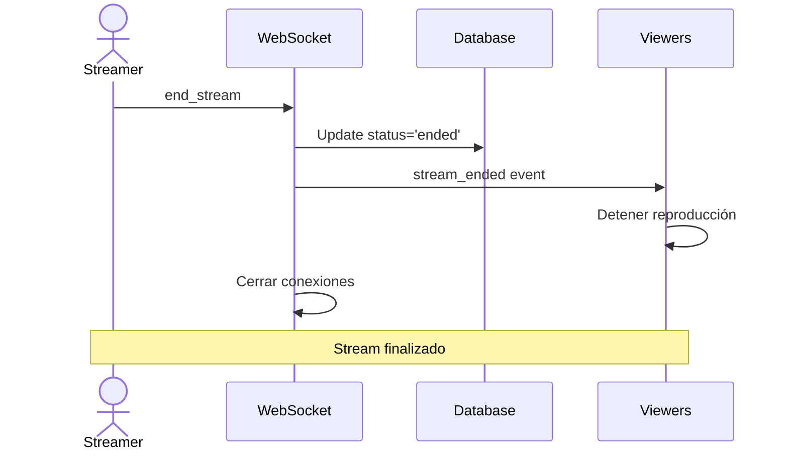

---

## 👥 Gestión de Viewers

### Contador en Tiempo Real:

El sistema mantiene un conteo preciso de espectadores:

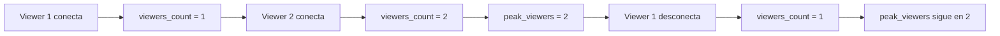

**Funcionalidades:**

- **Incremento**: Cada nuevo viewer suma 1 al contador
- **Decremento**: Cada desconexión resta 1 del contador
- **Pico histórico**: Se guarda el máximo de viewers alcanzado
- **Broadcast**: Todos los conectados reciben actualizaciones del contador

### Lista de Viewers:

El streamer puede ver quiénes están viendo:

- Lista de usernames conectados
- Indicador de roles (moderador, VIP, viewer normal)
- Acciones disponibles según rol

---

## 🎭 Sistema de Roles

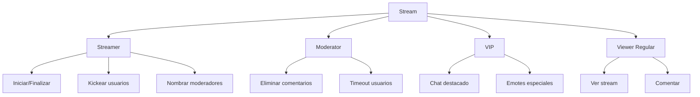

### Permisos por Rol:

| Acción | Streamer | Moderador | VIP | Viewer |
|--------|----------|-----------|-----|--------|
| Iniciar/Finalizar stream | ✅ | ❌ | ❌ | ❌ |
| Kickear usuarios | ✅ | ✅ | ❌ | ❌ |
| Eliminar comentarios | ✅ | ✅ | ❌ | ❌ |
| Timeout usuarios | ✅ | ✅ | ❌ | ❌ |
| Nombrar moderadores | ✅ | ❌ | ❌ | ❌ |
| Chat destacado | ✅ | ✅ | ✅ | ❌ |
| Ver stream | ✅ | ✅ | ✅ | ✅ |
| Comentar | ✅ | ✅ | ✅ | ✅ |

---

## 💬 Chat en Vivo

### Envío de Comentarios:

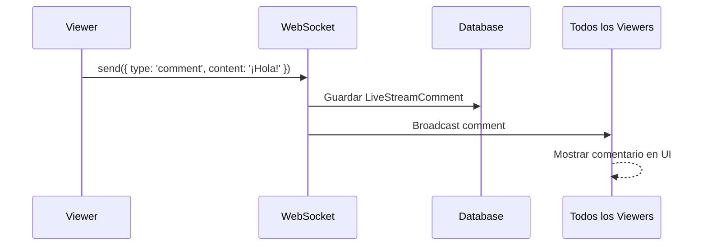

**Características:**

- **Tiempo real**: Los comentarios aparecen instantáneamente
- **Persistencia**: Se guardan en la base de datos
- **Broadcast**: Todos los viewers reciben el comentario
- **Orden cronológico**: Se muestran en orden de creación

### Moderación de Chat:

Los moderadores pueden:

1. **Eliminar comentarios**: Remover mensajes inapropiados
2. **Timeout usuarios**: Silenciar temporalmente a un usuario
3. **Kickear usuarios**: Expulsar del stream

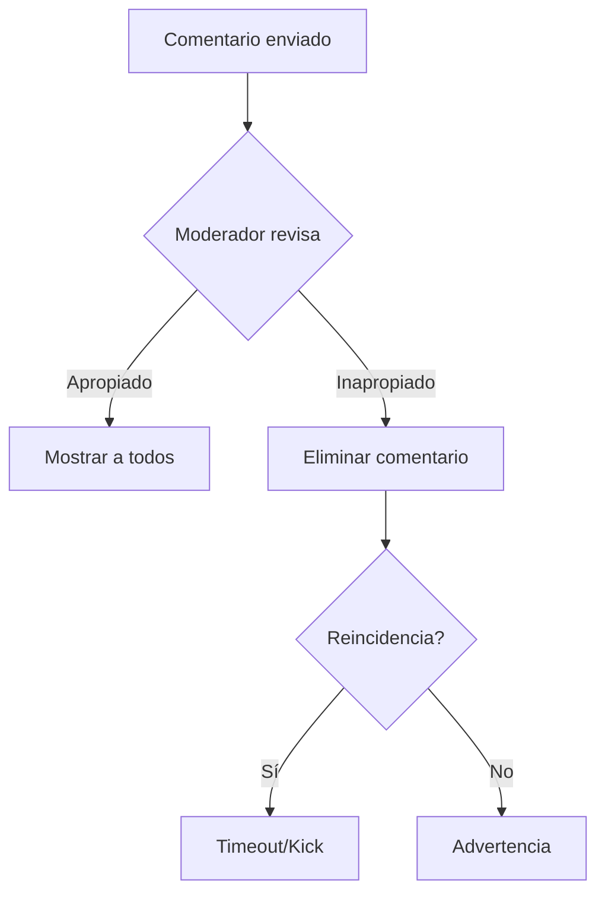

---

## 📡 WebRTC y Señalización

### Arquitectura P2P:

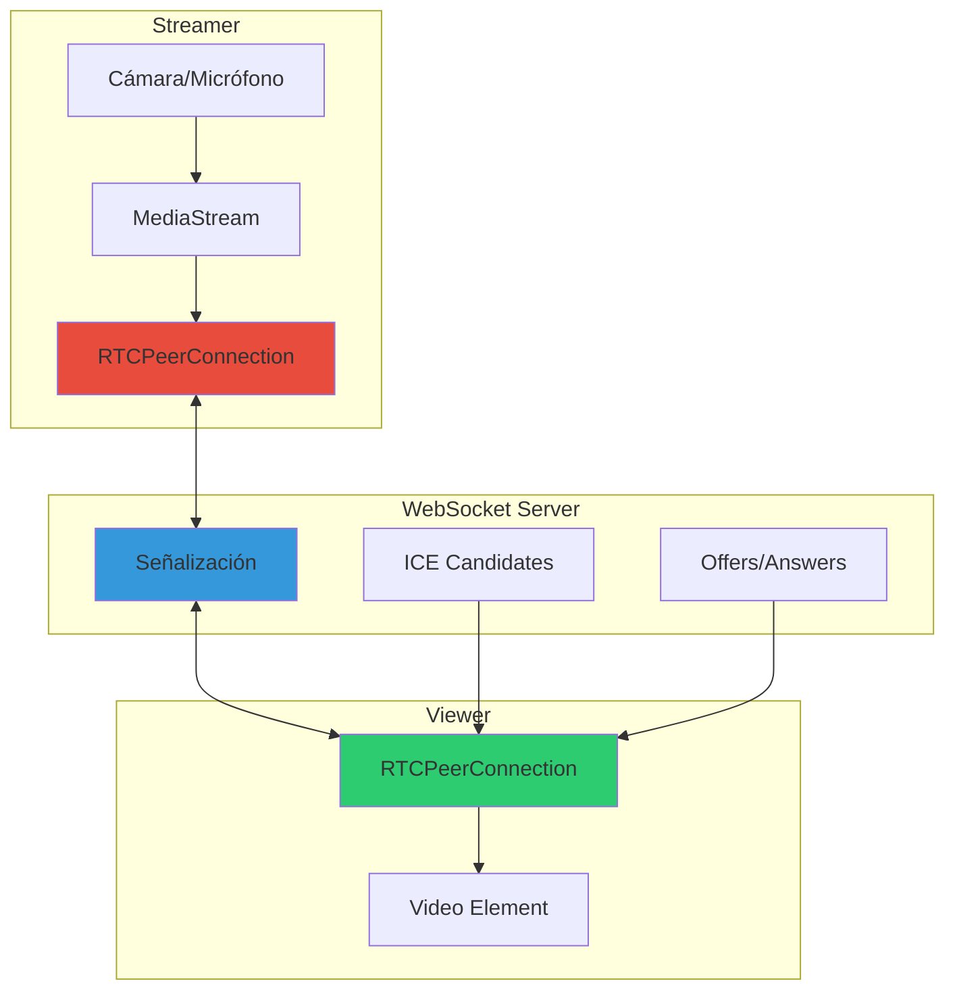

### Tipos de Mensajes WebSocket:

| Tipo | Dirección | Descripción |
|------|-----------|-------------|
| `connection_established` | Server → Client | Conexión exitosa |
| `offer` | Streamer → Server → Viewer | Oferta WebRTC |
| `answer` | Viewer → Server → Streamer | Respuesta WebRTC |
| `ice_candidate` | Bidireccional | Candidatos ICE para conectividad |
| `comment` | Viewer → Server → All | Comentario en chat |
| `viewers_update` | Server → All | Actualización de contador |
| `stream_ended` | Server → All | Stream finalizado |
| `user_joined` | Server → Streamer | Nuevo viewer se unió |
| `user_left` | Server → Streamer | Viewer se fue |

### Proceso de Conexión WebRTC:

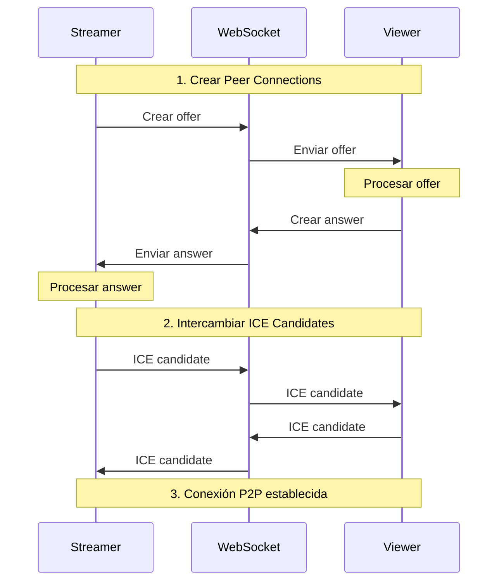

---

## 📊 Estadísticas de Streaming

### Métricas Disponibles:

- **viewers_count**: Espectadores actuales
- **peak_viewers**: Pico máximo alcanzado
- **duration**: Duración del stream
- **comments_count**: Total de comentarios
- **average_viewers**: Promedio de viewers durante el stream

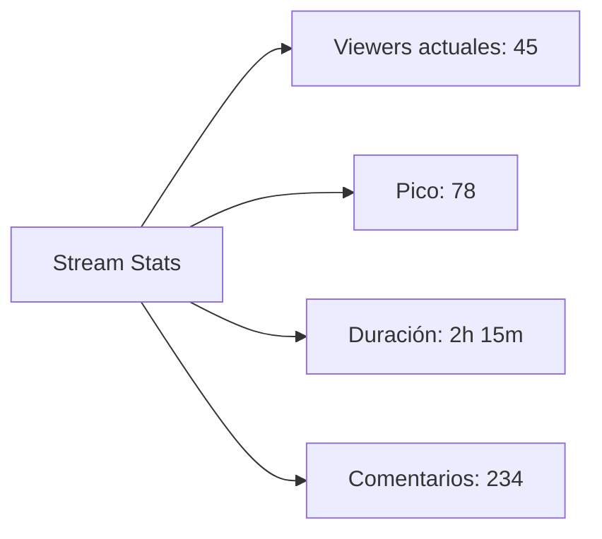

---

## 🛠️ Scripts de Mantenimiento

### Limpieza de Streams:

El sistema incluye scripts para mantener la BD limpia:

1. **cleanup_streams.py**: Finaliza streams antiguos que quedaron "colgados"
2. **check_streams.py**: Verifica estado de streams activos
3. **force_cleanup_streams.py**: Limpieza forzada de streams

**Triggers de limpieza:**

- Streams en estado "live" por más de 4 horas
- Streams sin viewers por más de 30 minutos
- Conexiones WebSocket huérfanas

---

## 🎯 Casos de Uso

### Caso 1: Stream Gaming

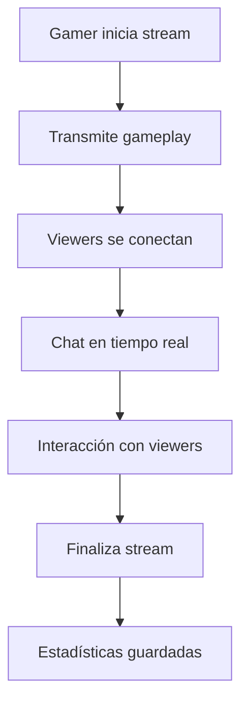

### Caso 2: Stream Educativo

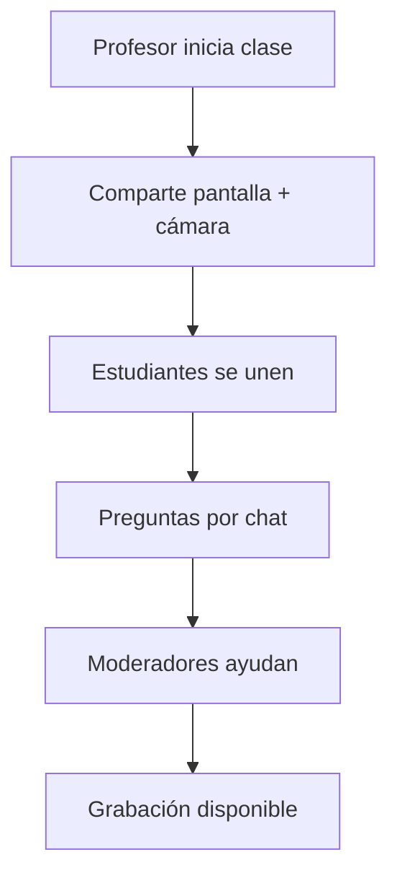

---

## ✅ Checklist de Funcionalidades

- [x] ✅ Creación de streams por usuarios
- [x] ✅ Transmisión WebRTC peer-to-peer
- [x] ✅ Señalización por WebSocket
- [x] ✅ Chat en tiempo real
- [x] ✅ Contador de viewers actualizado
- [x] ✅ Sistema de roles (Streamer, Mod, VIP)
- [x] ✅ Moderación de chat
- [x] ✅ Kickear/Timeout usuarios
- [x] ✅ Estadísticas de stream
- [x] ✅ Persistencia de comentarios
- [x] ✅ Lista de viewers para streamer
- [x] ✅ Scripts de limpieza automática

---

## 🎉 Resultado Final

Un sistema completo de streaming con:
- 🎥 **Transmisión en vivo** con WebRTC de baja latencia
- 🔌 **Señalización** robusta con WebSockets
- 👥 **Gestión de viewers** en tiempo real
- 💬 **Chat integrado** con moderación
- 📊 **Estadísticas detalladas**
- 🛡️ **Sistema de roles** y permisos

**¡Streaming profesional en RED-RED!** 📹

---