# 🔌 Sistema de WebSockets - RED-RED

> **Arquitectura completa de comunicación en tiempo real**

## 📋 Tabla de Contenidos

- [Visión General](#visión-general)
- [Chat en Tiempo Real](#chat-en-tiempo-real)
- [Sistema de Notificaciones](#sistema-de-notificaciones)
- [Streaming en Vivo](#streaming-en-vivo)
- [Arquitectura de Canales](#arquitectura-de-canales)
- [Flujo de Mensajes](#flujo-de-mensajes)

---

## 🎯 Visión General

RED-RED utiliza WebSockets para proporcionar comunicación bidireccional en tiempo real entre el servidor y los clientes. Esto permite que las actualizaciones lleguen instantáneamente sin necesidad de hacer polling.

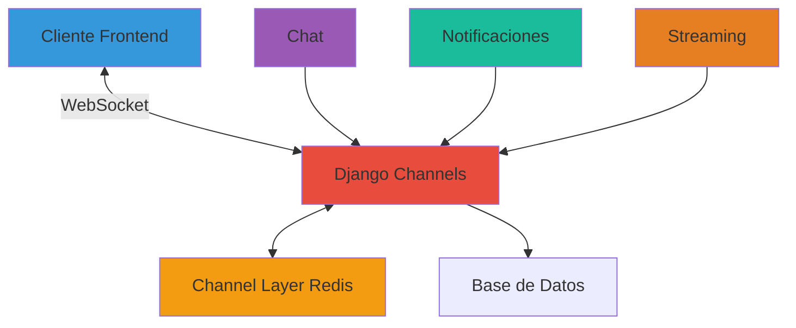
```mermaid
graph TB
    A[Cliente Frontend] <-->|WebSocket| B[Django Channels]
    B <--> C[Channel Layer Redis]
    
    D[Chat] --> B
    E[Notificaciones] --> B
    F[Streaming] --> B
    
    B --> G[Base de Datos]
    
    style A fill:#3498db
    style B fill:#e74c3c
    style C fill:#f39c12
    style D fill:#9b59b6
    style E fill:#1abc9c
    style F fill:#e67e22
```

### Tecnologías Base:

- **Django Channels**: Extiende Django para manejar WebSockets
- **Daphne**: Servidor ASGI que soporta WebSockets
- **Redis** (opcional): Channel layer para comunicación entre procesos
- **WebSocket Protocol**: Comunicación full-duplex sobre TCP

---

## 💬 Chat en Tiempo Real

### Funcionalidad Principal:

El sistema de chat permite conversaciones privadas uno-a-uno entre usuarios con entrega instantánea de mensajes.

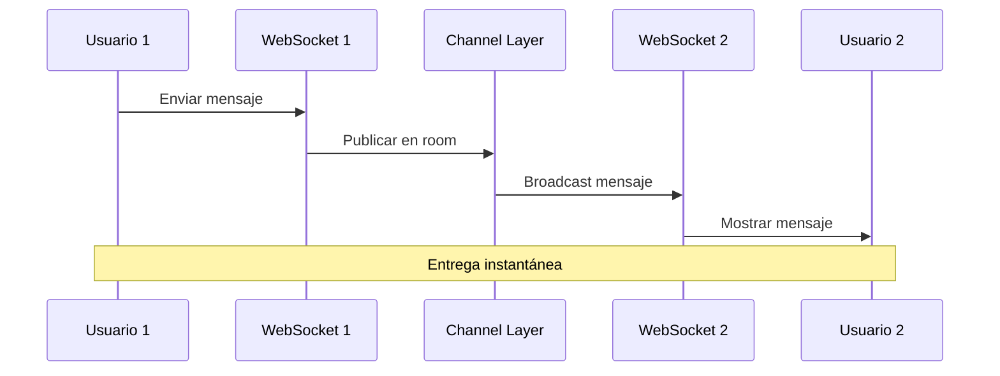
```mermaid
sequenceDiagram
    participant U1 as Usuario 1
    participant WS1 as WebSocket 1
    participant Server as Channel Layer
    participant WS2 as WebSocket 2
    participant U2 as Usuario 2
    
    U1->>WS1: Enviar mensaje
    WS1->>Server: Publicar en room
    Server->>WS2: Broadcast mensaje
    WS2->>U2: Mostrar mensaje
    
    Note over U1,U2: Entrega instantánea
```

### Flujos de Comunicación:

#### 1. **Conexión al Chat**

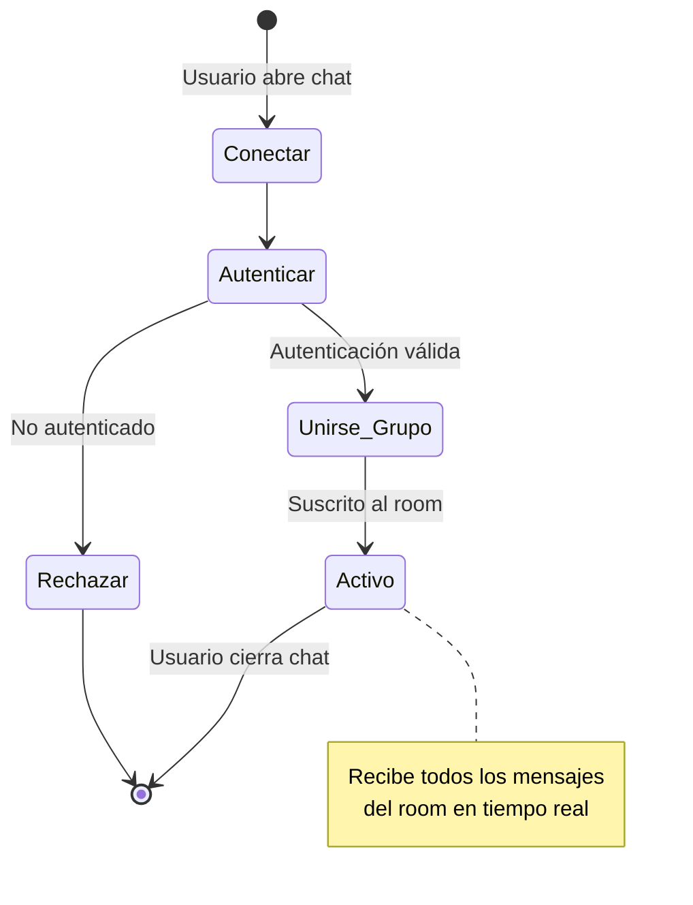
```mermaid
stateDiagram-v2
    [*] --> Conectar: Usuario abre chat
    Conectar --> Autenticar
    Autenticar --> Unirse_Grupo: Autenticación válida
    Autenticar --> Rechazar: No autenticado
    Unirse_Grupo --> Activo: Suscrito al room
    Activo --> [*]: Usuario cierra chat
    Rechazar --> [*]
    
    note right of Activo
        Recibe todos los mensajes
        del room en tiempo real
    end note
```

Cada usuario se conecta a:
- **Room específico**: Canal de la conversación (ej: `chat_room_42`)
- **Updates personales**: Canal de actualizaciones de sus chats (`chat_updates_user_123`)

#### 2. **Envío de Mensajes**

Cuando un usuario envía un mensaje:

1. **Recepción**: El servidor recibe el mensaje por WebSocket
2. **Validación**: Verifica que el usuario pertenezca al room
3. **Persistencia**: Guarda el mensaje en la base de datos
4. **Broadcast**: Envía el mensaje a todos en el room
5. **Actualización**: Notifica a ambos usuarios sobre la última actividad

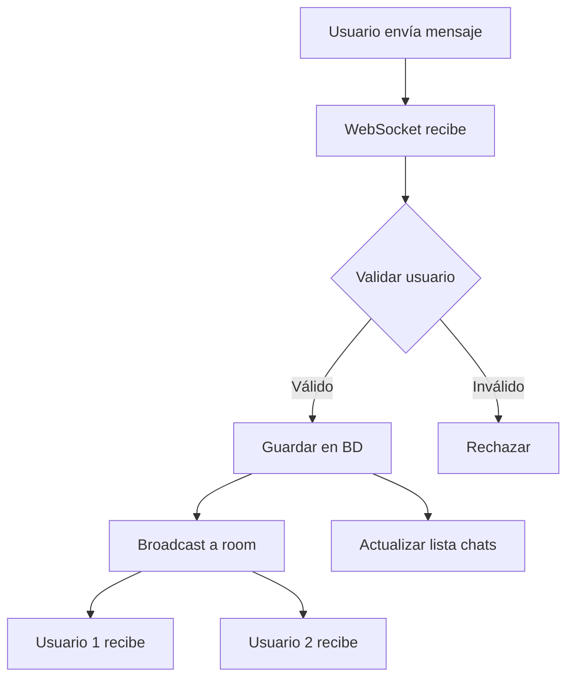
```mermaid
graph TD
    A[Usuario envía mensaje] --> B[WebSocket recibe]
    B --> C{Validar usuario}
    C -->|Válido| D[Guardar en BD]
    C -->|Inválido| E[Rechazar]
    D --> F[Broadcast a room]
    F --> G[Usuario 1 recibe]
    F --> H[Usuario 2 recibe]
    D --> I[Actualizar lista chats]
```

#### 3. **Indicadores de Estado**

El sistema gestiona varios indicadores en tiempo real:

- **Escribiendo...**: Se notifica cuando alguien está escribiendo
- **Mensaje entregado**: Confirmación de recepción
- **Mensaje leído**: El otro usuario vio el mensaje
- **Usuario conectado**: Estado online/offline

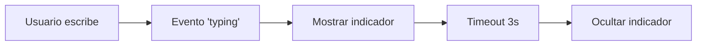
```mermaid
graph LR
    A[Usuario escribe] --> B[Evento 'typing']
    B --> C[Mostrar indicador]
    C --> D[Timeout 3s]
    D --> E[Ocultar indicador]
```

### Tipos de Eventos en Chat:

| Evento | Dirección | Descripción |
|--------|-----------|-------------|
| `chat_message` | Cliente → Servidor → Clientes | Mensaje nuevo |
| `typing` | Cliente → Servidor → Cliente | Indicador de escritura |
| `mark_read` | Cliente → Servidor | Marcar mensajes como leídos |
| `chat_update` | Servidor → Cliente | Actualización de lista de chats |
| `connection_established` | Servidor → Cliente | Confirmación de conexión |

### Estructura de Room:

Cada conversación tiene un identificador único:
- **Room ID**: Identificador de la sala (ej: `chat_room_42`)
- **Participantes**: Máximo 2 usuarios en chat privado
- **Grupo WebSocket**: `chat_{room_id}` para broadcast

---

## 🔔 Sistema de Notificaciones

### Funcionalidad Principal:

Las notificaciones en tiempo real informan a los usuarios sobre eventos importantes sin recargar la página.

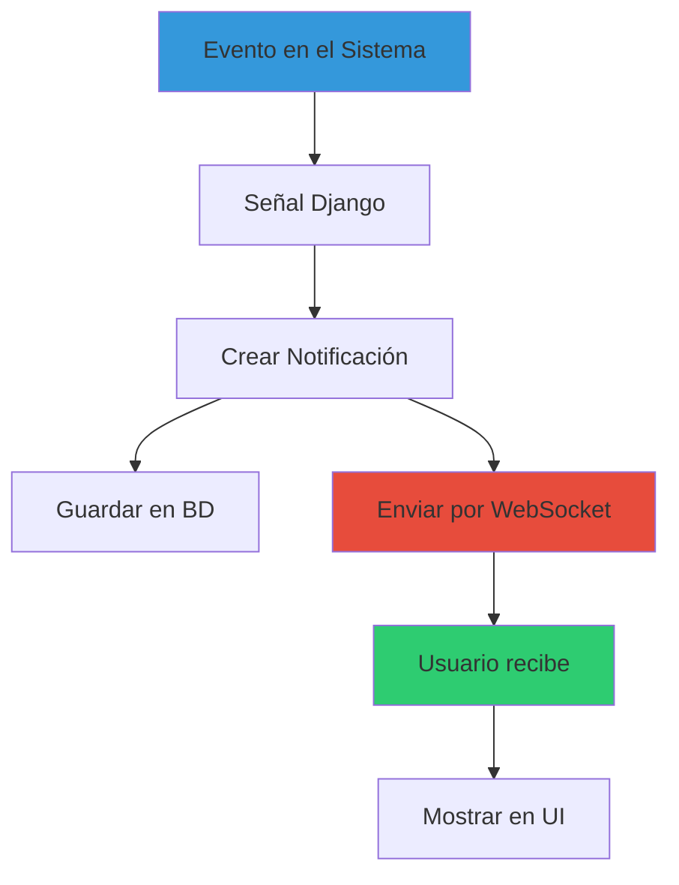
```mermaid
graph TB
    A[Evento en el Sistema] --> B[Señal Django]
    B --> C[Crear Notificación]
    C --> D[Guardar en BD]
    C --> E[Enviar por WebSocket]
    E --> F[Usuario recibe]
    F --> G[Mostrar en UI]
    
    style A fill:#3498db
    style E fill:#e74c3c
    style F fill:#2ecc71
```

### Tipos de Notificaciones:

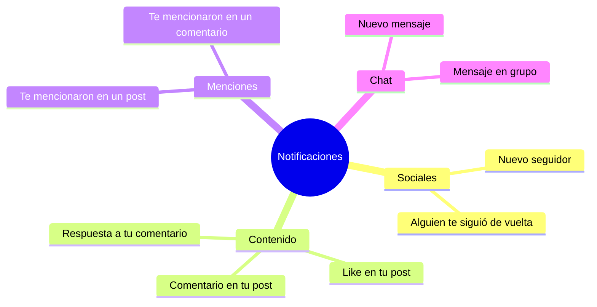
```mermaid
mindmap
  root((Notificaciones))
    Sociales
      Nuevo seguidor
      Alguien te siguió de vuelta
    Contenido
      Like en tu post
      Comentario en tu post
      Respuesta a tu comentario
    Menciones
      Te mencionaron en un post
      Te mencionaron en un comentario
    Chat
      Nuevo mensaje
      Mensaje en grupo
```

### Flujo de Notificaciones:

#### 1. **Generación de Notificación**

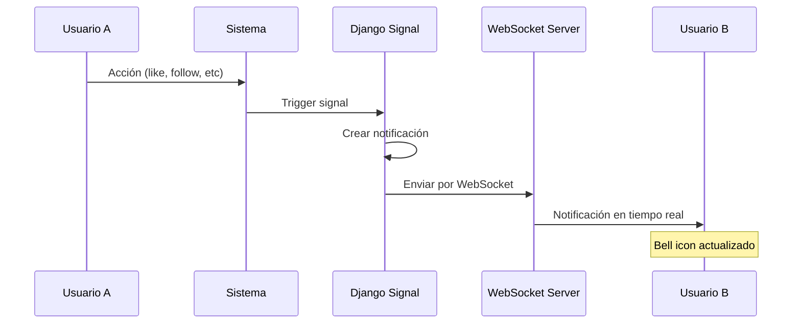
```mermaid
sequenceDiagram
    participant U1 as Usuario A
    participant System as Sistema
    participant Signal as Django Signal
    participant WS as WebSocket Server
    participant U2 as Usuario B
    
    U1->>System: Acción (like, follow, etc)
    System->>Signal: Trigger signal
    Signal->>Signal: Crear notificación
    Signal->>WS: Enviar por WebSocket
    WS->>U2: Notificación en tiempo real
    
    Note over U2: Bell icon actualizado
```

#### 2. **Suscripción Personal**

Cada usuario tiene su propio canal de notificaciones:
- **Canal único**: `notifications_{user_id}`
- **Privado**: Solo el usuario recibe sus notificaciones
- **Persistente**: Mantiene conexión activa mientras está online

#### 3. **Contador de No Leídas**

El sistema gestiona el contador de notificaciones no leídas:

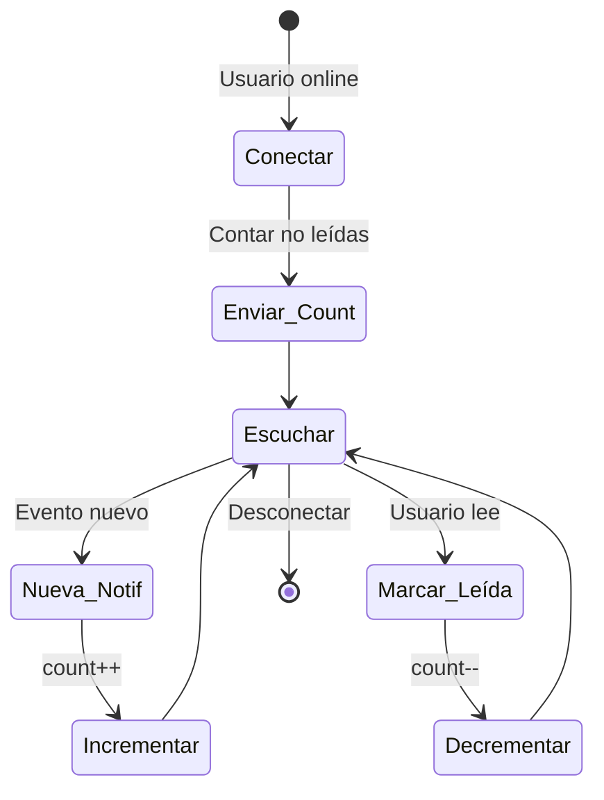
```mermaid
stateDiagram-v2
    [*] --> Conectar: Usuario online
    Conectar --> Enviar_Count: Contar no leídas
    Enviar_Count --> Escuchar
    Escuchar --> Nueva_Notif: Evento nuevo
    Nueva_Notif --> Incrementar: count++
    Incrementar --> Escuchar
    Escuchar --> Marcar_Leída: Usuario lee
    Marcar_Leída --> Decrementar: count--
    Decrementar --> Escuchar
    Escuchar --> [*]: Desconectar
```

### Eventos de Notificación:

| Evento | Descripción | Datos |
|--------|-------------|-------|
| `connection_established` | Conexión exitosa | user_id |
| `unread_count` | Contador inicial | count |
| `new_notification` | Nueva notificación | tipo, mensaje, usuario_origen |
| `notification_read` | Notificación leída | notification_id |
| `mark_all_read` | Todas marcadas | - |

### Sistema de Prioridades:

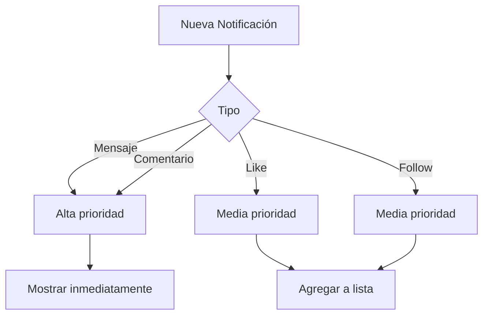
```mermaid
graph TD
    A[Nueva Notificación] --> B{Tipo}
    B -->|Mensaje| C[Alta prioridad]
    B -->|Like| D[Media prioridad]
    B -->|Follow| E[Media prioridad]
    B -->|Comentario| C
    
    C --> F[Mostrar inmediatamente]
    D --> G[Agregar a lista]
    E --> G
```

---

## 📹 Streaming en Vivo

### Funcionalidad Principal:

El streaming utiliza WebSockets para la señalización WebRTC y la gestión de viewers en tiempo real.

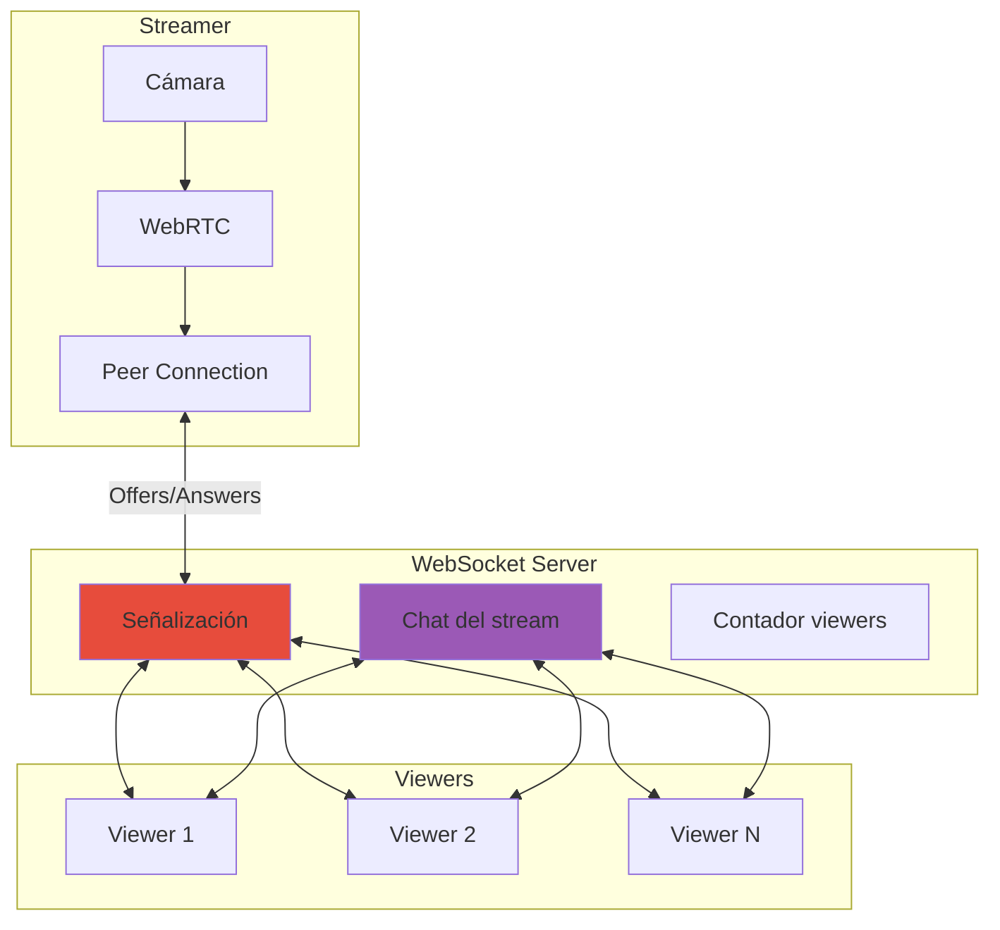
```mermaid
graph TB
    subgraph Streamer
        A[Cámara] --> B[WebRTC]
        B --> C[Peer Connection]
    end
    
    subgraph WebSocket Server
        D[Señalización]
        E[Chat del stream]
        F[Contador viewers]
    end
    
    subgraph Viewers
        G[Viewer 1]
        H[Viewer 2]
        I[Viewer N]
    end
    
    C <-->|Offers/Answers| D
    D <--> G
    D <--> H
    D <--> I
    
    E <--> G
    E <--> H
    E <--> I
    
    style D fill:#e74c3c
    style E fill:#9b59b6
```

### Roles en el Stream:

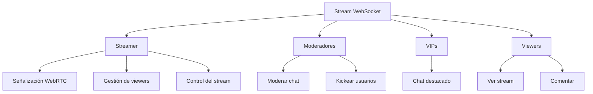
```mermaid
graph TD
    A[Stream WebSocket] --> B[Streamer]
    A --> C[Moderadores]
    A --> D[VIPs]
    A --> E[Viewers]
    
    B --> B1[Señalización WebRTC]
    B --> B2[Gestión de viewers]
    B --> B3[Control del stream]
    
    C --> C1[Moderar chat]
    C --> C2[Kickear usuarios]
    
    D --> D1[Chat destacado]
    
    E --> E1[Ver stream]
    E --> E2[Comentar]
```

### Flujos de WebSocket en Streaming:

#### 1. **Iniciar Stream**

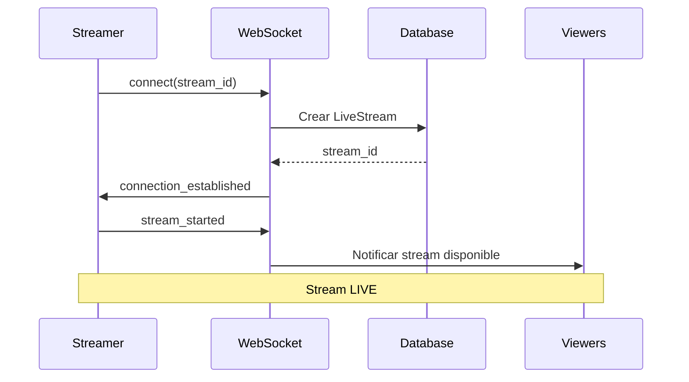
```mermaid
sequenceDiagram
    participant S as Streamer
    participant WS as WebSocket
    participant DB as Database
    participant V as Viewers
    
    S->>WS: connect(stream_id)
    WS->>DB: Crear LiveStream
    DB-->>WS: stream_id
    WS->>S: connection_established
    S->>WS: stream_started
    WS->>V: Notificar stream disponible
    
    Note over S,V: Stream LIVE
```

#### 2. **Unirse como Viewer**

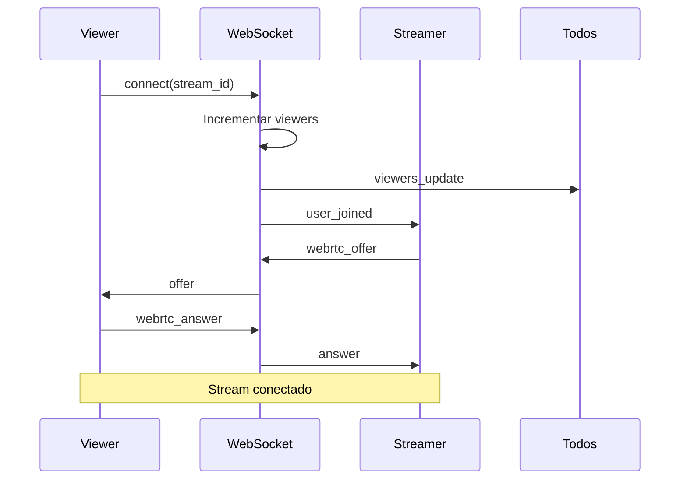
```mermaid
sequenceDiagram
    participant V as Viewer
    participant WS as WebSocket
    participant S as Streamer
    participant ALL as Todos
    
    V->>WS: connect(stream_id)
    WS->>WS: Incrementar viewers
    WS->>ALL: viewers_update
    WS->>S: user_joined
    S->>WS: webrtc_offer
    WS->>V: offer
    V->>WS: webrtc_answer
    WS->>S: answer
    
    Note over V,S: Stream conectado
```

#### 3. **Chat del Stream**

Los comentarios en vivo se gestionan por WebSocket:

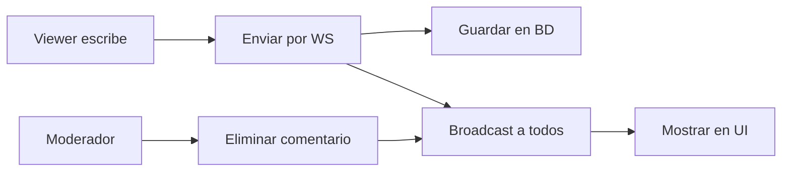
```mermaid
graph LR
    A[Viewer escribe] --> B[Enviar por WS]
    B --> C[Guardar en BD]
    B --> D[Broadcast a todos]
    D --> E[Mostrar en UI]
    
    F[Moderador] --> G[Eliminar comentario]
    G --> D
```

### Eventos de Streaming:

| Evento | Descripción | Emisor → Receptor |
|--------|-------------|-------------------|
| `stream_started` | Stream iniciado | Streamer → Sistema |
| `user_joined` | Nuevo viewer | Sistema → Streamer |
| `user_left` | Viewer se fue | Sistema → Streamer |
| `viewers_update` | Actualización contador | Sistema → Todos |
| `webrtc_offer` | Oferta WebRTC | Streamer → Viewer |
| `webrtc_answer` | Respuesta WebRTC | Viewer → Streamer |
| `ice_candidate` | Candidato ICE | Bidireccional |
| `comment` | Comentario en vivo | Viewer → Todos |
| `stream_ended` | Stream finalizado | Streamer → Todos |

### Gestión de Viewers:

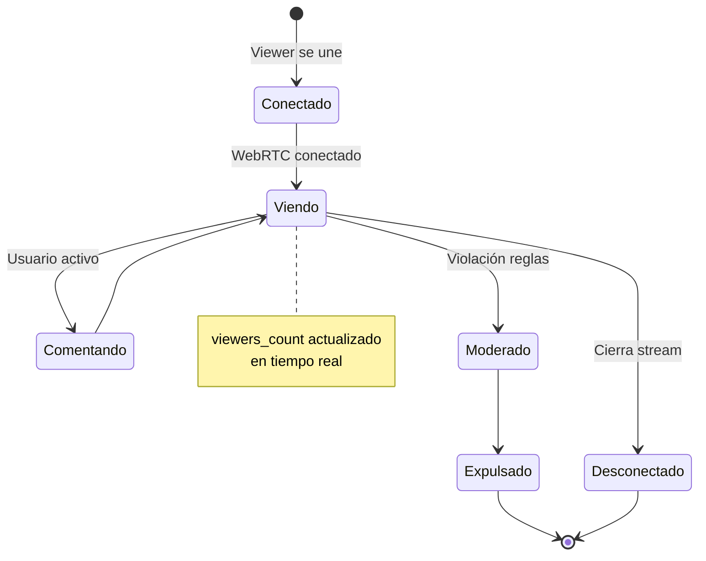
```mermaid
stateDiagram-v2
    [*] --> Conectado: Viewer se une
    Conectado --> Viendo: WebRTC conectado
    Viendo --> Comentando: Usuario activo
    Comentando --> Viendo
    Viendo --> Moderado: Violación reglas
    Moderado --> Expulsado
    Expulsado --> [*]
    Viendo --> Desconectado: Cierra stream
    Desconectado --> [*]
    
    note right of Viendo
        viewers_count actualizado
        en tiempo real
    end note
```

---

## 🏗️ Arquitectura de Canales

### Django Channels:

Django Channels extiende Django para manejar protocolos asíncronos como WebSockets.

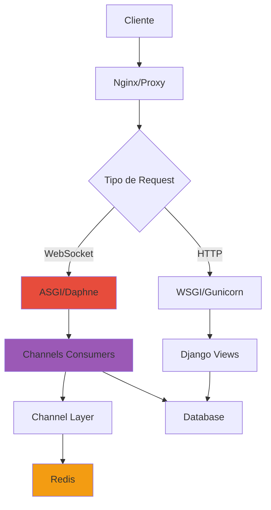
```mermaid
graph TB
    A[Cliente] --> B[Nginx/Proxy]
    B --> C{Tipo de Request}
    C -->|HTTP| D[WSGI/Gunicorn]
    C -->|WebSocket| E[ASGI/Daphne]
    
    D --> F[Django Views]
    E --> G[Channels Consumers]
    
    G --> H[Channel Layer]
    H --> I[Redis]
    
    F --> J[Database]
    G --> J
    
    style E fill:#e74c3c
    style G fill:#9b59b6
    style I fill:#f39c12
```

### Componentes Principales:

#### 1. **Consumers**

Los consumers son equivalentes a las views pero para WebSockets:

- **ChatConsumer**: Maneja conexiones de chat
- **NotificationConsumer**: Maneja notificaciones
- **LiveStreamConsumer**: Maneja streaming

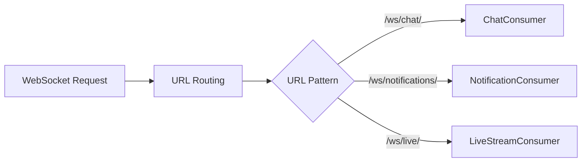
```mermaid
graph LR
    A[WebSocket Request] --> B[URL Routing]
    B --> C{URL Pattern}
    C -->|/ws/chat/| D[ChatConsumer]
    C -->|/ws/notifications/| E[NotificationConsumer]
    C -->|/ws/live/| F[LiveStreamConsumer]
```

#### 2. **Channel Layer**

Permite comunicación entre diferentes instancias del servidor:

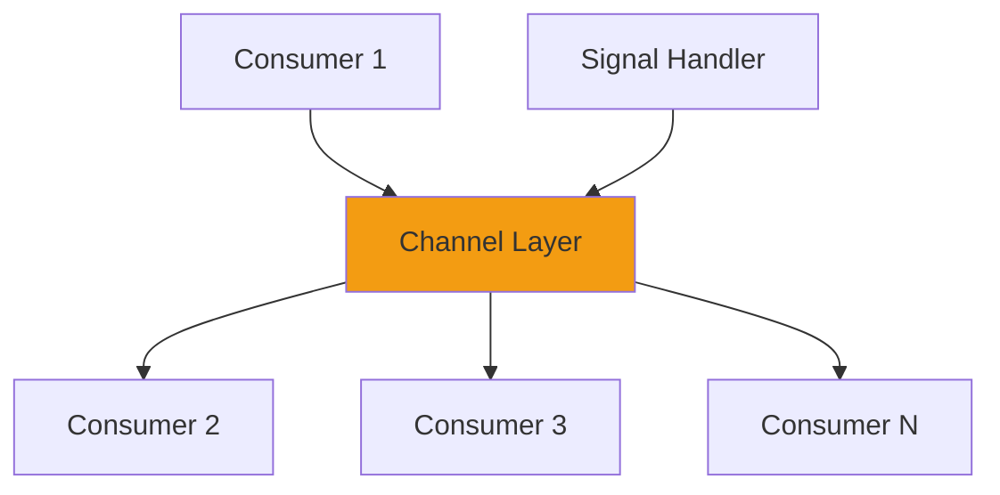
```mermaid
graph TD
    A[Consumer 1] --> B[Channel Layer]
    B --> C[Consumer 2]
    B --> D[Consumer 3]
    B --> E[Consumer N]
    
    F[Signal Handler] --> B
    
    style B fill:#f39c12
```

#### 3. **Groups**

Los grupos permiten enviar mensajes a múltiples conexiones:

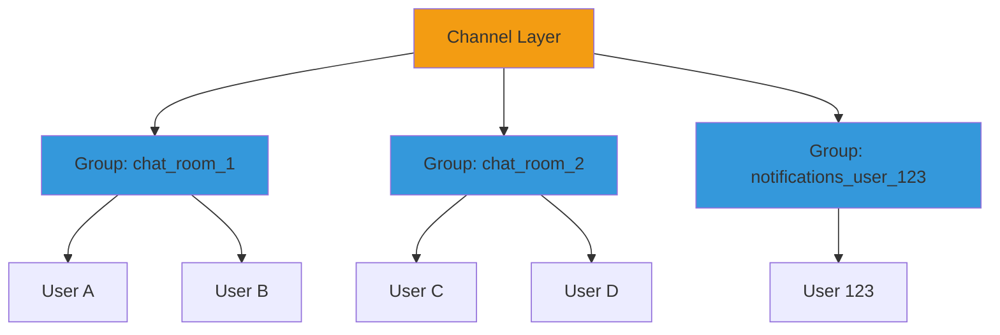
```mermaid
graph TB
    A[Channel Layer] --> B[Group: chat_room_1]
    A --> C[Group: chat_room_2]
    A --> D[Group: notifications_user_123]
    
    B --> E[User A]
    B --> F[User B]
    
    C --> G[User C]
    C --> H[User D]
    
    D --> I[User 123]
    
    style A fill:#f39c12
    style B fill:#3498db
    style C fill:#3498db
    style D fill:#3498db
```

### Routing de WebSockets:

El enrutamiento de WebSockets funciona similar a URLs:

```mermaid
graph LR
    A[ws://backend/ws/] --> B{Path}
    B -->|chat/<room_name>/| C[ChatConsumer]
    B -->|notifications/| D[NotificationConsumer]
    B -->|live/<stream_id>/| E[LiveStreamConsumer]
```

---

## 🔄 Flujo de Mensajes

### Ciclo de Vida de una Conexión:

```mermaid
stateDiagram-v2
    [*] --> Handshake: Cliente inicia WS
    Handshake --> Autenticar: Upgrade HTTP
    Autenticar --> Conectado: Auth válida
    Autenticar --> Rechazar: Auth inválida
    
    Conectado --> Unirse_Grupo: Suscripción
    Unirse_Grupo --> Activo: Listo
    
    Activo --> Recibir: Mensajes entrantes
    Recibir --> Procesar
    Procesar --> Activo
    
    Activo --> Enviar: Mensajes salientes
    Enviar --> Activo
    
    Activo --> Desconectar: Close signal
    Desconectar --> Limpiar: Salir de grupos
    Limpiar --> [*]
    
    Rechazar --> [*]
```

### Tipos de Mensajes:

#### 1. **Cliente → Servidor**

```mermaid
graph TD
    A[Frontend] --> B{Tipo de mensaje}
    B -->|chat_message| C[Enviar mensaje]
    B -->|typing| D[Usuario escribiendo]
    B -->|mark_read| E[Marcar leído]
    B -->|webrtc_offer| F[Oferta WebRTC]
    B -->|comment| G[Comentario stream]
    
    C --> H[Consumer procesa]
    D --> H
    E --> H
    F --> H
    G --> H
```

#### 2. **Servidor → Cliente**

```mermaid
graph TD
    A[Backend] --> B{Tipo de mensaje}
    B -->|chat_message| C[Nuevo mensaje]
    B -->|notification| D[Nueva notificación]
    B -->|viewers_update| E[Contador viewers]
    B -->|stream_ended| F[Stream finalizado]
    B -->|user_joined| G[Usuario se unió]
    
    C --> H[Frontend recibe]
    D --> H
    E --> H
    F --> H
    G --> H
```

### Formato de Mensajes:

Todos los mensajes siguen una estructura JSON:

```mermaid
graph LR
    A[Mensaje] --> B[type]
    A --> C[data]
    A --> D[timestamp]
    A --> E[metadata]
    
    B --> F[Identifica acción]
    C --> G[Payload del mensaje]
    D --> H[Marca temporal]
    E --> I[Info adicional]
```

---

## 🔍 Monitoreo y Debugging

### Conexiones Activas:

```mermaid
graph TB
    A[Sistema] --> B[Chat: 234 conexiones]
    A --> C[Notificaciones: 450 conexiones]
    A --> D[Streaming: 23 streams]
    
    D --> D1[Stream 1: 45 viewers]
    D --> D2[Stream 2: 23 viewers]
    D --> D3[Stream 3: 12 viewers]
```

### Métricas de WebSocket:

| Métrica | Descripción | Importancia |
|---------|-------------|-------------|
| Conexiones activas | Total de WS conectados | Capacidad del servidor |
| Mensajes/segundo | Throughput de mensajes | Performance |
| Latencia promedio | Tiempo de entrega | UX |
| Errores de conexión | Fallos de handshake | Estabilidad |
| Reconexiones | Intentos de reconectar | Confiabilidad |

---

## ⚡ Optimizaciones

### 1. **Gestión de Conexiones**

```mermaid
graph TD
    A[Nueva Conexión] --> B{Pool disponible?}
    B -->|Sí| C[Asignar conexión]
    B -->|No| D[Crear nueva]
    
    E[Conexión inactiva] --> F{Timeout?}
    F -->|Sí| G[Cerrar conexión]
    F -->|No| H[Mantener]
```

### 2. **Compresión de Mensajes**

- Mensajes grandes se comprimen automáticamente
- Reduce ancho de banda
- Mejora latencia

### 3. **Batching de Notificaciones**

```mermaid
graph LR
    A[Notif 1] --> D[Batch]
    B[Notif 2] --> D
    C[Notif 3] --> D
    D --> E[Enviar conjunto]
    E --> F[Cliente procesa]
```

---

## 🎯 Casos de Uso Prácticos

### Caso 1: Conversación de Chat

```mermaid
sequenceDiagram
    participant A as Alice
    participant WS as WebSocket
    participant B as Bob
    
    A->>WS: "Hola Bob!"
    WS->>B: Mensaje entregado
    B->>B: Leer mensaje
    B->>WS: mark_read
    WS->>A: Mensaje leído ✓✓
```

### Caso 2: Notificación de Like

```mermaid
sequenceDiagram
    participant U1 as Usuario 1
    participant Sys as Sistema
    participant WS as WebSocket
    participant U2 as Usuario 2
    
    U1->>Sys: Like a post
    Sys->>Sys: Crear notificación
    Sys->>WS: new_notification
    WS->>U2: Mostrar notif
    U2->>U2: Ver notificación
    U2->>WS: mark_read
```

### Caso 3: Stream en Vivo

```mermaid
sequenceDiagram
    participant S as Streamer
    participant WS as WebSocket
    participant V1 as Viewer 1
    participant V2 as Viewer 2
    
    S->>WS: Iniciar stream
    V1->>WS: Unirse
    WS->>S: viewers: 1
    V2->>WS: Unirse
    WS->>S: viewers: 2
    V1->>WS: "¡Hola!"
    WS->>S: Comentario
    WS->>V2: Comentario
```

---

## ✅ Checklist de Funcionalidades

- [x] ✅ Chat privado en tiempo real
- [x] ✅ Indicador de "escribiendo..."
- [x] ✅ Confirmaciones de lectura
- [x] ✅ Notificaciones push instantáneas
- [x] ✅ Contador de no leídas en tiempo real
- [x] ✅ Streaming con señalización WebRTC
- [x] ✅ Chat en vivo durante streams
- [x] ✅ Contador de viewers en tiempo real
- [x] ✅ Gestión de grupos WebSocket
- [x] ✅ Reconexión automática
- [x] ✅ Compresión de mensajes
- [x] ✅ Autenticación de conexiones

---

## 🎉 Conclusión

El sistema de WebSockets de RED-RED proporciona:
- 💬 **Chat instantáneo** entre usuarios
- 🔔 **Notificaciones** en tiempo real
- 📹 **Streaming** con baja latencia
- 🔄 **Sincronización** automática
- ⚡ **Performance** optimizada
- 🔒 **Seguridad** en conexiones

**¡Comunicación en tiempo real perfecta!** 🚀

---