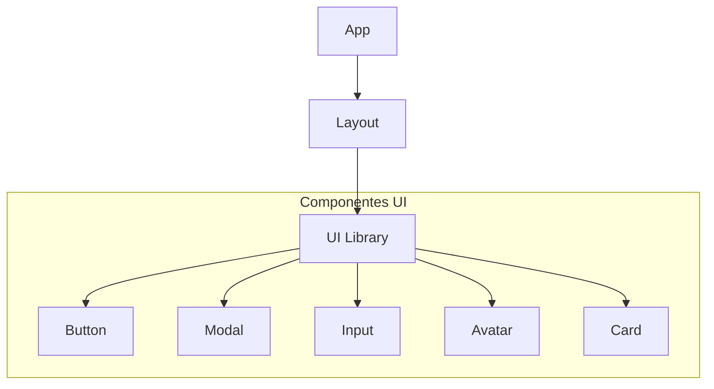

# 🧱 Componentes UI Personalizados - RED-RED

> **Análisis detallado de la biblioteca de componentes UI (Criterio B)**

## 📋 Visión General

El proyecto utiliza una arquitectura basada en componentes reutilizables situados en `frontend/src/components/ui/`. Estos componentes actúan como "primitivas" de diseño que aseguran la consistencia visual y facilitan el mantenimiento.

---

## 🛠️ Catálogo de Componentes

### 1. Button (`Button.js`)
El componente de botón es el más utilizado. Está construido sobre `framer-motion` para proporcionar feedback táctil.

*   **Variantes**: `primary`, `secondary`, `outline`, `ghost`, `danger`, `success`.
*   **Tamaños**: `sm`, `md`, `lg`, `xl`.
*   **Características**: Soporte para iconos, estado de carga (`loading`) y deshabilitado.

### 2. Modal (`Modal.js`)
Gestiona los diálogos y ventanas emergentes del sistema utilizando `AnimatePresence`.

*   **Animación**: Efecto de escalado y opacidad al abrir/cerrar.
*   **Accesibilidad**: Cierre al pulsar fuera o mediante la tecla `Esc`.
*   **Composición**: Cabecera, cuerpo y pie personalizables.

### 3. Input (`Input.js`)
Campos de texto estandarizados con soporte para iconos y validaciones.

*   **Integración**: Totalmente compatible con `react-hook-form`.
*   **Estilos**: Diferentes estados visuales (foco, error, deshabilitado).

---

## 🎨 Personalización y Tecnología

Los componentes no son simples envoltorios, sino que integran:
1.  **Tailwind Merge**: Para permitir la sobreescritura de clases sin conflictos.
2.  **CVA (Class Variance Authority)**: Para gestionar las variantes de forma tipada y limpia.
3.  **Framer Motion**: Integrado nativamente para micro-interacciones.

---

## ✅ Evidencia de Cumplimiento

Se cumple el **Criterio B** al no usar una librería de componentes "out-of-the-box" (como Material UI o Bootstrap) sin más, sino construyendo una capa propia adaptada a las necesidades de la red social.
