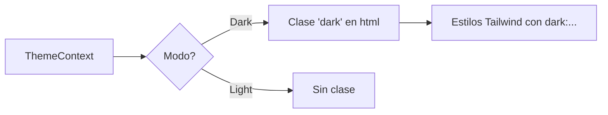

# 🎨 Estilos, Temas y Utilidades - RED-RED

> **Análisis del motor de estilos y sistema de temas (Criterios A y D)**

## 📋 Sistema de Diseño con TailwindCSS

El proyecto exprime al máximo las capacidades de **TailwindCSS**, no solo usando sus clases base, sino extendiendo su núcleo para crear una identidad propia.

### 1. Configuración Extendida
En `frontend/tailwind.config.js` hemos definido:
*   **Paleta de Colores**: Colores `primary` (Rojos) y `secondary` (Slates) personalizados.
*   **Animaciones**: Registradas como utilidades nativas (`fade-in`, `slide-up`).

---

## 🌓 Gestión de Temas (Dark Mode)

RED-RED incluye un sistema de temas dinámico que soporta modo claro, oscuro y automático (según el sistema operativo).

### Implementación Técnica:
*   **Contexto**: `ThemeContext.js` gestiona el estado global.
*   **Persistencia**: El tema se guarda en `localStorage` para recordar la preferencia del usuario.
*   **Estética**: El modo oscuro utiliza tonos de pizarra y carbón con acentos rojos neón para un look "premium".

---

## 🛠️ Uso de Utilidades del Framework

Se utiliza el **Criterio A** al emplear utilidades avanzadas:
*   **Ring & Shadow**: Para dar volumen a los elementos.
*   **Gradients**: Fondos degradados dinámicos en logins y botones.
*   **Transitions**: Todas las utilidades de color y estado tienen transiciones coordinadas.

---

## ✅ Evidencia de Cumplimiento

Se cumplen los **Criterios A y D** mediante:
*   La personalización total de la configuración de Tailwind.
*   Un sistema de temas que afecta a todos los componentes de la aplicación.
*   El uso de CSS Variables vinculadas al tema seleccionado.
