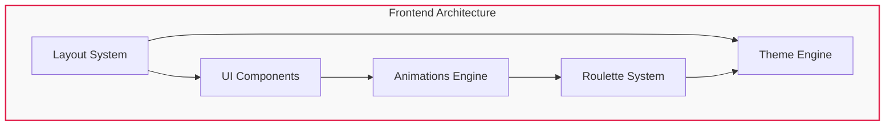

# 📚 Documentación RED-RED - Demo 6

> **Análisis exhaustivo del cumplimiento de criterios de Framework y diseño UI/UX**

## 📋 Índice de Contenidos

Bienvenido a la carpeta de la **Demo 6**. Aquí encontrarás el desglose detallado de cómo hemos construido la interfaz y la experiencia de usuario de la plataforma.

---

## 🔍 Guías Detalladas

### [🧱 Biblioteca de Componentes UI](./COMPONENTES_UI.md)
**El corazón visual de RED-RED**
Análisis de cómo se han creado y personalizado los elementos de la interfaz.

- 📏 Variantes y tamaños
- ⚛️ Integración con React
- 🧱 Gestión de dependencias de diseño

---

### [📐 Diseño, Layout y Responsividad](./DISENO_Y_LAYOUT.md)
**Cómo la App se adapta a ti**
Estructura espacial y adaptabilidad a móviles, tablets y PCs.

- 📱 Estrategia Mobile-First
- 📐 Arquitectura del Layout principal
- 📱 Breakpoints de TailwindCSS

---

### [🎨 Estilos, Temas y Utilidades](./ESTILOS_Y_TEMAS.md)
**Identidad visual y dinamismo**
Personalización de TailwindCSS y sistema de modo oscuro.

- 🌓 Dark/Light Mode dinámico
- 🎨 Paleta de colores extendida
- 🛠️ Uso avanzado de utilidades

---

### [✨ Sistema de Animaciones](./SISTEMA_ANIMACIONES.md)
**Una experiencia fluida y viva**
Detalles sobre CSS Keyframes y el uso de Framer Motion.

- 🚀 Capas de animación
- 🎭 Micro-interacciones
- ♿ Accesibilidad (Reduced Motion)

---

### [🎰 Ruleta y Recompensas](./SISTEMA_RULETA.md)
**Gamificación y Economía Virtual**
Análisis del motor de azar, sistema de Pity y personalización.

- 🎲 Mecánicas de azar y Pity
- 🎵 Motor de sonido (Web Audio API)
- 🛍️ Tienda e Inventario cosmético

---

## 📊 Resumen de Arquitectura

---

## 🛠️ Stack de Desarrollo (Diseño)

*   **React 18** (Lógica de interfaz)
*   **TailwindCSS 3** (Estilos rápidos y personalizados)
*   **Framer Motion** (Animaciones de alto nivel)
*   **Lucide React** (Iconografía consistente)

---

_Última actualización: 23 de febrero de 2026_
