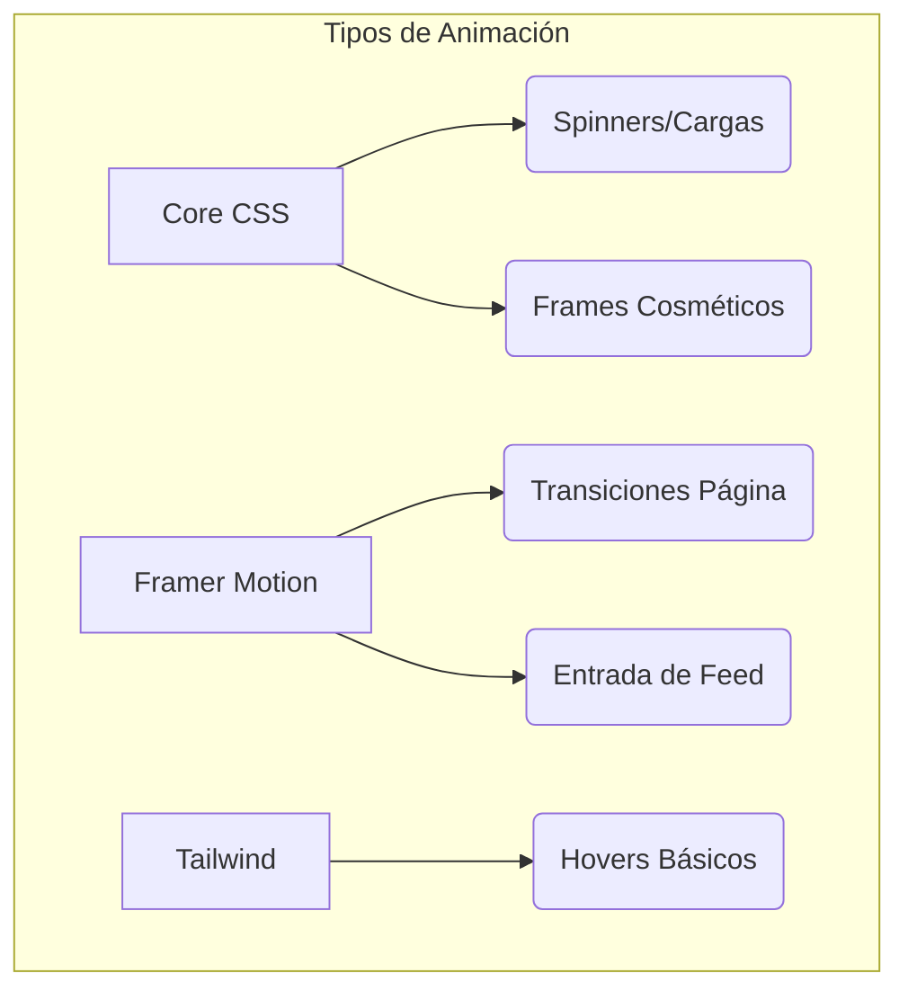

# ✨ Sistema de Animaciones - RED-RED

> **Análisis de la interactividad y fluidez visual (Criterio F)**

## 📋 Estrategia de Animación

RED-RED se siente una aplicación viva gracias a una estrategia de animación en tres niveles: **Utilidades CSS**, **Keyframes Propios** y **Lógica Declarativa con Framer Motion**.

---

## 🚀 Implementación en Tres Capas

### 1. Animaciones CSS (`animations.css`)
Este archivo de más de 500 líneas contiene el "motor" de animaciones base:
*   **Keyframes**: `fadeIn`, `slideDown`, `pulse`, `bounce`, `rotate`.
*   **Clases Especiales**: Efectos de cristal (`glass-effect`), brillos (`shimmer`) y marcos cosméticos de colores.

### 2. Framer Motion
Utilizado para las interacciones más complejas y refinadas:
*   **Entrada de Elementos**: Listas que aparecen con efecto escalonado (*stagger*).
*   **Gesto-Drive**: Comportamientos de arrastre y pulsación en botones y tarjetas.
*   **Layout Animations**: Elementos que se mueven fluidamente cuando cambia la disposición.

### 3. Tailwind Animations
Integración con el motor de Tailwind para animaciones rápidas de estado (como cambios de opacidad o escalado simple).

---

## 📊 Mapa Visual de Animaciones

---

## ♿ Accesibilidad y Rendimiento

El sistema está diseñado para ser inclusivo y eficiente:
*   **Reduced Motion**: Si el usuario activa "reducir movimiento" en su SO, se desactivan automáticamente mediante `@media (prefers-reduced-motion)`.
*   **GPU Accelerated**: Se priorizan propiedades como `transform` y `opacity` para asegurar 60 FPS.

---

## ✅ Evidencia de Cumplimiento

Se cumple el **Criterio F** al integrar animaciones que no son puramente decorativas, sino que mejoran el feedback del usuario y la jerarquía visual de la información.
