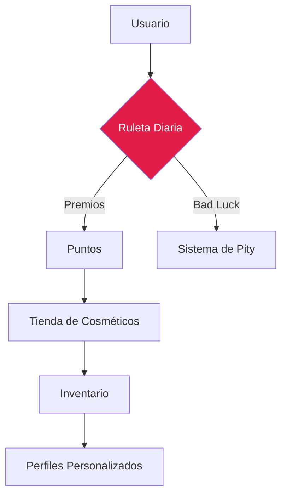
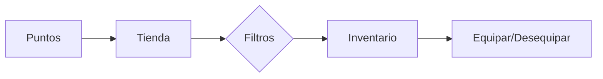

# 🎰 Sistema de Ruleta y Recompensas - RED-RED

> **Análisis exhaustivo del motor de gamificación, economía virtual y personalización**

## 📋 Visión General

El sistema de recompensas de RED-RED es una implementación avanzada de gamificación que combina mecánicas de azar controlado, una economía de puntos persistente y un sistema de cosméticos para el perfil.

---

## 🎲 La Ruleta: Mecánicas de Azar

Ubicada en `frontend/src/pages/Roulette.js`, la ruleta no es solo visual, sino que utiliza una lógica determinista basada en pesos y salvaguardas.

### 1. Pesos y Probabilidades
| Rareza | Probabilidad | Premio Máximo | Ejemplos |
|---|---|---|---|
| **Común** | 70% | 50 Puntos | Fondos grises |
| **Raro** | 25% | 200 Puntos | Fondos azules |
| **Épico** | 4% | 500 Puntos | Fondos morados |
| **Legendario** | 1% | 1000 Puntos | Fondo dorado + Efectos |

### 2. Sistema de "Pity" (Garantía de Suerte)
Para evitar la frustración del usuario, el código implementa un contador oculto que garantiza premios de mayor calidad:
*   **Pity Raro**: Tras 6 resultados comunes consecutivos, el siguiente premio es obligatoriamente **Raro** o superior.
*   **Pity Épico**: Tras 10 resultados sin premios grandes, se garantiza un premio **Épico** o **Legendario**.

---

## 🎵 Motor de Sonido y Audio (Web Audio API)

A diferencia de otras aplicaciones, RED-RED genera su propia música y efectos de sonido en tiempo real sin cargar archivos `.mp3` o `.wav`.

*   **Tecnología**: `OscillatorNode` y `GainNode` de la Web Audio API.
*   **Implementación**: La función `playSound` genera ondas sinusoidales con frecuencias específicas para cada rareza:
    *   *Común*: Tonos descendentes melancólicos.
    *   *Legendario*: Fanfarria triunfal ascendente con simulación de percusión.

---

## 🛍️ Economía y Tienda

Los puntos ganados se canjean en una tienda modular por tres tipos de items cosméticos:

1.  **Marcos (Frames)**: Bordes dinámicos alrededor del avatar.
2.  **Efectos (Effects)**: Gradientes y sombras especiales para el perfil.
3.  **Insignias (Badges)**: Iconos de estatus junto al nombre del usuario.

---

## ✨ Feedback Visual y UX

*   **Overlay Legendario**: Una capa especial (`LegendaryOverlay`) con lluvia de emojis y desenfoque radial que se activa solo con el premio mayor.
*   **Framer Motion**: Integración total en las transiciones entre las pestañas de "Jugar", "Tienda" e "Inventario".
*   **Persistencia**: El estado de las tiradas diarias y los contadores de Pity se sincronizan mediante `localStorage` vinculado al ID de cada usuario.

---

## ✅ Evidencia de Cumplimiento

Este sistema demuestra un uso avanzado de:
*   **React Hooks**: `useState` y `useEffect` para gestionar estados complejos de rotación.
*   **CSS Avanzado**: `conic-gradient` dinámico para los segmentos de la ruleta.
*   **Matemáticas de Rotación**: Cálculo preciso de ángulos para que el puntero siempre coincida con el premio seleccionado.
